# 📚 DJ — Wiki Overview & Knowledge Base Audit

This document summarizes the complete architectural footprint, pedagogical philosophy, core concepts, and operational tools built into this interconnected DJ Knowledge Base.

---

## 1. What Was Created

A custom, professional, and deeply interconnected DJ knowledge base consisting of **35+ specialized markdown notes**, 28 standardized transition recipes, 10 genre playbooks, 3 in-depth artist performance breakdowns, a 6-level structured curriculum, 10 progressive practice missions, and standardized templates for track analysis, transition logging, and set post-mortems.

```mermaid
graph TD
    Vault["The Open-Format DJ Knowledge Base"]
    Vault --> D00["00 - Dashboard (4 Notes)"]
    Vault --> D01["01 - Fundamentals (5 Notes)"]
    Vault --> D02["02 - Music Theory (3 Notes)"]
    Vault --> D03["03 - Track Anatomy (1 Note)"]
    Vault --> D04["04 - Core Techniques (4 Notes)"]
    Vault --> D05["05 - Transition Cookbook (28 Notes)"]
    Vault --> D06["06 - Energy & Crowd (2 Notes)"]
    Vault --> D07["07 - Track Selection (2 Notes)"]
    Vault --> D08["08 - Open Format (2 Notes)"]
    Vault --> D09["09 - Genre Playbooks (10 Notes)"]
    Vault --> D10["10 - Creative DJing (4 Notes)"]
    Vault --> D11["11 - Live Performance (1 Note)"]
    Vault --> D12["12 - Set Construction (2 Notes)"]
    Vault --> D13["13 - DJ Case Studies (4 Notes)"]
    Vault --> D14["14 - Practice Lab (2 Notes)"]
    Vault --> D15["15 - Track Database (2 Notes)"]
    Vault --> D16["16 - Transition Database (2 Notes)"]
    Vault --> D17["17 - Set Logs (2 Notes)"]
    Vault --> D18["18 - Glossary (1 Note)"]
    Vault --> D99["99 - Sources (1 Note)"]
```

---

## 2. Directory Structure & Content Mapping

* **`00 - Dashboard/`**: [[DJ Wiki]] (Command Hub), [[DJ - Start Here]] (Orientation Protocol), [[DJ - Learning Roadmap]] (7-Stage Pedagogy), [[DJ - Wiki Overview]] (This audit).
* **`01 - Fundamentals/`**: [[What Makes a Great DJ]], [[Rules vs Principles]], [[Listen Like a DJ]], [[Beatmatching & Tempo]], [[DJ Equipment & Software Concepts]].
* **`02 - Music Theory/`**: [[Music Fundamentals for DJs]], [[Phrasing & Structure]], [[Harmonic Mixing & Camelot System]].
* **`03 - Track Anatomy/`**: [[Track Anatomy & Structure]] (16 structural blocks across genres, adapting non-DJ pop tracks), [[Short-Form & Viral Track Architecture (The 32-Bar Rule)]] (High-velocity 35–50s arrangements for festival and social media routines).
* **`04 - Core Techniques/`**: [[EQ & Frequency Management]], [[Loops & Beat Jumps]], [[Hot Cues & Performance Pads]], [[Effects (FX) Mastery]].
* **`05 - Transition Cookbook/`**: 29 exhaustive transition recipes following the standardized 17-part blueprint:
  * *Blends:* [[Basic Blend]], [[Long Blend]], [[EQ Blend]], [[Bass Swap]], [[Filter Transition]].
  * *Cuts & Drops:* [[Quick Cut]], [[Hard Cut]], [[Drop Swap]], [[Vocal Punchline Drop Snap]], [[Build-to-Drop Transition]], [[Fake Drop]], [[Double Drop]].
  * *Time & Space:* [[Echo Out]], [[Reverb Transition]], [[Breakdown Transition]], [[Loop Transition]], [[Loop Roll]], [[Beat Jump Transition]], [[Stutter Transition]], [[Backspin (Spinback)]].
  * *Creative & Open-Format:* [[Vocal Transition]], [[Acapella Overlay]], [[Instrumental Overlay]], [[Drum Bridge]], [[Genre Bridge]], [[Tempo Bridge]], [[Stems Transition]], [[3-Deck Layering]], [[Live Mashup]].
* **`06 - Energy & Crowd/`**: [[Energy Management & Dynamics]] (with Mermaid visual curves for 30m, 60m, House, DnB, and Festival sets), [[Reading the Room & Crowd Psychology]].
* **`07 - Track Selection/`**: [[Track Selection Framework]] (The 7-Dimensional Matrix), [[DJ - What Do I Play Next]] (Real-time decision tree).
* **`08 - Open Format/`**: [[Open-Format DJing Guide]] (The 6 bridge mechanisms), [[Genre Bridge Playbook]] (Exact step-by-step blueprints for Pop $\to$ EDM, Pop $\to$ DnB, 128 $\leftrightarrow$ 174 BPM, etc.).
* **`09 - Genre Playbooks/`**: Dedicated technical playbooks for [[Pop Playbook|Pop]], [[EDM & Progressive House Playbook|EDM]], [[House & Tech House Playbook|House]], [[Drum & Bass (DnB) Playbook|Drum & Bass]], [[Hip-Hop & R&B Playbook|Hip-Hop]], [[Trap & Bass Music Playbook|Trap]], [[Dubstep Playbook|Dubstep]], [[Future Bass & Melodic Bass Playbook|Future Bass]], [[Melodic Electronic Playbook|Melodic Electronic]], and [[Open-Format Playbook|Open-Format]].
* **`10 - Creative DJing/`**: [[Stems, Live Remixing & Ableton Integration]], [[Reverse-Engineering Viral DJ Sets & Instagram Reels]] (Deconstructing transition forensics, micro-silence gaps, and short-form sets), [[Autonomous AI DJ Arranger & Intelligent Mashup Engine]] (Feature engineering meets agentic composition and sample-based intelligent arrangement), [[The Agentic DJ Framework]] (The ingestion-to-set agentic pipeline: tools, workflows and implementation phases).
* **`11 - Live Performance/`**: [[Live Performance & Crisis Management]] (Emergency error protocols, handling dead silence, stage presence).
* **`12 - Set Construction/`**: [[Set Construction & Architecture]] (The 8-stage narrative arc; 15m, 30m, 60m, 90m blueprints; planned vs. improvised ratios), [[Set Graph Theory & Stochastic Set Routing]] (The library as a directed multigraph; time-layered pathfinding; temperature, seeds and vibe controls).
* **`13 - DJ Case Studies/`**: [[Fred again.. Case Study]], [[Skrillex Case Study]], [[Martin Garrix Case Study]], and the [[DJ Comparison Matrix]] (15-artist comparative evaluation).
* **`14 - Practice Lab/`**: [[Practice Lab & Progressive Curriculum]] (Level 1–6 drills), [[First 10 Practice Missions]] (Mission 01 to Mission 10).
* **`15 - Track Database/`**: [[DJ - Track Analysis]] (Template), [[Example Track Analyses]].
* **`16 - Transition Database/`**: [[DJ - Transition]] (Template), [[Example Transition Experiments]].
* **`17 - Set Logs/`**: [[DJ - Set Log]] (Template), [[Example Set Logs]].
* **`18 - Glossary/`**: [[DJ Glossary]] (Comprehensive alphabetical reference with backlinks).
* **`99 - Sources/`**: [[Source Index]] (Tier 1–3 citations, primary artist interviews, technical manuals).

---

## 3. Core Concepts & Pedagogical Foundations

Every major concept across this vault is built on the **5 Pedagogical Questions**:
1. *What is it?*
2. *Why does it matter?*
3. *What does it sound/feel like?*
4. *How do I practice it?*
5. *When should I deliberately break the rule?*

### The Central Philosophy:
* **The Floor:** Technical mechanics (beatmatching, gain staging, phrasing).
* **The Flow:** Acoustic frequency ownership and harmonic Camelot modulation.
* **The Ceiling:** Emotional sequencing, real-time crowd psychology, and dynamic contrast.

---

## 4. Most Important Signature Techniques
1. **The Beat-1 Drop Swap ([[Drop Swap]]):** The high-impact festival weapon used by Skrillex and Martin Garrix to substitute drops and shock the room.
2. **The Clean Low-End Swap ([[Bass Swap]]):** The foundational club mechanic ensuring zero sub-bass mud or phase cancellation.
3. **The Ambient Breakdown Bridge ([[Breakdown Transition]]):** The secret to making impossible tempo leaps (e.g., 128 BPM Pop $\to$ 174 BPM Drum & Bass).
4. **The Real-Time Stems Mashup ([[Stems Transition]]):** Isolating vocals and drum grooves live to create unreleased bootlegs on stage.
5. **The Post-Fader Echo Throw ([[Echo Out]]):** The universal emergency exit across clashing keys or wild tempo jumps.

---

## 5. Recommended First 10 Exercises (The Rapid Start)
Follow the sequential training missions in [[First 10 Practice Missions]]:
1. *Mission 01:* Hear the Phrase (Blind downbeat detection).
2. *Mission 02:* Manual Beatmatching (No sync, no BPM readouts).
3. *Mission 03:* Clean Bassline Swap (Simultaneous two-handed 180° EQ twist).
4. *Mission 04:* 32-Bar Extended EQ Blend (Progressive frequency replacement).
5. *Mission 05:* Vocal Pocket Handoff (Lyrical turn-taking).
6. *Mission 06:* High-Impact Drop Swap (Instantaneous slam on Beat 1).
7. *Mission 07:* Post-Fader Echo Out Escape (Rhythmic delay throw).
8. *Mission 08:* 128 to 174 BPM Cross-Genre Bridge (Pop into Drum & Bass).
9. *Mission 09:* Live Stems Mashup (Real-time acapella over club groove).
10. *Mission 10:* The 15-Minute Multi-Genre Mini-Set (Recorded one-take performance).

---

## 6. Identified Knowledge Gaps for Future Research
As your live performance career advances, expand into these emerging frontier topics:
1. **DMX Lighting & Visual Automation (SoundSwitch / ShowKontrol):** Researching how live DJs link CDJ Pro DJ Link metadata to GrandMA lighting consoles and TC Supply visual rigs.
2. **Advanced Live Looping Hardware (Boss RC-505 Mk2 / Ableton Push 3):** Deeper technical routing for incorporating live multi-instrument looping (synths, electric bass, drum pads) directly into club mixer send/return loops.
3. **Acoustic PA System Tuning & Room Modes:** Advanced venue audio engineering: identifying room standing waves, subwoofer cancellation nodes, and optimizing booth monitor EQ in concrete warehouse venues.

---

## 7. Immediate Next Steps
1. Open **[[DJ - Start Here]]**.
2. Complete **[[First 10 Practice Missions#MISSION 01 — Hear the Phrase|MISSION 01]]** today.
3. Analyze 5 tracks in your library using the **[[DJ - Track Analysis]]** template.
4. Record your first transition experiment and log it in **[[DJ - Transition]]**!
