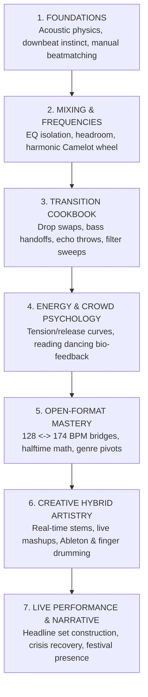

# 🎧 The Open-Format DJ Wiki

> **"Develop enough technical fluency that you can stop thinking about the equipment and start thinking about music, emotion, energy, and the audience."**

Welcome to your central, interconnected command center for modern, creative open-format DJing. This knowledge base is engineered to transform you from a passive track selector into a dynamic live performer capable of turning the music you love into unforgettable club and festival experiences.

---

## 🗺️ Master DJ Learning Path

---

## 🚀 Quick Navigation Hub

| Section | Description | Core Entry Links |
| :--- | :--- | :--- |
| **🚀 Start Here** | Your day-one orientation, mindset, and first missions. | [[DJ - Start Here]] • [[DJ - Learning Roadmap]] |
| **🧠 Fundamentals** | The mechanical, structural, and acoustic rules of the decks. | [[What Makes a Great DJ]] • [[Rules vs Principles]] • [[Listen Like a DJ]] • [[Beatmatching & Tempo]] |
| **🎼 Music Theory** | Applied functional music theory translated into DJ terms. | [[Music Fundamentals for DJs]] • [[Phrasing & Structure]] • [[Harmonic Mixing & Camelot System]] |
| **🔍 Track Anatomy** | Visual and aural deconstruction of modern arrangements. | [[Track Anatomy & Structure]] |
| **🎛️ Core Techniques** | The tactile physical controls and signal flow of the booth. | [[EQ & Frequency Management]] • [[Loops & Beat Jumps]] • [[Hot Cues & Performance Pads]] • [[Effects (FX) Mastery]] |
| **📖 Transition Cookbook** | 28 standardized recipes with step-by-step blueprints. | [[Drop Swap]] • [[Bass Swap]] • [[Echo Out]] • [[Double Drop]] • [[Stems Transition]] • [[Live Mashup]] |
| **⚡ Energy & Crowd** | Dynamic contrast, set curves, and crowd psychology. | [[Energy Management & Dynamics]] • [[Reading the Room & Crowd Psychology]] |
| **🎯 Track Selection** | The real-time algorithm for choosing what record to drop next. | [[Track Selection Framework]] • [[DJ - What Do I Play Next]] |
| **🌐 Open Format** | Making the "impossible" cross-genre transition work. | [[Open-Format DJing Guide]] • [[Genre Bridge Playbook]] |
| **📚 Genre Playbooks** | Dedicated tactics for Pop, House, EDM, DnB, Hip-Hop, etc. | [[Pop Playbook]] • [[House & Tech House Playbook]] • [[Drum & Bass (DnB) Playbook]] • [[Dubstep Playbook]] |
| **🎨 Creative DJing** | Stems, live remixing, performance pads, and Ableton rigs. | [[Stems, Live Remixing & Ableton Integration]] • [[Autonomous AI DJ Arranger & Intelligent Mashup Engine]] • [[The Agentic DJ Framework]] |
| **🏟️ Live Performance** | Stage presence, overcoming trainwrecks, and crowd reading. | [[Live Performance & Crisis Management]] • [[Set Construction & Architecture]] • [[Set Graph Theory & Stochastic Set Routing]] |
| **🔍 Artist Case Studies**| Deep breakdowns of modern performance titans. | [[Fred again.. Case Study]] • [[Skrillex Case Study]] • [[Martin Garrix Case Study]] • [[DJ Comparison Matrix]] |
| **🧪 Practice Lab** | Structured 6-level drills and your first 10 practice missions. | [[Practice Lab & Progressive Curriculum]] • [[First 10 Practice Missions]] |
| **🗃️ Performance Databases**| Standardized templates and lab reference logs. | [[DJ - Track Analysis]] • [[DJ - Transition]] • [[DJ - Set Log]] • [[DJ Glossary]] |
| **📚 Research Sources** | Primary evidence, gear manuals, and artist breakdowns. | [[Source Index]] |

---

## 📊 Live Performance Dashboard

> [!TIP]
> **Performance Dashboard State**
> * **Current Skill Level:** Level 1 / Novice (Mastering Phrasing & Downbeat Instinct)
> * **Current Practice Goal:** Complete [[First 10 Practice Missions#MISSION 01 — Hear the Phrase|Mission 01]] and [[First 10 Practice Missions#MISSION 02 — Manual Beatmatching & Phase Lock|Mission 02]].
> * **Active Focus Technique:** The Clean [[Bass Swap]] on Beat 1 of a 16-bar phrase.

### 🎧 Favorite & Core Signature Techniques
1. **The Beat-1 Drop Swap:** Building tension with a familiar pop vocal, cutting to silence, and slamming into a heavy bass drop. (See [[Drop Swap]]).
2. **The Vocal Punchline Drop Snap:** Isolating iconic catchphrases with an acoustic 180ms micro-silence vacuum before slamming Beat 1 drops at full 0 dBFS impact. (See [[Vocal Punchline Drop Snap]] and [[Short-Form & Viral Track Architecture (The 32-Bar Rule)]]).
3. **The 128 $\to$ 174 BPM Breakdown Bridge:** Floating an emotional pop vocal across an ambient breakdown before unleashing high-speed Drum & Bass. (See [[Genre Bridge Playbook]]).
4. **The Real-Time Stems Acapella Lift:** Muting drums live to create spontaneous live bootlegs. (See [[Stems Transition]]).

### 📝 Recent Transition Experiments & Practice Log
* `Experiment 01:` Billie Eilish (*"bad guy"*) $\to$ Sub Focus (*"Solar System"*) via [[Breakdown Transition]]. (See [[Example Transition Experiments]]).
* `Experiment 02:` Martin Garrix (*"Animals"*) $\to$ Skrillex (*"Chicken Soup"*) via [[Drop Swap]].
* `Experiment 03:` FISHER (*"Losing It"*) $\to$ Katy Perry (*"Last Friday Night"*) via [[Vocal Punchline Drop Snap]] (180ms micro-silence snap).
* `Experiment 04:` Pritam (*"Ye Tune Kya Kiya"*) $\to$ Rahat Fateh Ali Khan (*"Tum Jo Aaye"*) via [[Vocal Punchline Drop Snap]] (Sufi-Dholak 90 BPM snap).
* `Viral Decompilation Study:` Reverse-engineering short-form Instagram & TikTok DJ sets. (See [[Reverse-Engineering Viral DJ Sets & Instagram Reels]]).
* `Set Log Post-Mortem:` Headline set analysis at The Loft. (See [[Example Set Logs]]).

---

## 🎯 What to Do Next
1. If this is your first time in the wiki, head directly to **[[DJ - Start Here]]**.
2. Review the structured path in **[[DJ - Learning Roadmap]]**.
3. Fire up your DJ software/controller and tackle **[[MISSION 01 — Hear the Phrase]]**!
