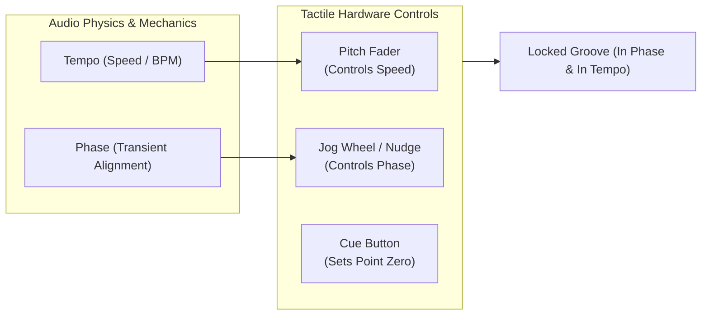
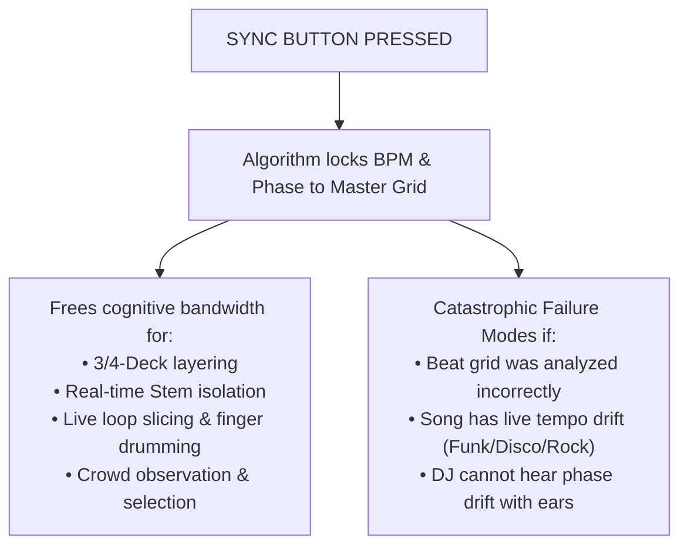

# Beatmatching, Tempo & Synchronization

Beatmatching is the foundational mechanical craft of DJing: aligning the speed (tempo/BPM) and rhythmic phase (transient alignment of downbeats) of two distinct audio recordings so that their percussive cycles interlock synchronously without drift or friction.

---

## 1. Core Mechanics: Tempo vs. Phase

To understand beatmatching, you must separate **tempo** from **phase**:
* **Tempo (BPM):** The frequency of the beat—how many quarter-note beats occur per minute. If Track A is 126 BPM and Track B is 124 BPM, they are *out of tempo*.
* **Phase (Rhythmic Alignment):** The alignment of the transients. Even if Track A and Track B are both set to exactly 126.0 BPM, if Track B's kick drum lands 50 milliseconds after Track A's kick, they are *out of phase*.
* **The "Galloping Horse" (Trainwreck):** When two tracks are slightly out of phase, their kick drums trigger in rapid succession (`th-thump, th-thump, th-thump`). This sounds like galloping horses and causes immediate cognitive disruption for dancers.

---

## 2. The Physical Controls: Pitch Fader, Jog Wheel & Cueing

### The Pitch Fader (Tempo Adjustment)
* **Function:** Adjusts the playback rate of the audio buffer/motor. Moving the fader changes the BPM.
* **Pitch Range Settings:** Most software and hardware (CDJs, controllers) allow setting the pitch fader range to $\pm 6\%$, $\pm 10\%$, $\pm 16\%$, or `WIDE` ($\pm 100\%$). 
  * *Best practice:* Keep the range at $\pm 6\%$ or $\pm 10\%$ for precision resolution; use `WIDE` only for extreme genre switches or tempo drop tricks.

### The Jog Wheel (Phase / Nudging)
* **Function:** A multi-function rotary platter.
  * **Top Surface (Platter):** In *Vinyl Mode*, touching the top plate physically stops playback (like holding a record) or scratches.
  * **Outer Edge (The Bezel):** Rotating the outer plastic ring temporarily accelerates or decelerates playback by a few milliseconds—known as **nudging**.
* **Nudging Mechanics:**
  * If Track B is lagging *behind* Track A: Spin the outer rim **clockwise** to speed it up momentarily until the beats lock.
  * If Track B is rushing *ahead* of Track A: Spin the outer rim **counter-clockwise** to slow it down momentarily.

### The Cue Button & Headphone Monitoring
* **The Cue Button:** Memorizes a single playback start point (usually the downbeat on beat 1 of the intro or drop). Pressing and holding `CUE` plays the track until released; pressing `PLAY` latches playback.
* **Split Cue vs. Master Cue:**
  * **Cue/Master Balance:** Blends the cued channel (Track B) and the live master output (Track A) in your headphones.
  * **Split Cue:** Sends the live Master to the right ear and the cued Track B to the left ear. Essential for loud club environments where room acoustics and monitor reflections make hearing room delays disorienting.

---

## 3. Beat Grids & Quantization

* **Beat Grid:** A software-generated mathematical overlay (analyzed by Rekordbox, Serato, Traktor, Engine DJ) that marks every downbeat and transient marker with microsecond timestamps.
* **Quantization:** An algorithmic assist that snaps live actions (pressing Hot Cues, engaging Loops, triggering Beat Jumps) to the nearest beat grid marker (selectable: 1 beat, 1/2 beat, 1/4 beat, 1/8 beat).
* **The Danger of Bad Beat Grids:** Software algorithms frequently misanalyze tracks with live acoustic drumming, complex swing, or syncopated intro vocals (e.g., placing the downbeat on beat 2 or 4). If the grid is wrong, Quantize and Sync will force the track into a permanent trainwreck. **You must verify beat grids in your library preparation.**

---

## 4. Deconstructing the "Sync" Debate: Tool vs. Crutch

In amateur online circles, pressing the `SYNC` button is frequently derided as "cheating." In professional touring environments, this framing is obsolete.

### What Sync Actually Does
1. **Tempo Sync:** Matches the incoming deck's BPM to the current Master deck.
2. **Beat Sync:** Automatically aligns the transient phase markers of both beat grids.

### When Sync is Essential
* Performing complex **3-deck or 4-deck layering** (e.g., Martin Garrix running a vocal ID, percussion loop, and melodic riser simultaneously; see [[3-Deck Layering]]).
* Operating **live stem separation** and real-time performance pad remixing (as seen in [[Fred again.. Case Study]]).
* High-velocity open-format sets where rapid drop swaps occur every 45–60 seconds.

### Why Understanding Manual Beatmatching is Still Mandatory
1. **Grid Failures:** If a track's grid is shifted by a 1/16th note, Sync will mathematically lock it into a dissonant flam. Only a DJ who can hear phase drift can disengage Sync, grab the jog wheel, and nudge it into the musical pocket.
2. **Classic & Analog Music:** Soul, Disco, Funk, and live Afrobeat tracks have fluctuating human tempos (e.g., drifting between 118 and 123 BPM across 4 minutes). Sync cannot handle unquantized live drumming; it requires continuous, tactile manual pitch riding.
3. **Gear Malfunctions & Back-to-Back (B2B) Sets:** If your link cable disconnects, CDJs fail to communicate, or you are playing B2B with a DJ who doesn't use grids, manual beatmatching is the difference between performing confidently and walking off the stage.

---

## The 5 Pedagogical Questions for Beatmatching

1. **What is it?** The acoustic alignment of tempo (frequency of beats) and phase (instantaneous arrival of transients).
2. **Why does it matter?** Without alignment, layered rhythms clash, destroying groove momentum and creating physical discomfort on the dancefloor.
3. **What does it sound/feel like?** When locked, two kick drums fuse into a single, punchy, thunderous transient. When out of phase, it sounds like a sloppy double-strike (`flam`) or galloping horse.
4. **How do I practice it?** Complete [[MISSION 02 — Manual Beatmatching]] by covering your software BPM displays with post-it notes and matching two tracks solely with your ears and jog wheels.
5. **When should I deliberately break the rule?**
   * **The "Rub" / Friction:** In UK Garage, Detroit Techno, or Afro-House, keeping two tracks slightly loose (a few milliseconds of natural human swing) creates a warm, lively analog tension that over-quantized digital locks destroy.
   * **Abrupt Cuts & Drops:** When cutting straight to a breakdown or drop swapping on beat 1, extended beatmatching is completely bypassed.

---

## Related Concepts
* [[Phrasing & Structure]]
* [[Listen Like a DJ]]
* [[DJ Equipment & Software Concepts]]
* [[Rules vs Principles]]
* [[MISSION 02 — Manual Beatmatching]]
