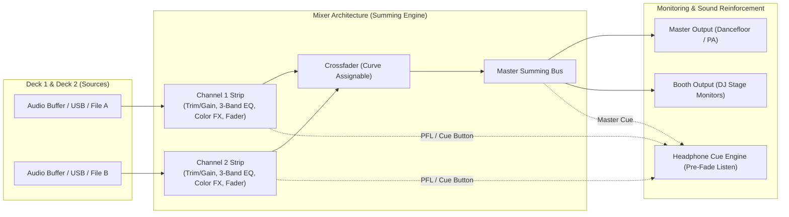

# DJ Equipment & Software Concepts: The Architecture of the Rig

Whether you are performing on a $200 entry-level USB controller (Pioneer DDJ-FLX4, Traktor Kontrol S2), a club-standard multi-player setup ($8,000+ Pioneer CDJ-3000 / DJM-A9 or DJM-V10 rig), or standalone units (Denon Prime 4, Pioneer XDJ-XZ), the fundamental signal flow and architectural concepts remain identical.

This guide establishes the **platform-neutral universal architecture** of DJ systems, separating invariant acoustic concepts from vendor-specific software implementations.

---

## 1. Universal Hardware Components

### Decks (The Playback Engines)
* **Universal Concept:** The audio playback mechanism that plays, loops, speeds up, and scratches individual audio files.
* **Modern Features:**
  * **Jog Wheel:** Dual-zone rotary wheel. Top platter triggers touch-stop / vinyl scratch; outer ring nudges pitch.
  * **Pitch / Tempo Fader:** Linear potentiometer controlling the playback speed of the track.
  * **Transport Controls:** Tactile `PLAY/PAUSE` and `CUE` buttons.
* **Software Implementations:** Virtual decks in Rekordbox, Serato DJ Pro, Traktor Pro, VirtualDJ, Engine DJ.

### Mixer & Channel Strips
* **Universal Concept:** The summing console where individual audio streams are shaped, balanced, equalized, and combined into a cohesive stereo output.
* **Each Channel Strip Contains:**
  1. **Gain / Trim:** Sets the initial input pre-amplification stage (calibrated so peaks hit amber, never red).
  2. **EQ Section:** 3-band (High, Mid, Low) or 4-band (High, Mid-High, Mid-Low, Low on Allen & Heath Xone / DJM-V10) potentiometers.
  3. **Color FX / Dedicated Filter Knob:** Center-detented bi-directional filter (Turn Left = Low Pass Filter / cuts highs; Turn Right = High Pass Filter / cuts bass).
  4. **Channel Fader (Upfader):** Linear volume attenuator controlling output level into the master bus.
  5. **Cue / PFL (Pre-Fade Listen) Button:** Routes channel audio directly to headphones *before* the upfader is raised.

### Crossfader
* **Universal Concept:** A horizontal linear fader that blends between Channel A (left) and Channel B (right).
* **Curve Switch Settings:**
  * **Smooth / Equal Power (Linear/Log):** Gradual blend across the entire throw (ideal for House, Techno, Long Blends).
  * **Sharp / Cut (Scratch):** Immediate full volume activation within 1mm of travel (essential for Hip-Hop scratching, turntablism, and rapid drop swaps).

### Master, Booth & Headphone Monitoring
* **Master Out:** Feeds the main audience front-of-house (FOH) PA system.
* **Booth Out:** Feeds dedicated monitor speakers pointed directly at the DJ's ears inside the booth. Having an independent volume knob allows the DJ to combat room delay and slapback echo.
* **Headphone Controls:**
  * **Headphone Volume:** Output level to cans.
  * **Cue/Master Mix Knob:** Pans between the cued incoming track (Cue) and the live room sound (Master).

---

## 2. Universal Digital & Performance Concepts

### Beat Grids & Waveforms
* **Waveform Display:** Visual spectrum representing audio dynamics and frequencies.
  * *Color Coding:* Blue/Green usually denotes low bass frequencies; orange/yellow denotes mid-range vocals/snares; white/bright denotes high hats and transients.
* **Beat Grid:** The internal temporal scaffolding that tells the processor where every 16th, 8th, quarter, and whole beat sits.

### Hot Cues vs. Memory Cues
* **Memory Cue:** A static bookmark that cues the playback head to a position when scrolled to, but requires pressing Play to initiate playback.
* **Hot Cue:** An instantaneous, non-destructive trigger pad. Pressing Pad 1 jumps immediately to that timestamp and begins playback instantly without latency.

### Loops & Loop Rolls
* **Loop:** Captures a continuous musical section (1, 2, 4, 8, 16, 32 beats) and repeats it seamlessly.
* **Loop Roll:** An instantaneous loop (often 1/2, 1/4, 1/8 beat) triggered on a performance pad that repeats while held. When released, playback jumps forward to where the song *would have been* if you had never touched it (governed by **Slip Mode**).

### Slip Mode
* **Universal Concept:** An essential creative mode. When engaged, the underlying track continues playing in silent digital background time while you scratch, reverse, trigger hot cues, or engage loop rolls. The moment you release your finger, playback snaps back in perfect musical time.

### Vinyl Mode vs. CDJ Mode
* **Vinyl Mode:** Touching the jog wheel platter immediately stops the track with simulated needle drag/scratch mechanics.
* **CDJ Mode:** Touching the platter acts as a continuous nudge without stopping playback. (Virtually all modern DJs keep Vinyl Mode ON).

### Key Lock (Master Tempo)
* **Universal Concept:** A digital phase-vocoder DSP algorithm that preserves the original musical key/pitch of a song regardless of how far the tempo fader is pushed.
* **When to Use:** Always keep active during open-format and multi-genre mixing to avoid unwanted "chipmunk" or "demon voice" pitch alterations.
* **Artifact Notice:** Extreme tempo shifts ($>15\%$) can cause transient smearing or phase flanging.

### Stems (Real-Time Source Separation)
* **Universal Concept:** Machine-learning algorithms (e.g., Spleeter, Demucs) integrated directly into DJ software that split a standard stereo MP3/WAV file into independent audio stems in real time: **Vocal, Drums, Bass, Melodic/Instrumental**.
* **Software Implementations:** Rekordbox Stems, Serato Stems, VirtualDJ Stems, Traktor Stems, djay Pro Neural Mix.

---

## Universal Concepts vs. Vendor-Specific Terms

| Universal Function | Pioneer DJ / Rekordbox | Serato DJ Pro | Native Instruments Traktor | Denon / Engine DJ |
| :--- | :--- | :--- | :--- | :--- |
| **Pitch-Independent Tempo** | Master Tempo | Pitch 'n Time / Key Lock | Key Lock | Key Lock |
| **Grid Snap Assist** | Quantize | Quantize | Snap (S) & Quantize (Q) | Quantize |
| **Silent Background Playback** | Slip Mode | Slip Mode | Flux Mode | Slip Mode |
| **Real-Time Audio Separation** | Rekordbox Stems | Serato Stems | Stems (Native format) | Engine Stems |
| **Channel Monitoring** | Cue Button | Headphone / Cue | Cue / Headphone | Cue |
| **Dynamic Key Shifting** | Key Sync | Key Shift / Pitch Play | Key Sync | Key Sync |

---

## Related Notes
* [[Beatmatching & Tempo]]
* [[EQ & Frequency Management]]
* [[Stems, Live Remixing & Ableton Integration]]
* [[Fred again.. Case Study]]
* [[Skrillex Case Study]]
