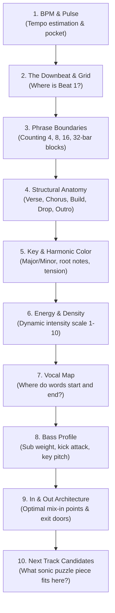

# Listen Like a DJ: Analytical Listening & Ear Training

Most music consumers listen **passively and holistically**: they experience music as an emotional wash of lyrics, rhythm, and mood. A DJ must cultivate **analytical and structural hearing**: the ability to instantly deconstruct any piece of audio into its constituent stems, frequencies, rhythmic grids, and architectural blocks—all in real time, without ever looking at a computer screen or visual waveform.

---

## The 10-Tier Analytical Listening Hierarchy

When a song comes on—whether in your headphones, on Spotify, or in a club—train your brain to run down this mental checklist within the first 15 seconds:

### 1. BPM & Pulse (Tempo Estimation)
* **What to listen for:** The frequency of the quarter-note pulse. 
* **Mental Benchmarks:**
  * ~70–85 BPM: Hip-hop, Slow R&B (or half-time Drum & Bass)
  * ~100–115 BPM: Moombahton, Mid-tempo, Reggaeton
  * ~120–126 BPM: Deep House, Tech House, Melodic Techno
  * ~126–130 BPM: Progressive House, Festival EDM, Mainstage Pop
  * ~140–150 BPM: Dubstep, Trap, Hard Techno, UK Bass
  * ~170–176 BPM: Drum & Bass, Jungle

### 2. The Downbeat & Beat Grid
* **What to listen for:** Where does the physical cycle begin? The "ONE" of the bar. It is typically punctuated by a kick drum transient, an open crash cymbal, or the start of a vocal sentence.

### 3. Phrasing (The 8-Bar / 32-Beat Instinct)
* **What to listen for:** Dance music is built in architectural units of 4, 8, 16, and 32 bars. Listen for subtle cues that signal an impending phrase change:
  * Snare rolls or drum fills on bar 8 or 16.
  * White noise risers (whooshes) swelling up.
  * Hi-hats dropping out on beat 4 of the last bar.
  * Vocal pickup notes right before the downbeat.

### 4. Structural Anatomy (The Map)
* **What to listen for:** Identify the section type immediately: Is this an unmixed **Intro**, an energetic **Verse**, a tension-building **Pre-Chorus / Build**, an explosive **Drop / Chorus**, an ambient **Breakdown**, or a stripped-back **Outro**? (See [[Track Anatomy & Structure]]).

### 5. Harmonic Key & Musical Mood
* **What to listen for:** Is the track in a Minor key (sad, menacing, moody, aggressive) or Major key (uplifting, celebratory, warm)? Listen for the root note of the bassline. (See [[Harmonic Mixing & Camelot System]]).

### 6. Energy & Spectral Density (Scale 1–10)
* **What to listen for:** How crowded is the audio spectrum? A track with just a sub-bass and a hi-hat is low density (Energy 3–4). A wall of distorted supersaws, layered kicks, and screaming vocals is high density (Energy 9–10). (See [[Energy Management & Dynamics]]).

### 7. Vocal Topography
* **What to listen for:** Is the vocal dry or reverberant? Is it continuous (leaving no room for another melody) or sparse with rhythmic gaps? 

### 8. Bass & Low-End Profile
* **What to listen for:** Is the bass a short, punchy kick drum (Tech House), a rolling 808 sub (Hip-Hop/Trap), or an oscillating Reese bass (Drum & Bass)? 

### 9. Potential Cue Points & Exit Points
* **What to listen for:** Where is the "door"? Where could another song enter seamlessly? Where does this song offer an exit ramp where the drums strip away?

### 10. Next Track Associative Memory
* **What to listen for:** What track in your library matches this energy, complements this groove, or introduces a dramatic contrast that would electrify the room? (See [[Track Selection Framework]]).

---

## The 5 Pedagogical Questions for Analytical Listening

1. **What is it?** Cultivating the mental ability to separate combined audio signals into independent sonic streams (bass, drums, chords, vocals).
2. **Why does it matter?** In a live club environment, lighting is erratic, screens can fail, and waveforms can be misleading. Your ears are the only infallible audio sensor you possess.
3. **What does it sound/feel like?** Rather than hearing a track as "one big wall of sound," it sounds like 4 distinct layers moving through space on distinct frequency shelves.
4. **How do I practice it?** Do the "Blind Listening Drills" detailed below—analyzing unfamiliar tracks without looking at a screen.
5. **When should I deliberately break the rule?** Once your analysis is instantaneous, step back and re-connect with holistic emotional listening. If you only listen analytically, you will pick tracks that are technically compatible but emotionally sterile.

---

## Analytical Blind Listening Exercises

### Exercise 1: The "Screen-Off" Phrase Count Drill
* **Setup:** Pick 5 random songs from different genres on Spotify or your library. Turn your monitor off or close your eyes.
* **Procedure:** Press Play. Count beats out loud: `1, 2, 3, 4 | 2, 2, 3, 4 | 3, 2, 3, 4 ... 8, 2, 3, 4`.
* **Objective:** Predict the exact second a structural change occurs (drop, fill, vocal entrance) purely by feeling the phrase boundary.
* **Success Criteria:** You call out "CHANGE COMING ON 1" 2 bars before it occurs, with 100% accuracy on 5 consecutive tracks.

### Exercise 2: Vocal Gap Identification
* **Setup:** Listen to a dense vocal Pop track (e.g., Dua Lipa, The Weeknd, Billie Eilish).
* **Procedure:** Tap your finger on the desk every time there is a complete 4-beat or 8-beat bar with **zero vocal lyrics**.
* **Objective:** Map the "vocal windows" where an incoming track's melodic hook could be introduced without causing vocal collision.

### Exercise 3: Low-End Density Audition
* **Setup:** Take 3 tracks: one Minimal House, one Festival Progressive House, one Drum & Bass.
* **Procedure:** Close your eyes and focus exclusively on the lowest octaves ($30\text{--}150\text{ Hz}$).
* **Objective:** Aurally measure how long the kick drum tail rings out. Is the kick short and tight (allowing easy overlapping with another bassline), or long and boomy (requiring an instantaneous [[Bass Swap]])?

---

## Related Notes
* [[What Makes a Great DJ]]
* [[Phrasing & Structure]]
* [[Track Anatomy & Structure]]
* [[EQ & Frequency Management]]
* [[Practice Lab & Progressive Curriculum]]
