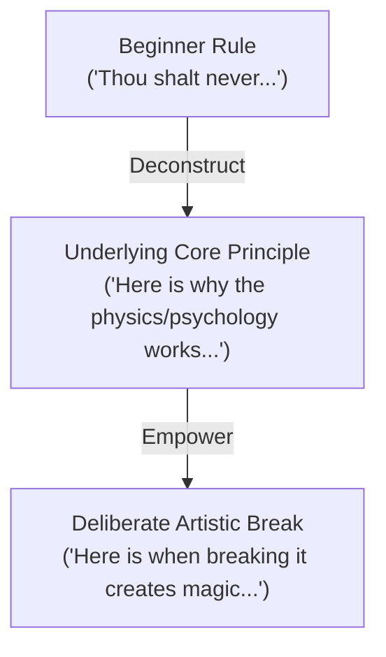

# Rules vs. Principles: The DJ Philosophy Matrix

In beginner DJ education, instructions are almost always handed down as rigid, dogmatic rules: *"Never mix out of key," "Always blend for 32 beats," "Never redline," "Never touch Sync."* 

While these rules serve as training wheels to prevent catastrophe, they create robotic DJs who are paralyzed when a transition doesn't fit a formula. **Master DJs do not follow rules; they master underlying physical and psychological principles, which allows them to deliberately break rules with stunning artistic results.**

---

## The 5 Pedagogical Questions Applied to Every Rule

Whenever you encounter a "rule" in DJing, interrogate it using these 5 foundational questions:
1. **What is it?** The surface prescription or prohibition.
2. **Why does it matter?** The technical or musical problem the rule was created to prevent.
3. **What does it sound/feel like?** The auditory sensation when the rule is followed versus poorly violated.
4. **How do I practice it?** The drill that instills the baseline competence into your muscle memory.
5. **When should I deliberately break the rule?** The precise context where violating the rule creates energy, surprise, or emotional impact.

---

## The Master Rules vs. Principles Breakdown

### 1. The Rule: "Always Mix in Key (Harmonic Mixing)"
* **The Beginner Rule:** Only transition between tracks that share the same Camelot wheel number or adjacent numbers ($\pm 1$).
* **The Underlying Principle:** Humans perceive sustained overlapping musical intervals as either concordant (settled, harmonious) or discordant (tense, jarring). Dissonance during complex polyphonic sections (melodies, vocals, synth leads) creates auditory confusion.
* **What it sounds/feels like:** In-key transitions feel creamy, effortless, and seamless. Badly clashing keys sound like an out-of-tune guitar or two radios playing simultaneously.
* **How to practice it:** Run the [[Harmonic Mixing & Camelot System]] drills, matching tracks within 8A $\to$ 9A or 8A $\to$ 8B.
* **When to DELIBERATELY break it:**
  * **Percussive / Drum Transitions:** Kicks and hi-hats lack sustained pitch; you can jump from 2A to 9B instantly during a percussive outro without any harmonic clash.
  * **Energy Boost / Key Jumps:** Jumping $+2$ semitones (e.g., from A minor to B minor / Camelot $+7$ hours) during a drop creates an exhilarating shot of emotional adrenaline.
  * **Abrupt Emotional Shock:** Jumping to an unexpected key after complete silence or a dramatic breakdown creates intense novelty.

### 2. The Rule: "Always Blend Smoothly for at least 16 or 32 Beats"
* **The Beginner Rule:** Gradually bring in Track B with EQ and faders across 16 or 32 bars.
* **The Underlying Principle:** The dancefloor needs continuity to maintain physical momentum and hypnotic groove.
* **What it sounds/feels like:** Smooth blends feel like an infinite, seamless river of music.
* **How to practice it:** Master the [[Long Blend]] and [[EQ Blend]] in the [[Transition Cookbook]].
* **When to DELIBERATELY break it:**
  * **The "Drop Swap" / "Slam Cut":** In bass music, dubstep, or festival EDM, spending 32 bars blending two high-energy tracks turns the sound into incomprehensible noise. Cutting instantly on the "1" of the drop provides maximum acoustic violence and ecstasy. (See [[Drop Swap]] and [[Skrillex Case Study]]).
  * **Comedy, Shock, or Nostalgia:** Cutting dead into a legendary pop hook or meme vocal creates immediate laughter and crowd connection.

### 3. The Rule: "Never Touch the Sync Button"
* **The Beginner Rule:** Manual beatmatching with jog wheels and pitch faders is the only legitimate way to DJ.
* **The Underlying Principle:** A DJ must have complete auditory control and know whether two tracks are drifting without looking at a computer screen.
* **What it sounds/feels like:** A DJ dependent on sync without ear training panics when a track's beat grid is misanalyzed, resulting in a trainwreck.
* **How to practice it:** Learn manual beatmatching in [[Beatmatching & Tempo]] and [[MISSION 02 — Manual Beatmatching]].
* **When to DELIBERATELY break it:**
  * When executing 3-deck or 4-deck layering, live stem isolation, or finger-drumming live samples (as seen in [[Fred again.. Case Study]]), manual pitch-riding on Deck 4 steals precious cognitive bandwidth needed for creative performance. Pro DJs engage Sync as an automation tool once their ears already know the grid is correct.

### 4. The Rule: "Never Have Both Bass EQs at 12 O'clock (Center)"
* **The Beginner Rule:** One low EQ must always be fully turned down when two tracks are playing simultaneously.
* **The Underlying Principle:** Sub-bass ($30\text{--}100\text{ Hz}$) carries massive physical energy. Two simultaneous sub-basses cause immediate phase cancellation (comb filtering) and clip the mixer's summing bus, destroying transient punch.
* **What it sounds/feels like:** Clashing basslines sound muddy, flabby, and quiet because the sound system's limiter clamps down. A clean swap sounds punchy and chest-thumping.
* **How to practice it:** Master the [[Bass Swap]] drill.
* **When to DELIBERATELY break it:**
  * Almost **never** in the sub-bass realm ($<100\text{ Hz}$ is governed by immutable acoustics).
  * However, in mid-bass ($150\text{--}300\text{ Hz}$), if one track has a high-passed acoustic bassline and the other has a thin funk guitar, slight layering creates rich warmth as long as the sub-frequencies are isolated to a single kick.

### 5. The Rule: "Stay Within $\pm 3\text{--}5\text{ BPM}$ of Your Current Track"
* **The Beginner Rule:** Only pick tracks within a narrow tempo window.
* **The Underlying Principle:** Pitch-shifting or time-stretching audio beyond $5\text{--}8\%$ introduces digital artifacts (phase flanging, transient smear) and drastic changes in dancefloor step frequency can trip up dancers.
* **What it sounds/feels like:** Natural, steady groove continuity.
* **How to practice it:** Incremental pitch blending in [[Beatmatching & Tempo]].
* **When to DELIBERATELY break it:**
  * **Metric Modulation / Halftime $\leftrightarrow$ Doubletime:** Jumping from 87 BPM Hip-Hop into 174 BPM Drum & Bass or 128 BPM House into 174 BPM DnB. When done through a half-time drum bridge or an ambient vocal breakdown, a massive tempo leap revitalizes a stagnant room. (See [[Open-Format DJing Guide]] and [[Genre Bridge Playbook]]).

---

## Summary Matrix: Rule vs. Principle vs. Mastery

| Beginner Rule | Foundational Principle | How the Master Breaks It |
| :--- | :--- | :--- |
| Never play two songs of different genres together | Groove continuity prevents crowd confusion | Uses [[Genre Bridge]] or [[Live Mashup]] to shock the crowd with unexpected cultural contrast |
| Never let the music stop | Silence kills dancefloor energy | Uses a sudden 1-bar cut of total silence before a colossal drop to amplify perceived loudness |
| Mix from outro to intro | Avoids clashing vocals and dense elements | Drops Track B directly into Track A's chorus using [[Stems Transition]] |
| Always play the original hit version | Audiences want familiarity | Plays a known pop vocal over an unexpected UK Garage or DnB instrumental to give them "the familiar inside the novel" |

---

## Related Concepts
* [[What Makes a Great DJ]]
* [[Listen Like a DJ]]
* [[Harmonic Mixing & Camelot System]]
* [[Energy Management & Dynamics]]
* [[Source Index]]
