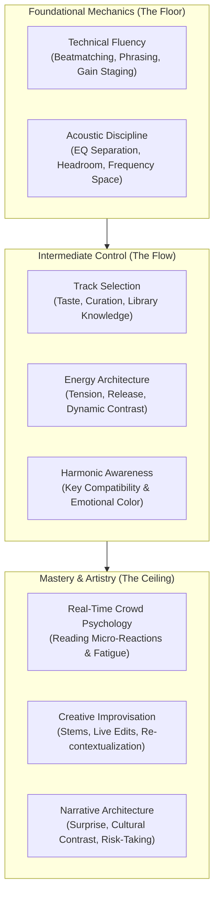

# What Actually Makes a Great DJ?

The fundamental misconception held by novices is that DJing is an equipment-operation skill—that mastering beatmatching, cue buttons, and loop encoders makes someone a great performer. In reality, equipment fluency is merely table stakes. A laptop or CDJ can beatmatch infinitely better and faster than any human ear ever could.

A truly great DJ is an **emotional architect**, an **auditory storyteller**, and a **real-time energy psychologist**.

---

## The 10 Core Dimensions of DJing

### 1. Track Selection (The 80% Rule)
* **What it is:** The art of picking the exact right song for the exact right group of human beings at the exact right second of the night.
* **Why it matters:** A technically sloppy transition between two magnificent songs will still keep people dancing. A mathematically flawless transition between two wrong songs will clear the dancefloor instantly.
* **Connected Concepts:** [[Track Selection Framework]], [[DJ - What Do I Play Next]].

### 2. Phrasing & Structural Alignment
* **What it is:** Aligning the internal architectural sentences of music (8-bar, 16-bar, 32-bar phrases) so that musical changes happen synchronously.
* **Why it matters:** When phrases clash, the listener's brain experiences subconscious cognitive friction—it feels like two people talking simultaneously, even if the beats are locked.
* **Connected Concepts:** [[Phrasing & Structure]], [[Track Anatomy & Structure]].

### 3. Timing & Rhythmic Pocket
* **What it is:** The microscopic placement of sounds within the groove. Not just matching the tempo (BPM), but aligning the transient snap of the downbeats and swing.
* **Connected Concepts:** [[Beatmatching & Tempo]], [[Listen Like a DJ]].

### 4. Acoustic & Frequency Discipline
* **What it is:** Treating the frequency spectrum (Sub, Low, Mid, High) as limited real estate where only one dominant element can live at a time.
* **Why it matters:** Muddy sound drains crowd energy physically; clean separation makes the club sound system feel punchy, loud, and effortless.
* **Connected Concepts:** [[EQ & Frequency Management]], [[Bass Swap]].

### 5. Energy Management & Dynamic Contrast
* **What it is:** The deliberate calibration of tension, release, anticipation, and silence across a set.
* **Why it matters:** Relentless maximum energy produces auditory fatigue and emotional numbness. A drop only feels massive if the preceding breakdown provided genuine hunger for the bass.
* **Connected Concepts:** [[Energy Management & Dynamics]], [[Rules vs Principles]].

### 6. Real-Time Crowd Reading
* **What it is:** Observing non-verbal cues—shoulder movement, head bobs, bar traffic, wandering eyes, phone checks—and diagnosing the room's collective mental state.
* **Connected Concepts:** [[Reading the Room & Crowd Psychology]], [[Live Performance & Crisis Management]].

### 7. Narrative & Emotional Sequencing
* **What it is:** Sequencing tracks so they tell an overarching emotional story rather than sounding like an automated shuffle playlist.
* **Why it matters:** An emotional arc creates memories. A collection of bangers creates transient dopamine that evaporates when the set finishes.
* **Artist References:** Compare how [[Fred again.. Case Study]] weaves nostalgic voice notes with club rhythms versus how [[Martin Garrix Case Study]] engineers stadium-wide euphoria.

### 8. Genre Flexibility & Cultural Contrast (Open Format)
* **What it is:** The ability to move fearlessly across stylistic boundaries (Pop $\to$ House $\to$ EDM $\to$ Drum & Bass $\to$ Hip-hop) without sounding disjointed.
* **Connected Concepts:** [[Open-Format DJing Guide]], [[Genre Bridge Playbook]].

### 9. Technical Improvisation & Live Remixing
* **What it is:** Using hot cues, live loops, stems, samples, and performance pads to dismantle tracks live on stage and reconstruct them into unrepeatable moments.
* **Connected Concepts:** [[Creative DJing]], [[Stems, Live Remixing & Ableton Integration]], [[Skrillex Case Study]].

### 10. Taste, Curation & Risk-Taking
* **What it is:** Having the courage to play the unexpected record that challenges the audience, and the cultural intelligence to know how to set it up so it works.

---

## Foundational vs. Advanced Skills Hierarchy

| Skill Category | Foundational (Must Master First) | Advanced (Artistry & Individuality) |
| :--- | :--- | :--- |
| **Rhythm** | Identifying downbeat, manual beatmatching, beat grid verification | Metric modulation, polyrhythmic layering, unquantized finger drumming |
| **Structure** | 8-bar / 16-bar phrase alignment, finding cue points | Drop swapping, live loop rearrangement, stem dissection |
| **Acoustics** | Eliminating bass clash, setting correct gain levels | 3-deck frequency carving, creative resonant filter sweeps, ducking delays |
| **Selection** | Matching BPM and Camelot key within safe parameters | Bold multi-genre leaps, cross-tempo bridging, harmonic re-contextualization |
| **Crowd** | Playing to the venue/time slot, avoiding dancefloor mass exits | Micro-reading body language, engineering collective emotional catharsis |

---

## The Ultimate Paradigm Shift

> [!IMPORTANT]
> **The goal is not to become technically perfect at DJing.**
> The goal is to develop enough technical fluency that you can stop thinking about the equipment entirely and focus 100% of your cognitive bandwidth on **music, emotion, energy, and the human beings standing in front of you.**

---

## Practice & Next Steps
* **Test Your Ears:** Proceed to [[Listen Like a DJ]] to cultivate analytical listening.
* **Understand the Balance:** Read [[Rules vs Principles]] to learn what conventions to follow and what to break.
* **First Practical Step:** Begin with [[MISSION 01 — Hear the Phrase]] in the [[Practice Lab & Progressive Curriculum]].

---
## Sources
* Morse, Phil. *Rock The Dancefloor!* (Digital DJ Tips, 2016).
* Resident Advisor. *The Art of DJing Series* (Interviews with Four Tet, Joy Orbison, Andy C). Cited in [[Source Index]].
