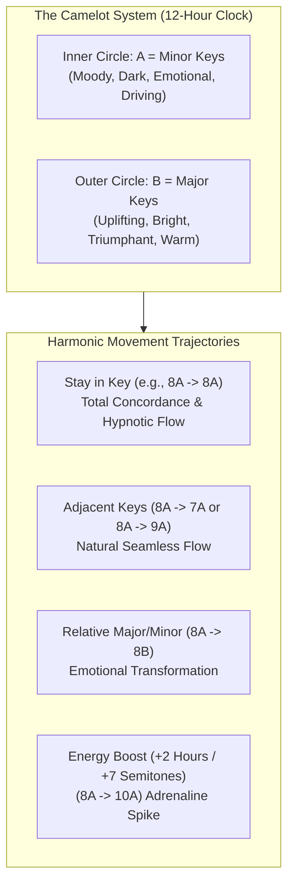

# Harmonic Mixing & The Camelot System: Tool, Not Rule

Harmonic mixing is the practice of transitioning between tracks that share compatible musical keys, or intentionally modulating between keys to engineer emotional energy shifts. 

However, harmonic mixing is frequently the most misunderstood concept in modern DJing. Beginners treat the **Camelot Wheel** like a prison cell, refusing to play incredible songs because "the numbers don't match." **Harmonic compatibility is a creative tool, not an absolute law.**



---

## 1. The Physics: Musical Keys & Dissonance

Every song is written in a key—a tonal center of gravity determined by a specific scale of 7 notes.
* **Consonance / Concordance:** When two tracks share the same scale degrees (or relative chords), their simultaneous playback creates harmonious resonance.
* **Dissonance / Clashing:** When Track A plays a note that is a minor second (one semitone) away from Track B's melody, the audio waveforms physically fight each other, producing acoustic beating and harsh, cringe-inducing discordance.

---

## 2. The Camelot Wheel Notation

Created by Mark Davis (inventor of *Mixed In Key*), the Camelot system translates traditional music theory into an intuitive 12-hour clock face:
* **The "A" Ring (Inner):** Minor keys (e.g., `8A` = A minor, `9A` = E minor, `4A` = F minor). Minor keys dominate 90% of EDM, Dubstep, Drum & Bass, and Club House.
* **The "B" Ring (Outer):** Major keys (e.g., `8B` = C major, `9B` = G major, `4B` = Ab major). Major keys dominate Pop, Uplifting Trance, and Anthem House.
* **Relative Major/Minor Pairs:** Every number has an identical key signature between A and B (e.g., `8A` [A minor] shares the exact same notes as `8B` [C major]).

---

## 3. Harmonic Navigation Trajectories

| Movement | Camelot Shift | Example | Emotional & Acoustic Effect |
| :--- | :--- | :--- | :--- |
| **Same Key** | None ($0$) | `8A` $\to$ `8A` | Perfect harmonic glue; tracks sound like a single studio production. Ideal for long blends and mashups. |
| **Adjacent (+1)** | $+1$ Hour (Clockwise) | `8A` $\to$ `9A` | Subtle, euphoric uplift; moves up a fifth (dominant modulation). Feels like positive forward momentum. |
| **Adjacent (-1)** | $-1$ Hour (Counter-clockwise) | `8A` $\to$ `7A` | Deepening, introspective mood; moves to the subdominant. Feels grounding, darker, or heavier. |
| **Relative Flip** | $\text{A} \leftrightarrow \text{B}$ | `8A` $\leftrightarrow$ `8B` | Drastic emotional transformation without clashing. Flips from moody introspection to bright sunshine. |
| **The Energy Boost** | $+2$ Hours | `8A` $\to$ `10A` | **The Truck Driver's Gear Shift:** Modulates up by a whole tone ($+2$ semitones). Creates an undeniable rush of adrenaline on the drop! |
| **The Dark Descent** | $-2$ Hours | `8A` $\to$ `6A` | Descends by a whole tone; introduces heavy, menacing weight. |
| **The Semi-Tone Clash** | $+7$ Hours | `8A` $\to$ `3A` | Modulates up $+1$ semitone (half-step). Extreme tension; must be executed on a drop cut, not a blend. |

---

## 4. When Harmonic Mixing MATTERS vs. When It Can Be IGNORED

```
CRITICAL (Key Matters 100%)       MODERATE                           NEGLIGIBLE (Ignore Key)
┌───────────────────────────────┬──────────────────────────────────┬────────────────────────────┐
│ • Vocal Acapella Overlays     │ • Vocal Intro over Chords        │ • Percussive Outro to Intro│
│ • Long Synth Melodic Blends   │ • Short 8-bar Transitional Blend │ • Hip-Hop Drum Breaks      │
│ • Emotional Breakdown Mashups │ • Basslines with Sparse Notes    │ • Echo Out / Drop Swaps    │
│ • Piano / Chord Progressions  │                                  │ • Sudden Backspins/Cuts    │
└───────────────────────────────┴──────────────────────────────────┴────────────────────────────┘
```

### When Key Compatibility is Non-Negotiable:
1. **Vocals & Acapellas:** Playing a vocal in `4A` over an instrumental in `11A` sounds disastrous. The singer will sound out of tune. (See [[Acapella Overlay]]).
2. **Melodic Drops & Progressive House:** If two tracks have prominent melodic synth leads, blending them out-of-key will cause ugly dissonance.

### When Key Compatibility Can Be Completely Disregarded:
1. **Drums & Percussion:** Kick drums, claps, hi-hats, and percussion loops have unpitched or broadband frequency distributions. A 130 BPM Tech House drum loop in `2A` can be mixed into a `9B` track effortlessly.
2. **The "Drop Swap" / Cut on the "1":** When you cut instantly from Track A's build-up into Track B's drop, there is zero harmonic overlap. The sudden key shift acts as a thrilling acoustic shock rather than a clash. (See [[Drop Swap]]).
3. **Echo Out / Filter Sweeps:** High-pass filtering Track A while echoing it out strips the fundamental tonal frequencies, clearing the harmonic spectrum for Track B to enter in any key.

---

## The 5 Pedagogical Questions for Harmonic Mixing

1. **What is it?** Aligning musical keys using the 12-hour Camelot wheel to manage melodic concordance and tension.
2. **Why does it matter?** Prevents cringe-inducing dissonant clashes during melodic blends and provides a deliberate mechanism for energy modulation.
3. **What does it sound/feel like?** In-key blends feel creamy, natural, and unified. Badly clashing keys sound like an amateur cacophony that makes dancers visibly wince.
4. **How do I practice it?** Complete the Camelot navigation drills below.
5. **When should I deliberately break the rule?**
   * Whenever crowd energy demands an immediate change of pace or a beloved anthem that happens to be in a "clashing" key. Use a non-harmonic transition technique like an [[Echo Out]], [[Filter Transition]], or [[Breakdown Transition]].

---

## Harmonic Mixing Drills

### Drill 1: The Energy Lift Test (+2 Modulation)
* Load Track A in `8A` (A minor). Find a high-energy build-up.
* Load Track B in `10A` (B minor). Set a Hot Cue on the drop.
* Blend Track B's high-passed build under Track A. On Beat 1 of the drop, slam Track B's bass in and cut Track A.
* **Listen for:** The unmistakable feeling of the crowd "lifting off" because the musical root moved up by a whole step.

### Drill 2: Resolving a Clashing Vocal (Tone Shifting)
* Take an acapella in `5A` (C minor) and a backing track in `8A` (A minor).
* In your DJ software, use **Key Shift** to move the vocal down 3 semitones (or up 9 semitones).
* Notice how the vocal snaps into the key of the track without changing its BPM or timing.

---

## Related Notes
* [[Music Fundamentals for DJs]]
* [[Track Selection Framework]]
* [[Acapella Overlay]]
* [[Drop Swap]]
* [[Rules vs Principles]]
* [[Source Index]]
