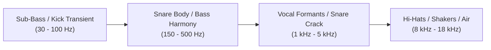

# Music Fundamentals for DJs: Applied Acoustic Theory

DJs do not need to read classical sheet music, transcribe fugues, or calculate counterpoint intervals. However, a DJ must master **applied functional music theory**: understanding how rhythm, harmony, frequency, and texture operate in human neurology and club sound systems.

For every single concept below, we answer the vital question: **Why should a DJ care?**

---

## 1. Rhythmic & Temporal Concepts

### Beat
* **What it is:** The fundamental atomic pulse of music—the recurring tick of the clock that you tap your foot to.
* **Why Should a DJ Care?** The beat is your reference point for synchronization. Every cue point, loop, and FX parameter (1/2, 1/4, 1/8 beat) is calculated in direct proportion to this atomic unit.

### Tempo & BPM (Beats Per Minute)
* **What it is:** The mathematical velocity of the beat—how many beats elapse in sixty seconds.
* **Why Should a DJ Care?** BPM dictates the physical energy and biological heart-rate resonance of the dancefloor. Jumping tempos changes physical step rate. Knowing standard genre BPM ranges allows instant repertoire grouping.

### Downbeat (Beat 1)
* **What it is:** The first, heaviest, and most authoritative beat of a musical measure (bar).
* **Why Should a DJ Care?** If you drop a track on Beat 2, 3, or 4 instead of Beat 1, the entire musical sentence is inverted. Dancers will stumble because their weight lands on the wrong foot. **Never launch an incoming track off the downbeat unless using an intentional syncopated pickup.**

### Bar (Measure) & 4/4 Time Signature
* **What it is:** A grouped container of beats. In 99% of electronic and modern pop music, the time signature is **4/4** (four quarter-note beats per bar: `1 - 2 - 3 - 4`).
* **Why Should a DJ Care?** The bar is the standard currency of transitions. You do not blend in "seconds"; you blend in bars (4 bars, 8 bars, 16 bars).

### 3/4 & Unusual Time Signatures (Waltzes & Polyrhythms)
* **What it is:** Time signatures with 3 beats per bar (Waltz/3/4) or compound meters (6/8, 5/4).
* **Why Should a DJ Care?** Trying to beatmatch a 3/4 acoustic ballad or 6/8 Afro-rhythm against a 4/4 House track without isolating elements causes rhythmic chaos. You must use breakdown swaps or acapella overlays rather than long grid blends.

### Subdivisions (Quarter, 8th, 16th, Triplets)
* **What it is:** The fractional divisions between the main beats (`1 and 2 and 3 and 4` for 8ths; `1 e and a 2 e and a` for 16ths).
* **Why Should a DJ Care?** Setting Echo, Delay, and Roll FX requires knowing subdivisions. A 1/2-beat echo creates an upbeat bounce; a 3/4 dotted delay creates hypnotic dub textures; triplet rolls create rapid trap/drum rolls.

---

## 2. Percussive Elements & Frequency Placement

### Kick Drum
* **What it is:** The low-frequency foundation ($40\text{--}100\text{ Hz}$ transient thump) that anchors dance music.
* **Why Should a DJ Care?** The kick carries the highest energy amplitude in the mix. Two simultaneous kicks will overload the mixer bus and cause destructive phase cancellation. You must manage kick handoffs ruthlessly.

### Snare & Clap
* **What it is:** The mid-frequency percussive snap ($200\text{ Hz}\text{--}3\text{ kHz}$) landing traditionally on beats 2 and 4 (or beat 3 in half-time trap/dubstep).
* **Why Should a DJ Care?** The snare defines the rhythmic feel. In 128 BPM House, the snare hits on 2 and 4 (four-on-the-floor). In 140 BPM Dubstep or 174 BPM DnB, the snare hits on 3, creating a half-time swagger. Matching snare placement is how you lock cross-genre grooves.

### Hi-Hat & Shakers
* **What it is:** The high-frequency metallic top-end ($7\text{--}16\text{ kHz}$) providing forward momentum and subdivision swing.
* **Why Should a DJ Care?** Hi-hats are your best friend for micro-beatmatching. If two kicks sound identical, listening to the high-pass click of the hi-hats in your headphones tells you instantly which track is rushing or dragging.

---

## 3. Harmonic & Melodic Concepts

### Bassline
* **What it is:** The lowest pitched musical layer ($40\text{--}250\text{ Hz}$) that establishes root harmony and groove.
* **Why Should a DJ Care?** Basslines carry both pitch and groove. Clashing basslines destroy both harmony and audio fidelity. Master the [[Bass Swap]].

### Melody & Lead
* **What it is:** The dominant sequential line of musical notes that sticks in human memory (synth riffs, vocal hooks).
* **Why Should a DJ Care?** Two simultaneous melodies create mental clutter. Only one melodic lead should take center stage; the secondary track should be stripped to percussive or harmonic pads.

### Harmony & Chord Progressions
* **What it is:** Multiple pitches sounding simultaneously to create emotional depth (Major = bright/triumphant, Minor = dark/introspective/tense).
* **Why Should a DJ Care?** Chord progressions determine whether two songs sound like they were written together or like an auditory car crash. Mixing compatible chord progressions creates euphoric live mashups.

### Key (Major vs. Minor)
* **What it is:** The tonal center of gravity that all musical notes in a song resolve toward.
* **Why Should a DJ Care?** Key compatibility allows seamless, musical blending without dissonance. (See [[Harmonic Mixing & Camelot System]]).

---

## 4. Acoustic, Psychoacoustic & Dynamic Concepts

### Energy & Spectral Density
* **What it is:** The total perceived acoustic power and frequency saturation of a track.
* **Why Should a DJ Care?** Energy controls dancefloor adrenaline. If you drop a low-density track immediately after a maximum-density wall-of-sound drop without a bridge, the crowd experiences an energy vacuum.

### Dynamics (Peak vs. RMS / Loudness)
* **What it is:** The variation in volume between the quietest passages and the loudest climaxes.
* **Why Should a DJ Care?** Modern club masters are heavily compressed and limited. Over-compressed tracks sound fatiguing over time. You must use breakdowns and dynamic valleys to let the ears reset.

### Timbre & Texture
* **What it is:** The unique acoustic color and harmonic fingerprint of a sound (e.g., a warm Rhodes piano vs. a metallic neurofunk reese bass).
* **Why Should a DJ Care?** Tracks with complementary textures blend effortlessly. Mixing an organic, warm acoustic vocal over a cold, clinical industrial techno beat can either create stunning artistic contrast or harsh sonic friction depending on your EQ carving.

---

## Related Concepts
* [[Phrasing & Structure]]
* [[Harmonic Mixing & Camelot System]]
* [[EQ & Frequency Management]]
* [[Track Anatomy & Structure]]
