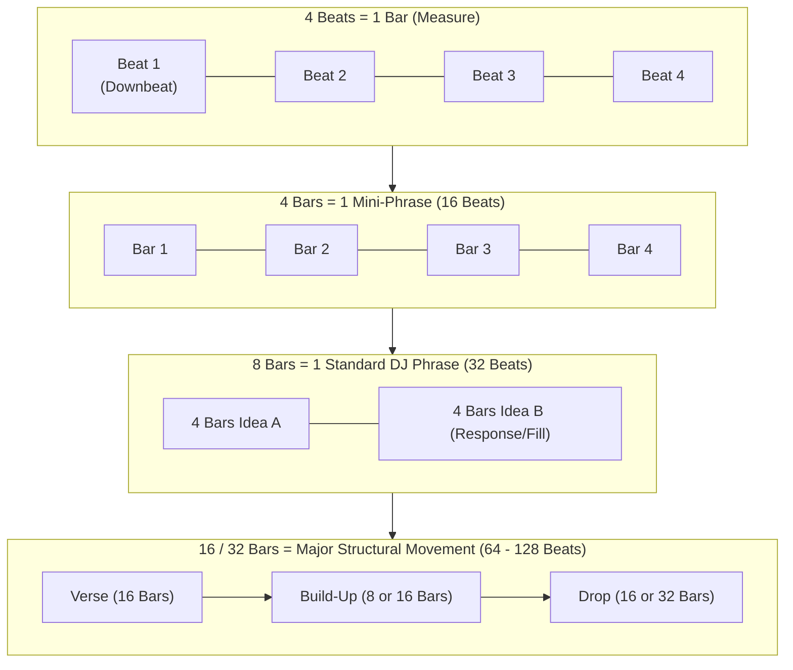

# Phrasing & Structural Alignment: The Secret to Musical Mixing

If beatmatching is the process of getting two clocks to tick at the exact same speed, **phrasing is making sure both clocks strike midnight at the exact same second.**

Understanding phrasing is the single biggest conceptual leap that transforms an amateur "button-pusher" into a polished, musical DJ. **A transition can be mathematically 100% beatmatched and in perfect harmonic key, yet still sound completely amateurish, trainwrecked, and jarring if the phrases are misaligned.**



---

## 1. The Anatomy of Musical Phrases

Western music—and electronic dance music in particular—is structured like spoken language:
* **Words:** Beats ($1, 2, 3, 4$)
* **Sentences:** Bars ($4\text{ beats}$)
* **Paragraphs:** 8-Bar Phrases ($32\text{ beats}$)
* **Chapters:** 16-Bar and 32-Bar Sections ($64\text{ to }128\text{ beats}$)

### The 32-Beat (8-Bar) Building Block
In almost all electronic music (House, EDM, Techno, Drum & Bass, Pop), musical ideas unfold in **8-bar chunks (32 beats)**.
* Bars 1–4: Statement (Theme introduced).
* Bars 5–7: Development or variation.
* Bar 8: The **Resolution & Fill** (Drum roll, vocal pickup, cymbal crash, white noise sweep signaling a transition).

---

## 2. Why Beatmatched Transitions Sound "Wrong" Without Phrase Alignment

Imagine two people having a conversation where both speak at exactly 120 words per minute, but Person B starts talking in the exact middle of Person A's sentence. Even though they are talking at the identical cadence, it feels chaotic, rude, and unlistenable.

### The Phenomenon of Phrase Clashing:
1. **The Dropped Drop:** Track A is reaching the climax of its build-up (ready to drop on Bar 1). You drop Track B 4 bars too late. When Track A drops its monster kick drum, Track B is still playing a weak riser. The impact is totally deflated.
2. **Double Fills / Cacophony:** If both tracks execute a complex drum fill at different bars, the drums stumble over each other, making the mix sound cluttered.
3. **Premature Vocal Entry:** Track A's vocal is finishing its emotional chorus, but Track B's vocal suddenly barges in 8 bars early, causing overlapping lyrical clashes.

---

## 3. Perfect Phrase Alignment in Practice

To achieve seamless, professional transitions, you must align the phrase boundaries of both songs:

```
Track A (Playing): | Bar 1  2  3  4  5  6  7  8  | Bar 9 10 11 12 13 14 15 16 | (DROP / CHORUS)
Track B (Incoming): | Bar 1  2  3  4  5  6  7  8  | Bar 9 10 11 12 13 14 15 16 | (DROP / CHORUS)
                    ▲                                                          ▲
                    Launch Track B Cue on Bar 1                                Both hit DROP together!
```

When aligned this way:
* Both tracks build tension synchronously.
* The risers in Track A and Track B swell together.
* On Bar 16, beat 4, both tracks cut their low-end or drop into silence simultaneously.
* On Bar 17, Beat 1: You execute a [[Bass Swap]] or drop swap, and the new drop hits with colossal, unified impact!

---

## The 5 Pedagogical Questions for Phrasing

1. **What is it?** The alignment of 8, 16, and 32-bar structural cycles between two pieces of music.
2. **Why does it matter?** Human psychology anticipates structural changes at regular powers of two ($2, 4, 8, 16, 32$ bars). Aligning phrases makes transitions feel natural, inevitable, and emotionally satisfying.
3. **What does it sound/feel like?** When locked, the transition feels like a single song undergoing a magnificent, pre-composed arrangement change. When broken, it feels sloppy, jarring, and amateur.
4. **How do I practice it?** Complete the phrase counting and alignment drills below.
5. **When should I deliberately break the rule?**
   * **The "Fake-Out" / Abrupt Drop Swap:** Cutting on Bar 9 or Bar 13 to catch the crowd off-guard with an unexpected drop (see [[Skrillex Case Study]]).
   * **The 4-Bar Quick-Strike:** In fast-paced open-format or hip-hop sets, cutting a track after only 4 or 8 bars before crowd fatigue sets in.
   * **Songs with Odd Structures:** Classic disco, 1970s funk, or progressive rock often feature 6-bar or 10-bar phrases. When mixing these, you must use cue points, loops, or breakdown cuts to bypass odd phrase counts.

---

## Practical Listening & Counting Exercises

### Drill 1: The Out-Loud Phrase Count
1. Load any House, Pop, or EDM track.
2. Find the downbeat (Beat 1).
3. Count out loud with this specific cadence:
   * `1, 2, 3, 4` (Bar 1)
   * `2, 2, 3, 4` (Bar 2)
   * `3, 2, 3, 4` (Bar 3)
   * `4, 2, 3, 4` (Bar 4)
   * `5, 2, 3, 4` (Bar 5)
   * `6, 2, 3, 4` (Bar 6)
   * `7, 2, 3, 4` (Bar 7)
   * `8, 2, 3, 4` (Bar 8 - Listen for the fill!)
4. On the next beat, call out: **"PHRASE TWO, BAR ONE!"** (`1, 2, 3, 4`).
5. Notice how on every "Bar 1," a new element (hi-hat, bassline, synth pad, vocal) enters or drops out.

### Drill 2: Visualizing Phrase Alignment
* Load Track A (e.g., 16-bar intro).
* Load Track B (e.g., 16-bar build-up).
* Start Track B's build-up on Bar 1 of Track A's verse. Time it so that Track B's drop lands precisely on the moment Track A's verse finishes.
* Record the transition and listen back in your car or headphones. Did the change feel "natural"?

---

## Related Notes
* [[What Makes a Great DJ]]
* [[Track Anatomy & Structure]]
* [[Beatmatching & Tempo]]
* [[Basic Blend]]
* [[Drop Swap]]
* [[MISSION 01 — Hear the Phrase]]
