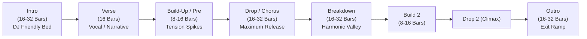
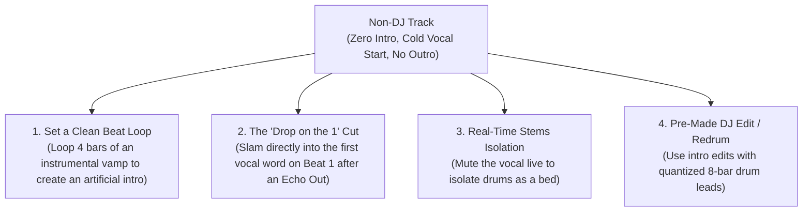

# Track Anatomy & Structural Analysis: Visual & Aural Deconstruction

To mix with authority and speed, a DJ must look at an audio waveform—or hear 5 seconds of a track—and immediately visualize its structural anatomy. A track is not a monolithic recording; it is a modular sequence of energy blocks designed for tension, storytelling, and physical release.

---

## 1. The 16 Structural Elements Deconstructed

### 1. Intro (The Entrance Ramp)
* **What it is:** The opening section (usually 8, 16, or 32 bars). In club music, it consists of stripped-back drums and subtle bass before the main melodic themes appear.
* **DJ Purpose:** The designated mixing window where Track B is introduced while Track A is exiting.

### 2. Outro (The Exit Ramp)
* **What it is:** The closing section of a song where elements progressively drop away until only percussion remains.
* **DJ Purpose:** The safest canvas for a smooth [[Basic Blend]] or [[Long Blend]].

### 3. Verse (Narrative & Story)
* **What it is:** Lower-energy section where the main lyrics unfold. Lower spectral density.
* **DJ Purpose:** Great for introducing subtle rhythmic elements or teasing the next song's hi-hats.

### 4. Pre-Chorus / Build-Up (The Tension Engine)
* **What it is:** The section immediately preceding the drop. Characterized by rising pitch (shepard tones, pitch-bent synths), snare rolls doubling in speed ($1/4 \to 1/8 \to 1/16 \to 1/32$), rising white noise risers, and the complete removal of sub-bass frequencies.
* **DJ Purpose:** Crucial for aligning transitions. Bringing in Track B's build while Track A is building creates massive, exponential tension.

### 5. Drop (The Payoff / Physical Catharsis)
* **What it is:** The moment of explosive impact where the full drum kit, sub-bass, and main musical hook collide.
* **DJ Purpose:** The destination point of your mix. The drop is where [[Bass Swap]], [[Drop Swap]], or [[Double Drop]] occur.

### 6. Chorus / Main Hook
* **What it is:** The most memorable melodic, lyrical, or rhythmic theme of the song. In Pop, it is sung; in EDM/Dubstep/DnB, the chorus *is* the instrumental Drop.

### 7. Breakdown (The Reset Valley)
* **What it is:** An ambient section in the middle of a song where the kick drum completely drops out, leaving only vocals, pads, or chords.
* **DJ Purpose:** An invaluable "mixing pocket." Because there are no drums to clash, breakdowns are ideal for changing BPM or modulating genres. (See [[Breakdown Transition]]).

### 8. Bridge
* **What it is:** A contrasting musical departure (often 8 bars) offering a fresh chord progression or new vocal perspective before the final climax.

### 9. Instrumental Section
* **What it is:** Any passage devoid of human vocals.
* **DJ Purpose:** Safe territory for layering an incoming vocal or playing a live acapella without clash.

### 10. Vocal Section
* **What it is:** Passages dominated by human speech or singing.
* **DJ Caution:** Two simultaneous vocal sections will produce catastrophic lyrical clash ("verbal traffic jam").

### 11. Hook
* **What it is:** A short, infectious melodic or vocal motif ($1\text{ to }4\text{ bars}$) designed to stick in memory.

### 12. Fill (The Architectural Signpost)
* **What it is:** A rapid drum roll or sonic glitch lasting 1 or 2 beats at the end of a phrase (e.g., bar 8, beat 4).
* **DJ Purpose:** The audio cue that tells your ear: "Get ready to cut or swap basslines on the next downbeat!"

### 13. Transition Section
* **What it is:** A designated bridge (often 4–8 bars) designed to pivot between two distinct rhythms or feels.

### 14. Drum-Only / Percussion Section
* **What it is:** Stripped passage containing zero melodic or harmonic pitch information.
* **DJ Purpose:** Neutral territory where key compatibility can be 100% ignored.

---

## 2. Structural Comparisons Across Genres

| Genre | Typical Intro/Outro | Build Length | Drop / Chorus Structure | Primary Transition Zone |
| :--- | :--- | :--- | :--- | :--- |
| **Club House / Tech House** | Long (32–64 bars), clean kick/hats | Short/Subtle (8–16 bars) | Rolling groove; subtle bassline modulation | Extended 32-bar blends across Outro $\to$ Intro |
| **Festival EDM / Progressive** | Medium (16 bars) or non-existent | Long & Intense (16–32 bars) | Explosive supersaw melodic drop (16 bars) | Build-to-Drop cuts or Breakdown overlays |
| **Drum & Bass (DnB)** | Ambient or rolling (16–32 bars) | Intense, fast riser (16 bars) | High-speed kinetic bassline (32–64 bars) | Double drops or fast 16-bar cuts on phrase 1 |
| **Commercial Pop** | Very Short (2–4 bars) or immediate vocal | Short Pre-Chorus (8 bars) | Sing-along vocal chorus (16 bars) | Quick cuts on beat 1 or acapella overlays |
| **Hip-Hop & Trap** | Short (4–8 bars) | 4–8 bar snare roll / 808 drop | 16-bar hook / 16-bar verse | Quick cuts, backspins, or tone play on chorus 1 |
| **Dubstep / Bass Music** | Melodic / Cinematic (16 bars) | Aggressive riser (8–16 bars) | Half-time heavy bass drops (16 bars) | Drop swaps and instant cuts on the "1" |

---

## 3. Adapting Songs NOT Designed for DJ Mixing (Radio Pop, Classic Rock, Ballads)

Radio edits and non-electronic songs lack DJ-friendly 32-bar drum intros. They frequently open directly with a vocal or end abruptly with a cold fade-out.

### 4 Battle-Tested Tactics for Adapting Non-DJ Tracks:
1. **The Instant Loop Bed:** Find a 2-bar or 4-bar instrumental passage (often between chorus and verse 2). Save a **Hot Cue** and engage an **Auto-Loop**. Use this as your customized, loopable DJ intro!
2. **The "Echo Out" Cold Drop:** Apply a 1/2-beat echo to Track A on the downbeat of bar 8, cut the fader, and trigger the non-DJ track's vocal directly on Beat 1 of the new phrase.
3. **Stems Acapella Lift:** Use software stems to mute everything except the vocal of the pop song, dropping it seamlessly over the groove of a currently playing House or DnB track. (See [[Stems Transition]]).
4. **The Tone Play / Word Play Bridge:** Match a spoken lyric from Track A to trigger the first word of Track B.

---

## The 5 Pedagogical Questions for Track Anatomy

1. **What is it?** The modular functional sections that comprise modern music arrangement.
2. **Why does it matter?** Knowing track anatomy lets you predict where energy rises and falls, preventing clashing vocals or dropped drops.
3. **What does it sound/feel like?** You stop hearing an undifferentiated song; instead, you hear distinct lego blocks fitting together.
4. **How do I practice it?** Use the [[DJ - Track Analysis Template]] to deconstruct 5 diverse songs in your library.
5. **When should I deliberately break the rule?**
   * Cut straight into the middle of a verse or drop Track B's chorus out of nowhere when you need an immediate crowd sing-along shock.

---

## Related Notes
* [[Short-Form & Viral Track Architecture (The 32-Bar Rule)]]
* [[Vocal Punchline Drop Snap]]
* [[Phrasing & Structure]]
* [[Energy Management & Dynamics]]
* [[DJ - Track Analysis Template]]
* [[Drop Swap]]
* [[Stems Transition]]
