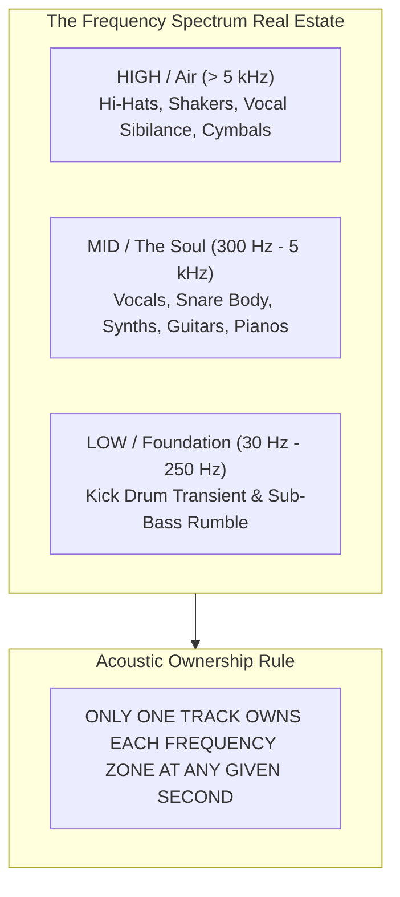

# EQ & Frequency Management: "Who Owns the Spectrum Right Now?"

The single most common mistake of intermediate DJs is treating EQ knobs like random volume sliders that they fiddle with absentmindedly during a mix. 

In professional acoustic engineering, EQ management is governed by a singular, non-negotiable mental model: **"Who owns the frequency spectrum right now?"**

The human auditory system and club sound systems have finite bandwidth and headroom. When two songs play at once, they must never fight for the same acoustic real estate. If two sounds try to occupy the same frequency band simultaneously, the result is **auditory masking**, **comb filtering**, and **mud**.

---

## 1. Gain, Volume & Headroom vs. Clipping

### Gain / Trim (Input Pre-Amplification)
* **What it is:** The control knob at the very top of each channel strip that normalizes the raw input volume of the audio file.
* **Why it matters:** Tracks produced in different eras, studios, or master formats have vastly different volume levels. A 1990s house track will sound quiet; a 2024 hyper-compressed EDM track will blast your ears.
* **Proper Gain Staging:** Cue the track at its loudest section (the drop). Adjust the **Trim/Gain** knob until the meter bounces consistently in the solid **green and amber zone** (usually around $0\text{ dB}$ to $+3\text{ dB}$). **NEVER enter the red.**

### Channel Fader (Performance Balance)
* **What it is:** The linear upfader that controls how much of the pre-amplified, EQ'd audio feeds the master summing bus.

### Headroom & Clipping (The "Redline" Myth)
* **Headroom:** The dynamic safety buffer between your highest audio peak and the point where the digital/analog circuits distort.
* **The "Redline" Myth:** Amateur DJs believe turning gains into the flashing red lights makes the sound louder. **It does not.** On digital club mixers (Pioneer DJM-900NXS2, DJM-A9), redlining triggers hard digital limiting and harmonic distortion. On the club PA, the sound engineer's system limiter clamps down harder, making your music sound dull, flattened, harsh, and physically quieter while fatiguing the crowd's ears.

---

## 2. Frequency Masking & Acoustic Conflicts

### The Sub/Kick Conflict ($30\text{--}120\text{ Hz}$)
* **The Physics:** Low frequencies produce enormous physical acoustic displacement. When two kicks or sub-basses play together, their waveforms either sum constructively (causing sudden, violent volume spikes that clip the system) or destructively (phase cancellation where the bass completely disappears, sounding hollow).
* **The Law:** **Zero Sub-Bass Overlap.** During any transition, one track's Low EQ must be dialed down (typically to 7 o'clock / kill, or 9 o'clock) until the exact downbeat where you execute the [[Bass Swap]].

### The Mid-Range Vocal Conflict ($300\text{ Hz}\text{--}3\text{ kHz}$)
* **The Physics:** The human ear is evolutionary tuned to the human voice band ($1\text{--}3\text{ kHz}$). When two songs with prominent vocals or heavy synth leads play at full Mid EQ, human speech intelligibility collapses. It sounds like two televisions shouting over each other.
* **The Law:** If Track B has a vocal, Track A's Mid EQ must be carved back to 10 or 9 o'clock to create a clear "acoustic pocket."

### The High-End Clatter ($5\text{--}16\text{ kHz}$)
* **The Physics:** Clashing hi-hat patterns (e.g., a straight 16th-note hat against a swung triplet shaker) sound like rattling silverware.
* **The Law:** Bring Track B's High EQ in at 9 or 10 o'clock. As you transition, gradually swap the Highs to transfer the top-end groove energy cleanly.

---

## 3. Dedicated Filters (HPF vs. LPF)

Filters are steep, resonant frequency sweepers (typically 12dB or 24dB per octave curves) controlled by the central **Color FX** knob:
* **High-Pass Filter (HPF - Turn Right):** Progressively cuts all bass frequencies, letting only high frequencies pass through.
  * *DJ Usage:* The ultimate transition tool. Sweeping HPF to 12 o'clock removes the sub-bass and kick while preserving crisp vocals and percussion, preparing the floor for an incoming bassline.
* **Low-Pass Filter (LPF - Turn Left):** Progressively cuts all high and mid frequencies, leaving only muffled, underwater low-end thumps.
  * *DJ Usage:* Useful for subtly sneaking in the rhythm of an incoming track under an existing melody without crowd detection.

---

## 4. Isolator Mode vs. Standard EQ

* **Standard EQ:** Typically cuts frequencies down to $-26\text{ dB}$. Even with the knob turned fully counter-clockwise, faint audio still bleeds through.
* **Isolator (ISO) Mode:** Cuts frequencies down to **$- \infty\text{ dB}$ (total silence / true kill)**.
* *Professional Recommendation:* **Set your mixer/software EQ mode to ISOLATOR.** True kill allows you to completely silence the bass or vocals on Channel B, turning any track into an instant stem or instrumental without buying specialized edits.

---

## The 5 Pedagogical Questions for EQ Management

1. **What is it?** The intentional spatial division of acoustic frequency bandwidth between audio channels.
2. **Why does it matter?** Prevents destructive acoustic interference, avoids mixer clipping, and ensures physical punch on club PA systems.
3. **What does it sound/feel like?** Proper EQ separation makes the mix sound transparent, wide, deep, and heavy. Bad EQ sounds muddy, boomy, harsh, and strangely weak.
4. **How do I practice it?** Complete the [[EQ Blend]] and [[Bass Swap]] drills.
5. **When should I deliberately break the rule?**
   * During dramatic build-ups, slightly leaving two Mid EQs at 11 o'clock can create intentional acoustic tension and density right before a drop cut.

---

## Concrete Frequency Ownership Scenarios

### Scenario A: Pop Vocal Over a Tech House Groove
* **Tech House (Track A):** Owns the **LOW** (100% kick and sub) and **HIGH** (crisp percussion). Mid EQ turned to 9 o'clock.
* **Pop Track (Track B):** Low EQ at **zero (kill)**. High EQ at 9 o'clock. Mid EQ at **12 o'clock (center)**.
* *Result:* Track B's vocal sits cleanly in the pocket provided by Track A's groove. Zero mud.

### Scenario B: The Clean Bassline Swap
* Track A is rolling.
* Bring in Track B with Low EQ at 7 o'clock (completely muted), Mids at 10 o'clock, Highs at 11 o'clock.
* At Bar 16, beat 4: Drum fill triggers.
* On Beat 1 of the new phrase: **In one decisive motion, snap Track A's Low EQ from 12 o'clock to 7 o'clock, and snap Track B's Low EQ from 7 o'clock to 12 o'clock.**
* *Result:* The crowd feels an instant, thunderous transition of groove with zero volume dip or phase cancellation.

### Hazard: Dead Air From Muting the Only Band the Other Track Has
Ownership is a hand-off, so the incoming track must actually contain the band you let through. Cutting Track A to its highs and bringing Track B in on "drums only" leaves a hole if B has no drums at that point (a long ambient intro, an empty stem after a remix or acapella cut). The master goes near silent for a second or two, which a dancefloor hears as a crash. Check that the band you are handing over is audible on the incoming track before you cut the outgoing one; otherwise keep A's full mix and bring B in on the stem that plays (or use an [[Echo Out]]). The same applies to stem tricks such as a voice-alone strip or synth hold on a stem with no energy in that section.
---

## Related Notes
* [[Bass Swap]]
* [[EQ Blend]]
* [[Filter Transition]]
* [[Track Anatomy & Structure]]
* [[Source Index]]
