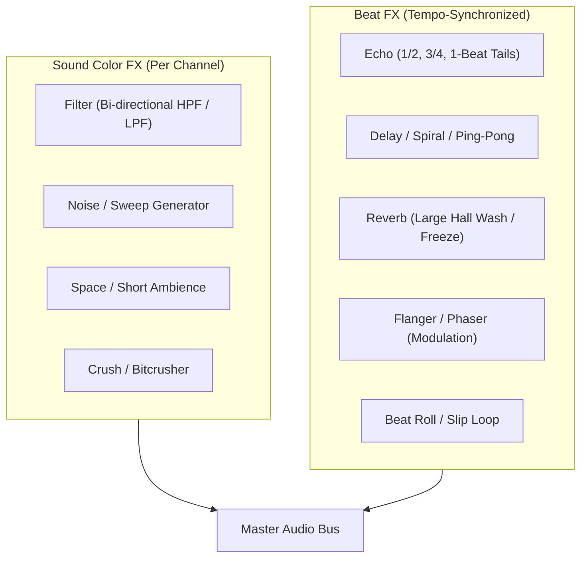

# Effects (FX) Mastery: Tasteful Seasoning vs. Acoustic Abuse

DJ effects (FX) are powerful auditory tools designed to smooth transitions, create synthetic tension, mask abrupt tempo or key changes, and add spatial dimension to a performance. 

However, effects are like **culinary salt**: a precise pinch elevates the flavor; dumping the entire shaker on the plate ruins the meal. **The trademark of an insecure amateur DJ is the "nervous flanger"—constantly twisting knobs and engaging random effects out of boredom or anxiety.** Master DJs use FX with deliberate, surgical intent.

---

## 1. Sound Color FX vs. Beat FX

### Sound Color FX (Channel-Specific / Rotary)
* **What they are:** Instant, knob-per-channel effects controlled by the large center knob located directly beneath the EQ strip.
* **Filter:** Center is OFF. Turn left for Low-Pass (LPF); turn right for High-Pass (HPF).
* **Noise:** Injects white noise tuned to the channel filter. Used sparingly during builds to simulate rising steam or crowd applause.
* **Sweep / Space:** Adds subtle room reflection and stereo width.

### Beat FX (Master / Bus-Assignable / Tempo-Locked)
* **What they are:** High-precision digital effects synchronized mathematically to the BPM and beat grid of the selected deck or master bus.
* **Subdivision Settings:** Typically controlled via tactile buttons ($1/16, 1/8, 1/4, 1/2, 3/4, 1, 2, 4\text{ beats}$).

---

## 2. Core Effects Deconstructed

### 1. Echo / Tape Delay
* **Acoustic Function:** Repeats audio at precise rhythmic intervals, with each repetition decaying in amplitude.
* **Crucial Subdivisions:**
  * **1/2 Beat:** Fast, bouncy rhythmic slapback. Fantastic for vocal transitions and bouncy house exits.
  * **3/4 Beat (Dotted 8th):** Hypnotic, syncopated reggae/dub delay that floats over a 4/4 beat without masking the downbeat.
  * **1 Beat:** Straight repetition; reinforces the quarter-note pulse.
* **The "Echo Out" Transition:** One of the most essential transitions in open-format DJing. (See [[Echo Out]]).

### 2. Reverb (Hall / Plate / Freeze)
* **Acoustic Function:** Simulates acoustic space by generating thousands of micro-reflections, pushing a sound "back" in the stereo field.
* **Warning:** Low frequencies inside a reverb create an unbearable, muddy sonic sludge. **Always engage a high-pass filter or low-cut when using large reverbs.**

### 3. Flanger & Phaser (Modulation FX)
* **Acoustic Function:** Combines the original signal with a delayed copy whose delay time is modulated by an LFO (Low-Frequency Oscillator), creating a sweeping "jet engine" whoosh.
* **Usage Rule:** Use sparingly—no more than once or twice in a 60-minute set, strictly during an 8-bar build-up. Leaving a flanger on over a main drop ruins the track's transient punch.

### 4. Roll / Slip Roll
* **Acoustic Function:** Captures a 1/2, 1/4, or 1/8 beat slice and stutters it continuously until disengaged. (See [[Loop Roll]]).

---

## 3. The Golden Rules of FX Discipline

1. **FX Are For Transitions & Builds, Not The Groove:** Never leave an effect engaged over the drop or the main groove unless you are intentionally creating a breakdown. Let the producer's master engineering breathe.
2. **Cut The Lows Before Applying Wet Reverb:** Never reverb an active kick drum or sub-bass.
3. **Turn the Effect OFF Before Starting the Next Song:** The classic amateur mistake is launching Track B only to discover a 100% wet flanger was accidentally left active on the channel.

---

## The 5 Pedagogical Questions for Effects Mastery

1. **What is it?** Real-time DSP algorithms that manipulate time (echo, reverb), frequency (filters), and phase (flanger, phaser).
2. **Why does it matter?** Bridges songs that cannot be beatmatched, masks abrupt BPM/key changes, and generates artificial tension.
3. **What does it sound/feel like?** Seasoned correctly, it sounds like an expensive cinema trailer or a live studio dub session. Overused, it sounds like an amateur frantically twiddling knobs in an arcade.
4. **How do I practice it?** Complete the [[Echo Out]] and [[Filter Transition]] drills in the cookbook.
5. **When should I deliberately break the rule?**
   * **The "Dub Out" / Space Echo:** In dub techno or experimental sets, intentionally sending a snare drum into an oscillating, near-infinite feedback delay loop creates sublime psychedelic atmospheres (championed by artists like [[Four Tet]]).

---

## Related Notes
* [[Echo Out]]
* [[Filter Transition]]
* [[Reverb Transition]]
* [[EQ & Frequency Management]]
* [[Rules vs Principles]]
