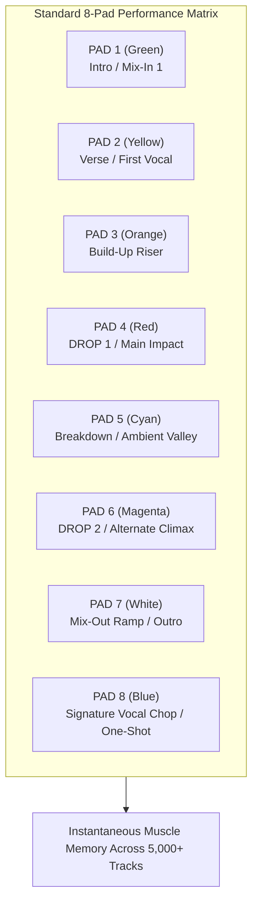

# Hot Cues & Performance Pads: Tactical Setup & Live Play

Hot Cues turn your DJ deck from a linear playback machine into a dynamic, responsive instrument. By establishing an organized, uniform Hot Cue architecture across your entire music library, you can navigate any track instantaneously during live sets without hunting through waveforms.

---

## 1. The Standardized 8-Pad Hot Cue System

If you place your Hot Cues randomly on every song (e.g., Pad 1 is the drop on Song A, but the intro on Song B), you will hesitate under pressure and make catastrophic errors. **Standardize your cues across your entire library:**

| Pad # | Function | Color Coding | Tactical Purpose |
| :---: | :--- | :--- | :--- |
| **Pad 1** | **Intro / Beat 1** | **Green** | Clean mix-in point for standard 32-bar beatmatched blend. |
| **Pad 2** | **Main Verse / Vocal Start** | **Yellow** | Instant start if you want to skip an extended DJ intro. |
| **Pad 3** | **Build-Up Start** | **Orange** | 8 or 16 bars before the drop. Used for build-to-drop swaps. |
| **Pad 4** | **MAIN DROP (Downbeat)** | **Red** | **The Nuclear Option.** Instant trigger for drop swaps, slam cuts, and quick drops. |
| **Pad 5** | **Breakdown (Melodic Valley)** | **Cyan** | Safe zone to reset tempo or drop an acapella with zero drums. |
| **Pad 6** | **Drop 2 / VIP Drop** | **Magenta** | The alternate or higher-energy drop. |
| **Pad 7** | **Mix-Out Exit Door** | **White** | The exact bar where the track strips back to percussion. |
| **Pad 8** | **Signature Vocal Chop / Stabs** | **Blue** | 1-shot vocal or horn hit used for live cue drumming/teasing. |

---

## 2. Advanced Performance Pad Modes

Modern controllers and CDJs offer specialized performance modes accessible via top mode buttons:
* **Hot Cue Mode:** Instant jump and play.
* **Pad FX:** Assigns temporary, momentary effects to pads (e.g., Pad 1 = 1/2-beat Roll, Pad 2 = Reverb freeze, Pad 3 = Pitch slip).
* **Beat Jump Mode:** Pads trigger instant temporal jumps ($-1, +1, -4, +4, -8, +8, -16, +16\text{ bars}$).
* **Key Shift / Pitch Play:** Transposes a single hot cue up and down in semitones across the 8 pads, turning a vocal chop or synth stab into a playable synthesizer keyboard for **Tone Play**.
* **Stems Mode:** Mutes or solos Drums, Vocal, Bass, and Melodic elements on individual pads in real time.

---

## 3. Cue Drumming & Vocal Teasing

* **Cue Drumming:** Rhythmically tapping a hot cue button (often with **Quantize** enabled) to create live percussive syncopation before launching the song on the "1".
  * *Example:* Tapping Pad 8 (vocal shout "Yeah!") on beats `4 and` right before dropping the kick on Beat 1.
* **The "Tease":** While Track A is playing its peak verse, tapping Track B's iconic vocal or synth hook on Pad 8 every 4 bars. The crowd instantly recognizes the upcoming track, generating massive anticipation before you even touch the fader.

---

## The 5 Pedagogical Questions for Hot Cues

1. **What is it?** Instantaneous, non-destructive memory markers that snap playback to specific timestamps.
2. **Why does it matter?** Eliminates the need to wait for a song to play through linearly, allowing instant drop swapping, live restructuring, and rapid multi-track mashups.
3. **What does it sound/feel like?** Fluid, responsive, and dynamic. Done poorly without Quantize, it sounds like uncoordinated stumbling.
4. **How do I practice it?** Map 10 songs to the standardized 8-pad layout, then practice jumping from Pad 1 to Pad 4 instantly on the phrase.
5. **When should I deliberately break the rule?**
   * **Unquantized Gate Tapping:** Turning Quantize OFF to tap a vocal chop rapidly like an unquantized MPC finger-drummer (a signature technique of [[Fred again.. Case Study]]).

---

## Related Notes
* [[Phrasing & Structure]]
* [[Loops & Beat Jumps]]
* [[Drop Swap]]
* [[Fred again.. Case Study]]
* [[Practice Lab & Progressive Curriculum]]
