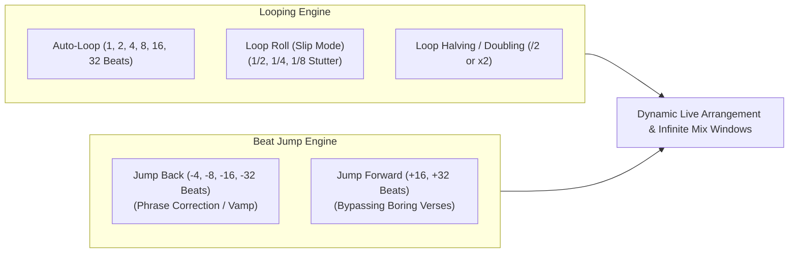

# Loops & Beat Jumps: Time Travel on the Decks

Loops and Beat Jumps are your ultimate time-manipulation mechanisms. Instead of being passive passengers on a track's pre-recorded timeline, mastering loops and beat jumps allows you to rewrite the arrangement, extend transitions indefinitely, correct phrase errors in real time, and engineer explosive tension builds.

---

## 1. Loop Mechanics & Strategic Applications

### 1. Extending the "Mix Window" (The Infinite Outro/Intro)
* **The Problem:** Many pop songs or vocal tracks have an outro that lasts only 4 bars before fading out cold. You do not have enough time to blend in your next track cleanly.
* **The Solution:** Set an **8-bar or 16-bar Auto-Loop** on a percussive section before the song ends. This freezes time, giving you an infinite, steady groove over which to introduce Track B at your own pace.

### 2. Building Pre-Drop Tension (Loop Halving / Build-Up Creation)
* **The Technique:** Take an iconic 1-bar vocal hook (e.g., "Let's go!").
* Set an active 4-beat loop.
* Every 4 bars, press the **`/2` (Loop Half)** button:
  * 4 beats $\to$ 2 beats $\to$ 1 beat $\to$ 1/2 beat $\to$ 1/4 beat $\to$ 1/8 beat buzzing stutter.
* Combine this halving with a high-pass filter sweep and rising reverb.
* On Beat 1 of the drop, release the loop and drop Track B! (See [[Loop Roll]]).

### 3. Loop Length vs. Musical Phrasing
* **Crucial Rule:** Loops must respect the power-of-two rule ($4, 8, 16, 32\text{ beats}$).
* If you accidentally set a 3-beat or 5-beat manual loop, you will instantly break phrase alignment and shift the downbeat onto beat 2 or 4. Always use **Quantized Auto-Loops** unless you are intentionally creating an unquantized glitch polyrhythm.

---

## 2. Beat Jump: The Ultimate Real-Time Phrase Repair Tool

### What Beat Jump Is
Beat Jump allows you to instantly move the playback position backward or forward by a mathematically exact quantity of beats ($1, 2, 4, 8, 16, 32$) without breaking the beat grid or stopping playback.

### Why Every Pro DJ Relies on Beat Jump:
1. **The Instant Phrase Correction:** You realize you launched Track B 8 bars too early—its drop is going to hit right in the middle of Track A's verse. **Solution:** Tap `Beat Jump -8 Bars` (or `-32 beats`) on Track B. The track leaps backward by an exact 8-bar phrase, instantly restoring perfect phrase alignment without missing a single kick drum.
2. **Bypassing the Lull:** A track's second verse is dragging the dancefloor down. Tap `Beat Jump +16 Bars` to skip the verse entirely and land directly on the build-up or second drop.

---

## The 5 Pedagogical Questions for Loops & Beat Jumps

1. **What is it?** Real-time digital repetition (loops) and temporal jumping (beat jump) synchronized to the beat grid.
2. **Why does it matter?** Gives you total control over song arrangement, allowing you to lengthen short intros, correct timing mistakes instantly, and generate dramatic build-ups on the fly.
3. **What does it sound/feel like?** Seamless loop playback sounds indistinguishable from an original studio groove. Poorly timed loops sound repetitive, monotonous, and stale.
4. **How do I practice it?** Complete the Loop Exit and Beat Jump phrase repair drills below.
5. **When should I deliberately break the rule?**
   * **The 3/4 Loop Polyrhythm:** Setting a 3-beat loop on a vocal or synth riff over a 4/4 drum beat creates a hypnotic polyrhythmic phasing effect beloved in minimalist techno and deep electronic music.

---

## Practical Drills

### Drill 1: The Emergency Phrase Correction Drill
* Play Track A.
* Start Track B deliberately 8 bars out of phrase (e.g., launch Track B on Bar 5 instead of Bar 1).
* Listen to the disharmony in your headphones.
* Identify the error, set Beat Jump to `8 Bars (32 Beats)`, and press `Beat Jump Forward (+)` or `Back (-)`.
* Hear the phrase snap back into lock immediately.

### Drill 2: The Loop Halving Tension Build
* Select an 8-beat loop on an energetic drum or vocal passage.
* Use `/2` to divide the loop down to 4 beats, then 2 beats, then 1 beat, then 1/2 beat across 16 bars.
* Release the loop on the downbeat of the drop.

---

## Related Notes
* [[Phrasing & Structure]]
* [[Track Anatomy & Structure]]
* [[Loop Transition]]
* [[Loop Roll]]
* [[Beat Jump Transition]]
