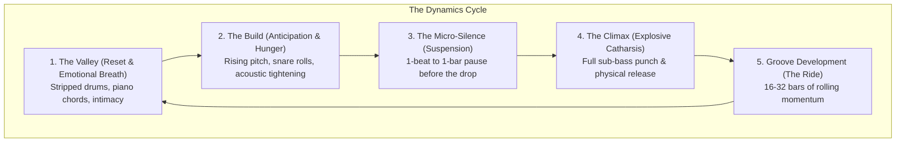
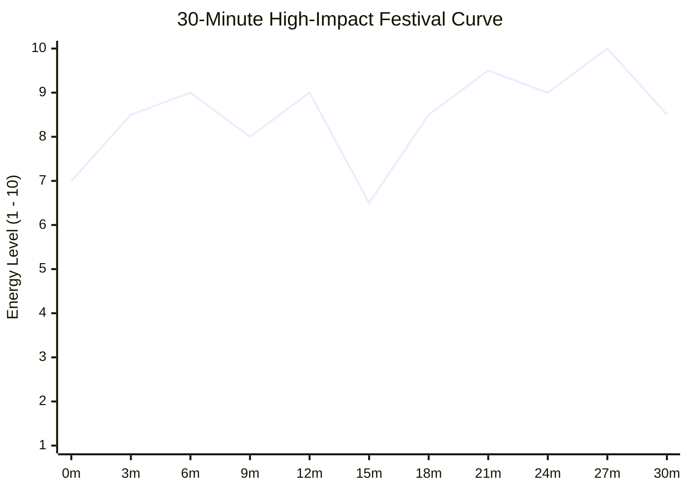
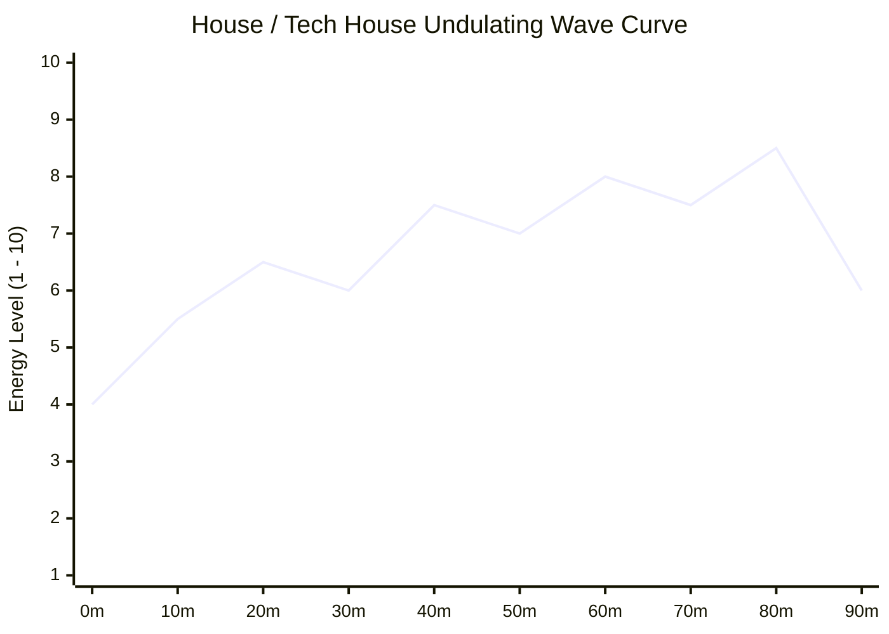
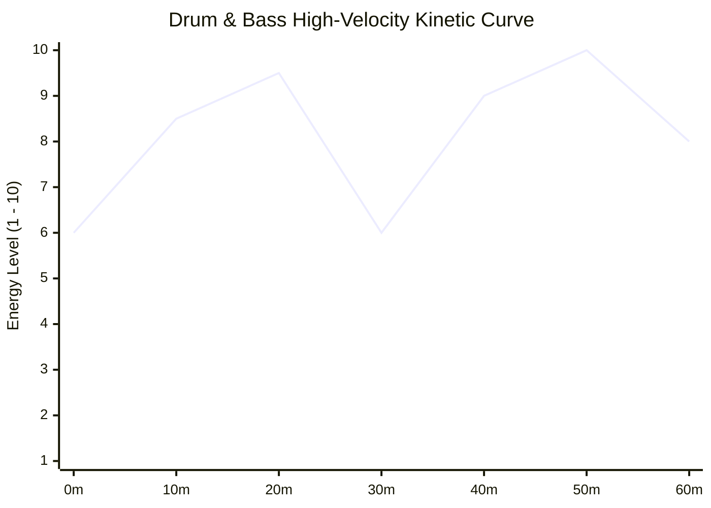
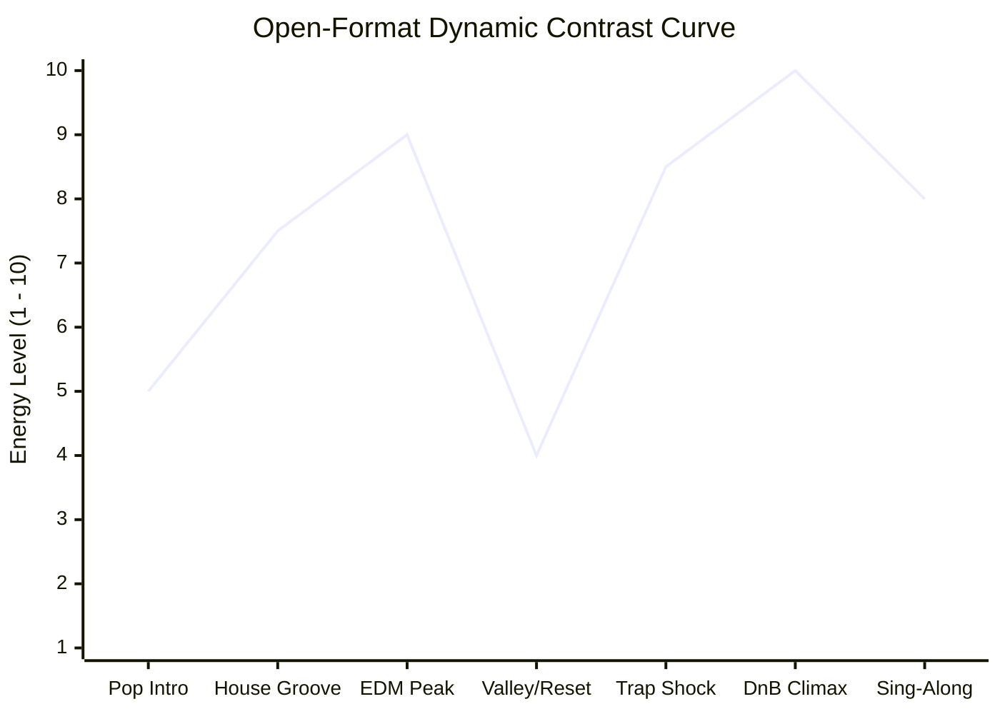

# Energy Management & Dynamics: The Architecture of Impact

Energy management is the single most decisive factor that separates world-class headliners from amateur bedroom DJs. 

The greatest amateur fallacy in DJing is the belief that:
> *"If I play maximum-energy bangers for 60 minutes straight, my set will have maximum impact."*

**This is acoustically and psychologically false.** The human nervous system operates on **contrast**. Constant, unrelenting maximum energy produces rapid auditory fatigue, emotional numbness, and physical exhaustion. A drop only feels colossal if the audience was starving for the kick drum during an ambient valley. **Silence and contrast are your most powerful weapons.**

---

## 1. The 8 Dimensions of Musical Energy

When analyzing where a track or a moment sits on the Energy Scale ($1\text{ to }10$), evaluate these 8 variables:

1. **BPM & Subdivisions:** A 174 BPM DnB roller carries inherently higher kinetic step frequency than a 118 BPM Deep House groove.
2. **Spectral Density:** How many frequencies are firing at once? A sparse sub-bass and a hi-hat = Energy 3. A massive wall of distorted supersaws, screaming vocal chops, and white noise = Energy 10.
3. **Low-End Punch (RMS Power):** How loud and aggressive is the sub-bass transient?
4. **Vocal Familiarity:** When 2,000 people sing every lyric together, emotional and psychological energy spikes even if the music is soft.
5. **Dynamic Tension:** Snare rolls, rising pitch, and high-pass sweeps tighten the room's collective nervous system.
6. **Release & Physical Catharsis:** The instantaneous return of the kick drum.
7. **The Power of Silence:** Complete cessation of sound right before a drop amplifies perceived loudness by $+3\text{--}6\text{ dB}$ due to the ear's acoustic reflex.
8. **Rhythmic Contrast:** Shifting from a straight four-on-the-floor kick into a broken half-time trap or dubstep beat shocks the body into a new physical dance mode.

---

## 2. Master Set Energy Curves (With Visual Models)

### A. The 60-Minute Club / Headline Set Curve (The Three-Peak Journey)
A classic 60-minute headline journey: establishes identity, builds to a mid-set peak, provides an emotional valley reset, and charges toward an explosive double-climax finale.

* **00–10m (Establish Identity):** Open at Energy 4–6. Establish the groove, let people finish their drinks and move onto the floor.
* **10–25m (First Major Peak):** Build steadily to Energy 8.5 with recognizable anthems and tight transitions.
* **25–35m (The Reset Valley):** Drop the energy back to 5–6 with an emotional vocal breakdown or deeper groove. Dancers breathe, hydrate, and look around.
* **35–50m (The Mountain Climb):** Ramp up through aggressive genre transitions and builds (Energy 7 $\to$ 9).
* **50–60m (The Grand Finale):** Deliver the ultimate climax (Energy 10), dropping your signature mashup, double drop, or heaviest unreleased track, followed by an emotional sing-along outro.

---

### B. The 30-Minute Festival Showcase Curve (High-Density Shock)
In a 30-minute competition or festival showcase, there is zero time to waste on long extended intros.

---

### C. The House / Techno Set Curve (The Wave-Like Rolling Groove)
House music does not rely on massive mountain peaks and cliff drops; it relies on a steady, hypnotic, undulating tide where energy rises and falls subtly through groove modulation.

---

### D. The Drum & Bass (DnB) High-Velocity Roller Curve
DnB operates at 174 BPM with rapid double-dropping. Valleys are short, atmospheric breaks that suddenly explode into intense kinetic sprints.

---

### E. The Open-Format Dynamic Contrast Curve (Genre-Hopping Rollercoaster)
Open-format DJing uses drastic tempo shifts, cultural nostalgia, and sudden genre bridges to create an exhilarating rollercoaster where energy fluctuates wildly between high-tension drops and communal pop sing-alongs.

---

## 3. The 5 Pedagogical Questions for Energy Management

1. **What is it?** The conscious, deliberate calibration of acoustic density, dynamic range, and psychological anticipation over time.
2. **Why does it matter?** Prevents dancefloor burnout, maintains physical stamina, and creates genuine emotional peaks that linger in the audience's memory.
3. **What does it sound/feel like?** Masterful energy control feels like a thrilling story or rollercoaster. Poor energy control feels like an exhausting siren or a boring treadmill.
4. **How do I practice it?** Complete the [[Practice Lab & Progressive Curriculum]] Level 5 drills: build an intentional 3-peak, 15-minute set and chart its curve before playing.
5. **When should I deliberately break the rule?**
   * **The "Total Slam" Closing Set:** In the final 15 minutes of an all-night rave or closing festival slot, when the next DJ is packing up and the venue lights are about to turn on, you can abandon valleys and unleash pure, unadulterated high-energy bangers until the curfew stops the power.

---

## Related Notes
* [[Vocal Punchline Drop Snap]]
* [[Short-Form & Viral Track Architecture (The 32-Bar Rule)]]
* [[Reading the Room & Crowd Psychology]]
* [[Track Selection Framework]]
* [[Set Construction & Architecture]]
* [[Fred again.. Case Study]]
* [[Martin Garrix Case Study]]
* [[Skrillex Case Study]]
* [[Set Graph Theory & Stochastic Set Routing]]
