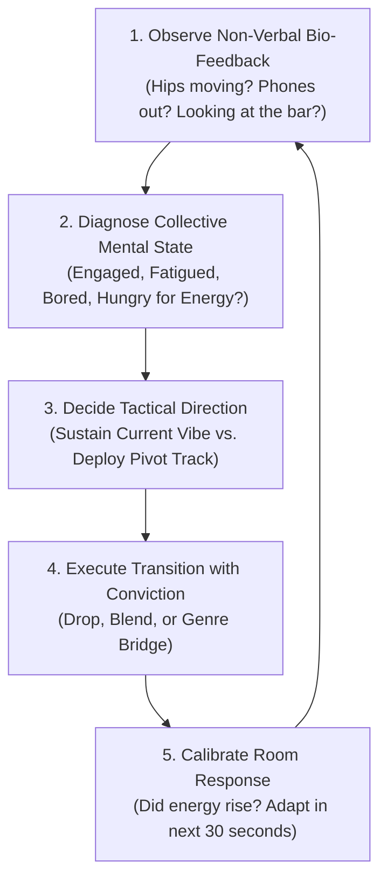

# Reading the Room & Crowd Psychology: The DJ's Sixth Sense

A bedroom DJ stares at the laptop screen, waveforms, and jog wheels. A professional live DJ stares at the **room**: the eyes, shoulders, hips, drinks, and facial expressions of human beings on the dancefloor.

The crowd is not a passive audience; it is a complex, dynamic biological organism with collective mood, energy reserves, and psychological thresholds. **Your job is to read their bio-feedback continuously and guide them where they didn't even know they wanted to go.**

---

## 1. The Non-Verbal Bio-Feedback Spectrum

When reading a room, ignore what people say and watch what their bodies do:

| Signal Tier | What to Watch For | Psychological Diagnostic | Tactical Action |
| :--- | :--- | :--- | :--- |
| **Peak Ecstasy (9–10)** | Hands in the air, jumping, screaming lyrics, faces turned toward the booth or each other. | Maximum engagement; dopamine surge. | **Do NOT change the track immediately.** Let the drop ride for 32 bars. Ride the wave! |
| **Locked In (7–8)** | Steady head nodding, hips swaying, feet stepping in pocket, smiling, drinks held low. | Hypnotic groove comfort; deep engagement. | Stay with this genre/sound. Introduce subtle variations without disrupting the pocket. |
| **Crowd Fatigue (5–6)** | Dancers slowing down, heavy breathing, glancing toward the bar, shoulders slumping. | Physical exhaustion from sustained high BPM/energy. | **Deploy an emotional breakdown or ambient valley.** Give them a chance to catch their breath. (See [[Breakdown Transition]]). |
| **Boredom / Disconnect (3–4)** | Phones coming out, heads turning around, couples talking loudly, people leaving the floor. | The current sound is stale or the track selection missed. | **Do not wait for the track to finish.** Execute an immediate [[Quick Cut]], [[Echo Out]], or drop an undeniable familiar anthem! |

---

## 2. Knowing When to Stay with a Vibe vs. When to Switch

### The Rule of Three (Staying with the Vibe):
When a track ignites the room:
* **Track 1:** The Breakthrough (Ignites the dancefloor with a fresh sound).
* **Track 2:** The Reinforcement (Keeps the same groove, BPM, and feel to solidify the vibe).
* **Track 3:** The Peak (The highest-energy iteration of that specific genre).
* *After Track 3:* **Prepare an exit or bridge.** Staying in the same pocket for 5+ songs without variation causes unconscious habituation.

### Testing a New Sound (The "Probe" Tactic):
Never jump blind into a radical new genre (e.g., jumping from Pop into 174 BPM DnB) without probing the room first:
1. **The Tease:** Loop an iconic vocal or tease a hi-hat pattern from the upcoming genre for 8 bars over the current beat.
2. **Watch the Reaction:** If heads snap up and cheers erupt, you have permission to drop the hammer. If people look confused, disengage the loop and stay in the safe zone.

---

## 3. The Psychology of Familiarity vs. Surprise

The greatest live sets balance two fundamental human psychological needs:
* **The Need for Security (Familiarity):** Recognizable pop hooks, classic anthems, sing-along vocals. Makes people feel safe, included, and uninhibited.
* **The Need for Adventure (Novelty / Surprise):** Unreleased edits, unexpected drops, genre shocks, underground basslines. Produces excitement and unforgettable thrills.
* **The Magic Formula:** **The Familiar Inside the Novel.** Take a vocal that 100% of the room knows, and drop it over an underground bassline that nobody saw coming. (See [[Live Mashup]]).

---

## 4. How to Handle Song Requests Gracefully

Requests are an inevitable reality of DJing. Amateur DJs get angry or insecure; master DJs treat requests as **data points about the room's demographic and mood**.

* **The Mental Shift:** A person requesting a song isn't trying to sabotage your artistic vision; they are telling you what emotional frequency they are vibrating at.
* **The 3 Golden Rules of Requests:**
  1. **Never play a request immediately:** If you drop it in 10 seconds, you look like an automated jukebox. Let it sit for 2–3 songs.
  2. **Only play it if it fits the room:** If someone asks for a slow sad ballad in the middle of a peak techno set, do not play it. Smile and say: *"I love that track, I'll see if I can work it into the late-night vibe!"*
  3. **Play the vibe, not the exact track:** If someone asks for Bad Bunny, they aren't necessarily demanding that exact MP3—they are telling you the room is thirsty for Latin/Reggaeton bounce.

---

## 5. Recovering from Mistakes & Crisis Management

Every touring DJ on earth—including Skrillex, Fred again.., and Martin Garrix—has experienced technical failures, trainwrecks, and wrong track choices on stage. **What defines a professional is how you recover.**

* **The Cardinal Rule:** **Never look panicked.** The audience takes its emotional cues directly from your face. If you make a mistake and smile, laugh, or dance through it, the crowd assumes it was a live improvisation. If you panic and stare at your hands in terror, the crowd feels second-hand embarrassment.
* **The Emergency Exit:** If two tracks are horribly clashing and trainwrecking:
  * Do **not** spend 15 agonizing seconds nudging the jog wheel back and forth while the trainwreck continues.
  * **Hit a 1-beat Echo on Track A, slam the fader down, and hit PLAY on Track B on the downbeat.** Clean, decisive, over.

---

## The 5 Pedagogical Questions for Crowd Psychology

1. **What is it?** The real-time perception and diagnosis of audience emotional and physical bio-feedback.
2. **Why does it matter?** DJing is a service of communal connection. Playing without reading the room is like talking at someone who isn't listening.
3. **What does it sound/feel like?** When locked with the crowd, you feel an electric telepathic connection where the room moves as a single organism.
4. **How do I practice it?** Complete the live house party and small venue exercises in [[Practice Lab & Progressive Curriculum]].
5. **When should I deliberately break the rule?**
   * **The "Challenge" Record:** When you have earned complete trust over 45 minutes of crowd-pleasing anthems, intentionally play an avant-garde, weird, or heavy underground record that challenges their comfort zone.

---

## Related Notes
* [[Energy Management & Dynamics]]
* [[Track Selection Framework]]
* [[Live Performance & Crisis Management]]
* [[Fred again.. Case Study]]
