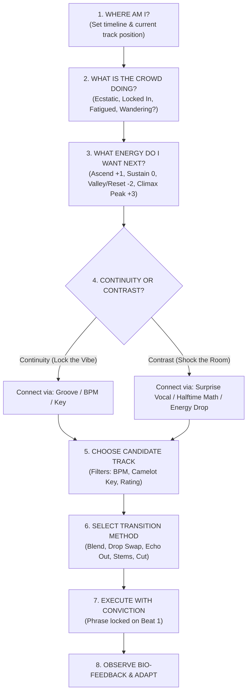

# DJ — What Do I Play Next? The Real-Time Decision Framework

When standing in the booth with 60 seconds remaining on Track A, panicking or freezing while staring at 3,000 files is the fastest way to derail a set. 

This is your **actionable, real-time tactical algorithm** to execute under live performance pressure.

---

## The Step-by-Step Live Decision Tree

### Step 1: Where Am I?
* **Time in Set:** Minute 15 (building)? Minute 45 (peak)? Minute 85 (closing)?
* **Track A Status:** Is it on Drop 1, the mid Breakdown, or approaching the Outro? How many bars do I have left before silence?

### Step 2: What is the Crowd Doing?
* **High Kinetic Energy:** Dancers locked in, sweating $\to$ *Keep the momentum driving!*
* **Visible Fatigue:** Dancers slowing down, reaching for drinks $\to$ *Time for an emotional vocal breakdown valley.*
* **Wandering Eyes / Stale Energy:** People checking phones $\to$ *Time for an undeniable sing-along anthem or high-voltage drop swap.*

### Step 3: What Energy Do I Want Next?
* **Maintain / Plateau (0):** Keep the dancefloor in a hypnotic flow state.
* **Elevate (+1 or +2):** Step up the intensity toward a peak.
* **Reset / Valley (-2):** Strip the drums, let them breathe and connect emotionally.
* **Explosive Climax (+3):** The set peak or festival drop.

### Step 4: Continuity or Contrast?
* **Choose Continuity when:** The crowd is completely locked into a groove and you want to deepen their trance (e.g., House $\to$ House, Techno $\to$ Techno).
* **Choose Contrast when:** You have played 3 songs of the same style, the energy is starting to plateau, and you want to shock the room with unexpected novelty (e.g., Pop $\to$ Drum & Bass, House $\to$ Hip-Hop).

### Step 5: What Musical Element Should Connect?
Pick **at least one** foundational thread to bridge the two songs:
* **The Rhythm Thread:** Same BPM and drum swing (e.g., 126 BPM Tech House $\to$ 126 BPM Bass House).
* **The Harmonic Thread:** Compatible Camelot key (e.g., 8A $\to$ 9A or 8A $\to$ 10A Energy Boost).
* **The Vocal Thread:** Shared lyrical concept, recognizable artist, or live mashup (e.g., Dua Lipa vocal over an EDM instrumental).
* **The Emotional Thread:** Same psychological feeling (e.g., nostalgic 2000s euphoria).

### Step 6: Choose Track & Transition Method
Match your transition technique to the musical relationship:

| Candidate Relationship | Recommended Transition Technique |
| :--- | :--- |
| Same BPM, Same Key, Long Outro/Intro | [[EQ Blend]] or [[Long Blend]] |
| Same BPM, Compatible Key, Heavy Drops | [[Bass Swap]] or [[Drop Swap]] |
| Same BPM, Competing Vocals | [[Vocal Transition]] or [[Stems Transition]] |
| Incompatible Keys, Percussive Sections | [[Drum Bridge]] or [[Filter Transition]] |
| Massive BPM Gap (e.g., 128 $\to$ 174 BPM) | [[Breakdown Transition]], [[Tempo Bridge]], or [[Echo Out]] |
| Complete Surprise / High Contrast | [[Quick Cut]], [[Hard Cut]], or [[Backspin (Spinback)]] |

### Step 7: Execute with Conviction
* Set the cue point, verify the phrase, lock the beat grid.
* **Commit 100%.** Half-hearted transitions sound messy; confident transitions sound intentional.

### Step 8: Observe Crowd & Adapt
* The moment Track B takes over: look up from the mixer immediately!
* Did the room's energy lift? Did they sing along? Did the floor thin out?
* Store that data point and begin preparing the next record.

---

## Related Notes
* [[Track Selection Framework]]
* [[Reading the Room & Crowd Psychology]]
* [[Energy Management & Dynamics]]
* [[Transition Cookbook]]
* [[Open-Format DJing Guide]]
* [[Set Graph Theory & Stochastic Set Routing]]
