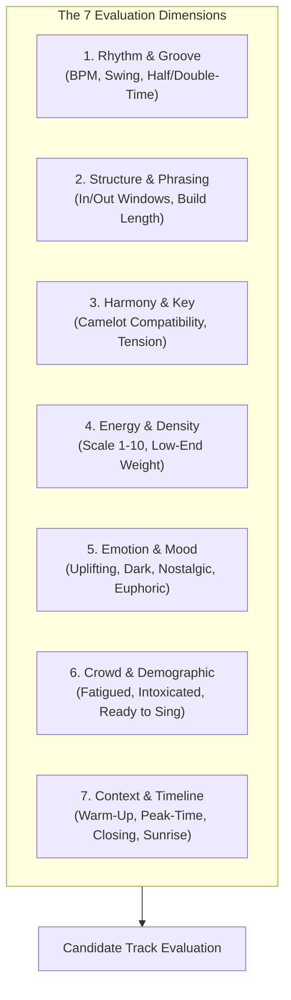

# Track Selection Framework: The 7-Dimensional Matrix

Track selection is the undisputed heart and soul of DJing. A technical genius with terrible track selection is unlistenable; an amateur with impeccable taste and track selection will keep a party dancing until sunrise.

Professional DJs do not select songs by scrolling through an alphabetical playlist hoping for inspiration. They evaluate candidate tracks through a real-time **7-Dimensional Evaluation Matrix**.

---

## 1. The 7 Dimensions Deconstructed

### 1. Rhythm & Groove (Kinetic Pocket)
* **What to evaluate:** Does the incoming track's drum pattern complement the current groove? A straight four-on-the-floor kick creates forward drive; a syncopated UK garage 2-step creates sexy bounce; a half-time trap rhythm creates swagger.
* **Compatibility Metric:** Can they lock at the same tempo without pitch distortion?

### 2. Structure & Phrasing (The Mechanics)
* **What to evaluate:** Does Track B provide an easy entrance door (e.g., 16-bar drum intro, immediate vocal pickup, or build-up)? Can its phrase align with Track A? (See [[Phrasing & Structure]]).

### 3. Harmony & Key (The Color)
* **What to evaluate:** What is the Camelot relationship? ($0$, $\pm 1$, $+2$ energy boost, or relative major/minor). If keys clash, does the track offer a percussive intro or breakdown where key doesn't matter? (See [[Harmonic Mixing & Camelot System]]).

### 4. Energy & Density (Dynamic Fit)
* **What to evaluate:** Does the track raise energy (+1), sustain energy (0), or provide a deliberate valley reset (-2)? Does it match the desired curve? (See [[Energy Management & Dynamics]]).

### 5. Emotion & Mood (The Soul)
* **What to evaluate:** What psychological emotion does this track evoke? Is it triumphant euphoria, nostalgic teenage sing-along, menacing dark aggression, or sensual intimacy?

### 6. Crowd & Demographic (The Room)
* **What to evaluate:** Who is on the dancefloor right now? Are they 21-year-old bass-heads, 35-year-old house lovers, or a diverse wedding crowd? Are they exhausted or ready to jump?

### 7. Context & Timeline (The Setting)
* **What to evaluate:** What time of night is it? Is it 10:30 PM (warm-up), 1:15 AM (peak-time climax), or 4:00 AM (after-hours)? Are you opening for an international headliner or playing the closing slot?

---

## 2. The Golden Rule of Dimension Scoring

> [!IMPORTANT]
> **A candidate track DOES NOT need to score a 10/10 on every single dimension.**
> In fact, requiring every transition to match on Rhythm, Harmony, Energy, and Mood creates monotonous, boring sets.

* **Continuity Transitions:** Score high on Rhythm, Harmony, and Energy (e.g., House $\to$ House long blend).
* **Contrast Transitions:** Intentionally score LOW on Rhythm and Genre, but score a massive 10/10 on **Emotion and Surprise** (e.g., cutting from dark techno directly into a 174 BPM pop-sing-along Drum & Bass anthem!).
* **The Rule of Two Anchors:** As long as a transition is strongly anchored by **at least two dimensions** (e.g., shared Vocal + shared Key, or shared Rhythm + shared Energy), the crowd will follow you across radical genre leaps.

---

## 3. The 14 Real-Time Decision Variables Checklist

Before loading a track onto Deck 2, run your eye down this micro-checklist:
1. **BPM:** Within $\pm 5\%$ or mathematical half/double-time?
2. **Key:** Compatible or percussive entry?
3. **Energy:** Matches the set narrative?
4. **Genre:** Continuity or deliberate contrast?
5. **Vocal Compatibility:** Will vocals clash with Track A?
6. **Groove:** Does the swing feel good?
7. **Texture:** Organic vs. electronic?
8. **Mood:** Does it elevate the room's emotional state?
9. **Crowd Response:** Did the last track work? If not, pivot!
10. **Time of Night:** Right for this hour?
11. **Context:** Fits the venue and expectations?
12. **Familiarity:** Do they need a safe anthem right now?
13. **Surprise:** Is it time for an unreleased ID or bootleg?
14. **Momentum:** Will this keep people on the floor?

---

## Related Notes
* [[DJ - What Do I Play Next]]
* [[Energy Management & Dynamics]]
* [[Harmonic Mixing & Camelot System]]
* [[Reading the Room & Crowd Psychology]]
* [[Open-Format DJing Guide]]
* [[Set Graph Theory & Stochastic Set Routing]]
