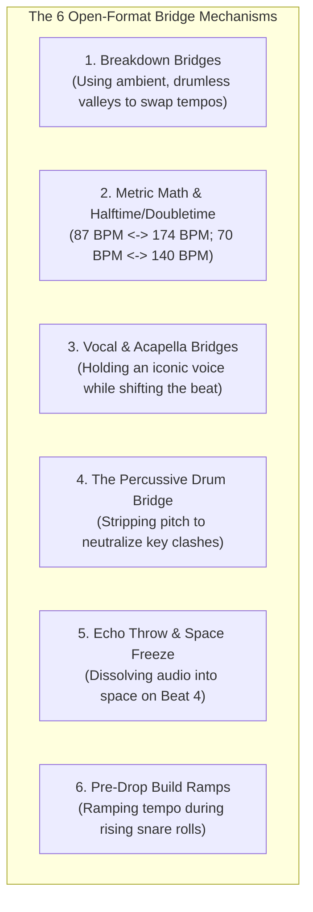
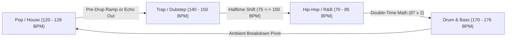

# Open-Format DJing: Making the "Impossible" Transition Work

Open-Format DJing is the pinnacle of live performance artistry. While a genre-purist DJ stays within a comfortable 5-BPM range (e.g., 124–128 BPM House) playing predictable 32-bar blends, **an open-format DJ fearlessly connects Pop, Hip-Hop, House, EDM, and 174 BPM Drum & Bass into an exhilarating, cohesive narrative.**

The ultimate objective of this guide is to teach you: **How to make a transition between two songs that theoretically "should not work."**

---

## 1. The Core Philosophy of Open-Format Mixing

When two tracks differ in BPM by 40+ beats and share zero musical similarities, traditional beatmatching will fail. If you try to blend an 85 BPM Drake song into a 128 BPM Fisher track with volume faders, you will produce an agonizing trainwreck.

To make an "impossible" transition sound natural, master the **Principle of the Shared Anchor**:
> *"You can change the Genre, you can change the Tempo, and you can change the Key—**but you must NEVER change all three at the exact same split-second without an auditory bridge.**"*

* If changing **Tempo & Genre** (e.g., Pop 124 BPM $\to$ DnB 174 BPM): Keep the **Harmonic Key** or the **Vocal Hook** identical!
* If changing **Harmonic Key & Genre** (e.g., Hip-Hop in 4A $\to$ EDM in 10B): Strip away the pitch using an unpitched **Drum Bridge** or an **Echo Out**!

---

## 2. The 6 Master Bridge Mechanisms Deconstructed

### 1. The Breakdown-Based Bridge
* **How it works:** Every electronic and pop genre has ambient breakdowns where the kick drum disappears. 
* **The Execution:** When Track A hits its drumless breakdown, the crowd is floating without a rhythmic clock. Launch Track B's drumless intro or melody. Because there are no drums to fight each other, the tempo difference is completely invisible. You can gently adjust the pitch fader or let Track B's build-up dictate the new tempo. (See [[Breakdown Transition]]).

### 2. Half-Time / Double-Time Mathematical Ratios
* **The Mathematics:**
  * **$70\text{ BPM} \leftrightarrow 140\text{ BPM}$:** Slow Trap / R&B $\leftrightarrow$ Heavy Dubstep / Bass Music.
  * **$75\text{ BPM} \leftrightarrow 150\text{ BPM}$:** Hip-Hop $\leftrightarrow$ Hard Trap / Future Bass.
  * **$87\text{ BPM} \leftrightarrow 174\text{ BPM}$:** Modern Pop / R&B $\leftrightarrow$ Drum & Bass / Jungle.
* **The Illusion:** Track A at 87 BPM has its snare hitting on beat 3. Track B at 174 BPM has its snare hitting on beats 2 and 4. **Their primary downbeats align perfectly!** You can blend them beat-for-beat as if they were identical speeds.

### 3. The Acapella / Vocal Bridge
* **How it works:** The human brain latches onto words more intensely than instruments.
* **The Execution:** Take an iconic vocal (e.g., Dua Lipa, Billie Eilish, Eminem). Isolate it using Stems or an acapella track. Keep the vocal singing at its native cadence while you swap the underlying rhythm from House to Drum & Bass. Because the audience is singing along with the voice, their brain accepts the radical genre shift underneath. (See [[Acapella Overlay]]).

### 4. The Drum Bridge (Atonal Reset)
* **How it works:** Percussion lacks sustained musical pitch.
* **The Execution:** Loop an 8-bar percussive break (congas, bongos, drum fills) on Deck 3. Fade out the melodies of Track A. Now that the room is listening purely to drums, you are harmonically free to drop Track B in **ANY key** without a single clashing note! (See [[Drum Bridge]]).

### 5. The Echo Throw & Space Dissolution
* **How it works:** The cleanest hard-reset available.
* **The Execution:** On the final vocal syllable or downbeat of Track A, engage a 1/2-beat post-fader Echo and snap the fader down. The room is filled with rhythmic delay. Drop Track B on Beat 1 of the new tempo. The decay masks the tempo jump completely. (See [[Echo Out]]).

### 6. The Pre-Drop Tempo Ramp
* **How it works:** In a 16-bar build-up, the rhythm is already accelerating ($1/4 \to 1/8 \to 1/16$ notes).
* **The Execution:** Gradually slide your pitch fader up from 124 BPM to 132 BPM during the build. Because the snare roll is speeding up anyway, the tempo increase sounds like intended musical tension! (See [[Tempo Bridge]]).

---

## 3. The Master BPM Transition Matrix

---

## The 5 Pedagogical Questions for Open-Format DJing

1. **What is it?** The fluid curation and performance across diverse genres, tempos, and musical eras.
2. **Why does it matter?** Real audiences have eclectic musical tastes. Mastering open-format allows you to command any room on earth—from underground warehouses to stadium festivals.
3. **What does it sound/feel like?** An exhilarating musical journey where every 5 minutes brings an unexpected sonic surprise, yet the groove never stumbles.
4. **How do I practice it?** Work through the detailed transition recipes in [[Genre Bridge Playbook]].
5. **When should I deliberately break the rule?**
   * **The "Zero-Bridge Slam Cut":** Deliberately cutting from a 174 BPM DnB drop into a dead-stop 90 BPM classic hip-hop piano chord without any bridge at all—for pure comedic or dramatic shock!

---

## Related Notes
* [[Genre Bridge Playbook]]
* [[Track Selection Framework]]
* [[DJ - What Do I Play Next]]
* [[Fred again.. Case Study]]
* [[Skrillex Case Study]]
