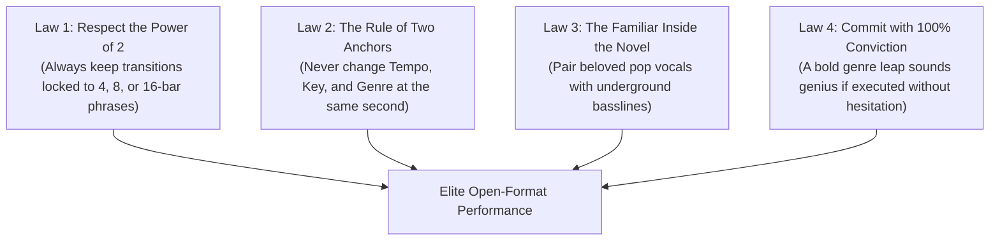

# Open-Format DJ Playbook: Master Multiverse Performance

Open-Format is not a single genre—it is the master discipline of seamlessly synthesizing all genres into an uninhibited, unpredictable, and thrilling live performance. An open-format DJ treats music history as an open toy box, fearlessly jumping between decades, tempos, and cultures.

---

## 1. Profile & Performance Specifications

* **BPM Range:** The entire spectrum (70 BPM to 175+ BPM).
* **Core Repertoire:** Pop, Hip-Hop, House, EDM, Drum & Bass, Dubstep, Trap, R&B, Funk, Disco, Rock anthems.
* **Performance Velocity:** Fast-paced. While a House DJ might play 15–18 tracks in an hour, an Open-Format DJ routinely plays **35 to 60 tracks per hour**, using short verses, quick cuts, drop swaps, and live mashups.
* **Transition Points:** Constant and varied:
  * Drop Swaps every 45–60 seconds.
  * Word-play cuts on the final bar of a verse.
  * Halftime to double-time metric jumps.
  * Ambient breakdown pivots.

---

## 2. The 4 Laws of Open-Format Mastery

---

## 3. The Master Open-Format Transition Arsenal

| Situation | Weapon of Choice | Reference |
| :--- | :--- | :--- |
| Large BPM jump ($>25\text{ BPM}$) | Breakdown Transition or Echo Out | [[Breakdown Transition]] / [[Echo Out]] |
| Incompatible Keys | Drum Bridge or Drop Swap on Beat 1 | [[Drum Bridge]] / [[Drop Swap]] |
| Crowd energy flagging | Pop Sing-Along Vocal over House Beat | [[Live Mashup]] / [[Acapella Overlay]] |
| Sudden dramatic shock | Backspin or Hard Cut on Beat 1 | [[Backspin (Spinback)]] / [[Hard Cut]] |
| Half-time to double-time ($87 \leftrightarrow 174$) | Mathematical downbeat lock | [[Genre Bridge Playbook]] |

---

## 4. The 60-Minute Multiverse Journey Blueprint

Here is an example of an elite 60-minute open-format set progression:
1. **00–10m:** Familiar Pop-Dance & Nu-Disco (120–124 BPM) $\to$ Warm up the floor, establish vocal sing-along comfort.
2. **10–25m:** Modern Tech House & Bass House (126–128 BPM) $\to$ Lock the room into a heavy physical groove; layer pop acapellas live.
3. **25–35m:** EDM Festival Peak (128 BPM) $\to$ Build-up into massive drops; trigger crowd jumping.
4. **35–42m:** The Ambient Reset Valley $\to$ Drop out drums; let an emotional vocal ballad or voice note play; reset the room's energy.
5. **42–50m:** The Halftime Trap / Dubstep Shock (140–150 BPM) $\to$ Accelerate into heavy bass music and rapid drop swaps.
6. **50–57m:** The 174 BPM Drum & Bass Climax $\to$ Metric double-time jump into blistering DnB rollers; peak physical ecstasy.
7. **57–60m:** The Emotional Sing-Along Finale $\to$ Reverb dissolve into a legendary nostalgic anthem (Queen, ABBA, The Killers) for a stadium-wide sing-along.

---

## Related Notes
* [[Open-Format DJing Guide]]
* [[Genre Bridge Playbook]]
* [[Track Selection Framework]]
* [[DJ - What Do I Play Next]]
* [[Live Mashup]]
