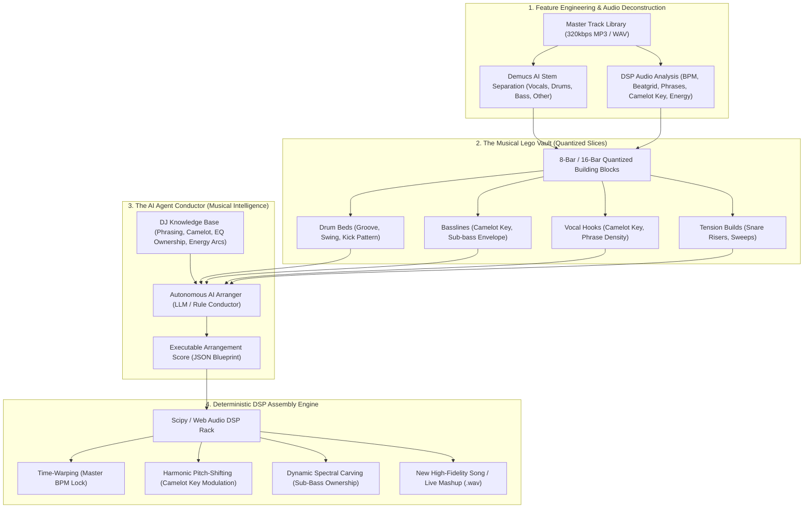
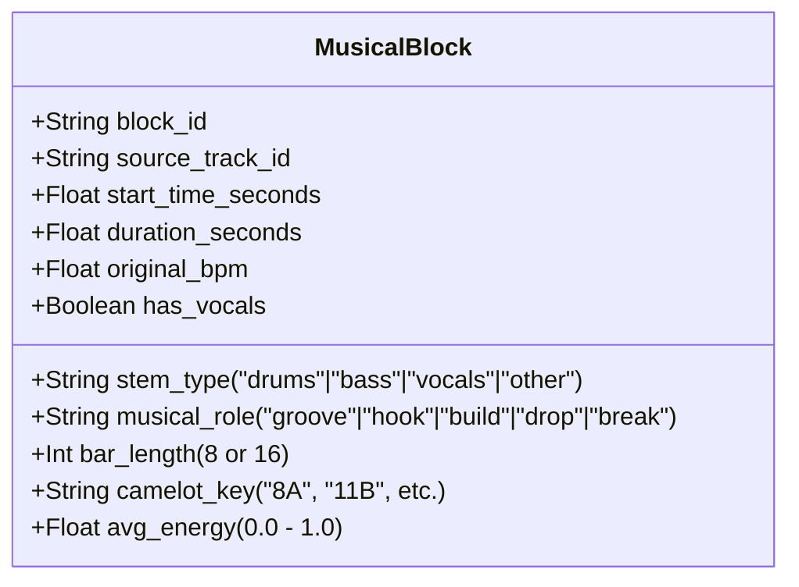
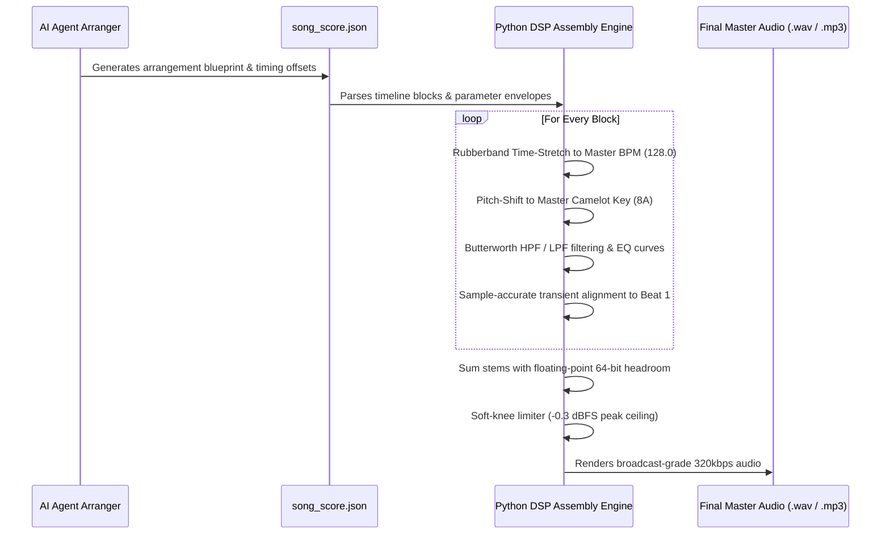

# Autonomous AI DJ Arranger & Intelligent Mashup Engine: Feature Engineering Meets Agentic Composition

The dream of AI-assisted music is often misunderstood as "push-button generation" (black-box models like Suno or Udio hallucinating audio from text prompts). While novel, generative diffusion models output **lossy, phase-smeared, unpredictable audio** with no stem isolation, poor transient definition, and zero real-time DJ control.

The true breakthrough in modern intelligent music mixing lies in **Deterministic Feature Extraction + Agentic Arrangement**: decomposing real, high-fidelity 320 kbps master recordings into their constituent acoustic atoms ("Musical Lego Bricks") and empowering an **autonomous AI Agent** to act as a virtuoso arranger, remixer, and DJ conductor.



---

## The 5 Pedagogical Questions

### 1. What is it?
The **Autonomous AI DJ Arranger** is a sample-based intelligent arrangement architecture. Rather than synthesizing synthetic audio from scratch, it extracts structural, harmonic, and rhythmic metadata from existing songs in your library, separates them into pristine audio stems (Vocals, Drums, Bass, Other), chunks them into quantized 8-bar musical blocks, and uses an AI Agent governed by music theory to compose brand-new songs, live mashups, and dynamic remixes.

It is the algorithmic equivalent of master sample-chopping producers:
* **Madeon's *Pop Culture*** (39 commercial tracks sliced and performed live on a Novation Launchpad).
* **Danger Mouse's *The Grey Album*** (Jay-Z acapellas dynamically arranged over Beatles instrumentation).
* **The Avalanches & DJ Shadow** (hundreds of micro-samples stitched into seamless groove narratives).
* **[[Fred again.. Case Study]]** (sampling raw vocal hooks from phone recordings and arranging them over 134 BPM garage drum beds).

### 2. Why does it matter?
* **Pristine Studio Fidelity:** Every drum kick, vocal transient, and sub-bass pulse originates from authentic, high-quality audio files. There is no AI hallucination hiss, muffled transients, or phase artifacting.
* **100% Explainable & Controllable:** The output is governed by an **Arrangement Score (`song_score.json`)**. The human DJ can inspect the timeline, swap a vocal block, automate an EQ sweep, or adjust a crossfade curve on the fly.
* **Infinite Recombination Potential:** A modest DJ library of 50 tracks yields over 200 stem streams and thousands of quantized 8-bar blocks, generating millions of mathematically valid harmonic mashup permutations.
* **Bridges DJing and Production:** It eliminates the artificial boundary between playing records and producing records.

### 3. What does it sound and feel like?
When an AI Arranger executes a composition:
* The rhythm bed feels solid, locked sample-accurately to a master tempo grid with zero timing drift.
* The bassline never clashes with the kick drum; the low end ($<120\text{ Hz}$) is punchy and clean because only one bass element owns the spectrum at any given instant.
* An anthemic vocal hook from a pop track floats effortlessly over an underground tech house groove in identical harmonic pitch.
* Drops land with massive dynamic impact on Beat 1 of a new 8-bar or 16-bar phrase.

### 4. How do I practice / implement it?
1. **Analyze:** Run full audio analysis on candidate tracks to discover their BPM, Camelot keys, and phrase boundaries (`python -m music_brain.agent_bridge analyze <track>`).
2. **Decompose:** Separate candidate songs into 4 uncompressed 44.1kHz stems (`python -m music_brain.agent_bridge separate <track> --stems 4`).
3. **Chunk:** Slice stems at 8-bar (32-beat) phrase boundaries and tag them by role (`[DRUM_BED]`, `[VOCAL_HOOK]`, `[BASS_GROOVE]`, `[BUILD_RISER]`).
4. **Draft Score:** Instruct the AI Agent to build an arrangement based on the 8-stage narrative arc in [[Set Construction & Architecture]].
5. **Render & Audition:** Execute the arrangement deterministically via the Python DSP rack or stream it into the live [[Pulse DJ Console]] decks.

### 5. When should I deliberately break the rule?
* **Harmonic Modulation (Camelot $+2$ Energy Boost):** Instead of staying strictly in the same key (e.g. 8A to 8A), have the agent modulate the vocal stem $+2$ semitones into the second drop to create an exhilarating, euphoric lift (see [[Harmonic Mixing & Camelot System]]).
* **Micro-Timing Humanization (Swing & Push):** Do not quantize every transient to a robotic, clinical grid. Preserving the natural organic swing of live drum breaks or vocal pushes produces a warm, authentic groove.
* **Phrase Extension (Deceptive Cadence):** Extend an 8-bar build to 9 bars (a 4-beat "fake drop" pause) right before the drop hits to subvert the dancefloor's expectations (see [[Fake Drop]]).

---

## 1. The 5 Dimensions of Feature Engineering

To turn a raw audio file into structured "Musical DNA" that an AI Agent can reason about, the system performs five distinct feature extraction processes:

| Feature Domain | Mathematical Extraction Algorithm | What the AI Agent Learns From It |
| :--- | :--- | :--- |
| **1. Temporal DNA** | Spectral flux onset detection (`librosa.onset`), dynamic tempo tracking, downbeat tracking, 8-bar (32-beat) phrase boundaries. | Identifies exact bar start times, tempo drift, whether the groove is straight or swung, and where drops naturally land. |
| **2. Harmonic DNA** | Constant-Q Chroma STFT (`chroma_cqt`), tonal centroid vectors, Camelot key identification (1A–12B), chord progression tagging. | Identifies which musical elements can play together without dissonant key clashes (see [[Harmonic Mixing & Camelot System]]). |
| **3. Stem Separation** | Deep neural tensor separation (**Demucs v4** `htdemucs` / `htdemucs_ft`): isolated `vocals`, `drums`, `bass`, and `other`. | Grants surgical access to individual acoustic layers with zero cross-talk or bleed (see [[Stems, Live Remixing & Ableton Integration]]). |
| **4. Dynamics & Energy** | Root Mean Square (RMS) energy curves, spectral centroid (perceptual brightness), zero-crossing density, crest factor. | Distinguishes high-tension builds, peak drops, quiet verses, and ambient intros (see [[Energy Management & Dynamics]]). |
| **5. Vocal Activity (VAD)**| Short-time energy thresholding on the isolated vocal stem + silence duration detection. | Maps out vocal-active corridors vs. vocal-silent breaks to prevent simultaneous vocal clashes (see [[Track Selection Framework]]). |

---

## 2. The "Musical Lego Vault" Schema

Once analyzed and separated, each track is decomposed into standardized, quantized building blocks stored in the catalog database:



### The 4 Primary Lego Categories:
1. **`[DRUM_BED]` (Percussive Foundations):** 8-bar or 16-bar drum loops containing kick, snare, and hi-hats. Devoid of vocals and melodic synths. Forms the rhythmic spine of the remix.
2. **`[BASS_GROOVE]` (Low-End Energy):** 8-bar sub-bass and mid-bass motifs. Tagged with exact Camelot key and frequency distribution.
3. **`[VOCAL_HOOK]` (Emotional Core):** Iconic vocal phrases, choruses, or spoken-word chops. Tagged with Camelot key and syllabic density.
4. **`[BUILD_RISER]` (Tension Generators):** Snare rolls, rising pitch sweeps, white noise washes, and reverse cymbals that signal an impending drop.

---

## 3. The AI Agent Arranger: The Autonomous Conductor

The AI Agent does not generate audio samples. It acts as an **expert musical arranger** equipped with the complete theoretical canon from this knowledge base.

### The Agent's Decision Rulebook:
1. **Harmonic Consistency:** Only combine melodic and vocal blocks that are:
   * Identical key ($0$ distance, e.g. 8A over 8A).
   * Adjacent keys ($\pm 1$ hour on Camelot wheel, e.g. 8A over 9A or 7A).
   * Relative Major/Minor ($\text{A} \leftrightarrow \text{B}$, e.g. 8A over 8B).
   * Allowed Energy Modulation ($+2$ hours for second drop escalation).
2. **Spectral Ownership Principle:** Sub-bass ($<120\text{ Hz}$) must **never** be occupied by two competing stems at once (see [[EQ & Frequency Management]] and [[Bass Swap]]). If a vocal stem has low rumble, the agent automatically high-pass filters it at 150 Hz.
3. **Arrangement Narrative Arc:** The agent organizes blocks into a standard 8-stage electronic progression:
   * `Intro (16 Bars)` $\to$ `Build 1 (8 Bars)` $\to$ `Drop 1 (16 Bars)` $\to$ `Breakdown (16 Bars)` $\to$ `Build 2 (8 Bars)` $\to$ `Main Climax Drop (32 Bars)` $\to$ `Outro (16 Bars)`.

### The Agent Output: Executable Arrangement Score (`song_score.json`)

```json
{
  "project_title": "AI Live Remix: Fisher Groove x Peggy Gou Vocal",
  "master_bpm": 128.0,
  "master_key": "8A",
  "total_bars": 80,
  "arrangement": [
    {
      "section": "Intro",
      "bars": [1, 16],
      "active_blocks": [
        {
          "block_id": "fisher_drums_groove_01",
          "stem": "drums",
          "volume_db": -2.0,
          "filter": { "type": "highpass", "cutoff_hz": 350, "sweep_to_hz": 20 }
        },
        {
          "block_id": "peggy_vocal_intro_phrase",
          "stem": "vocals",
          "volume_db": -1.0,
          "fx": { "reverb_wet": 0.35, "delay_subdivision": "1/2" }
        }
      ]
    },
    {
      "section": "Build-up",
      "bars": [17, 24],
      "active_blocks": [
        {
          "block_id": "skrillex_snare_riser_01",
          "stem": "drums",
          "volume_db": 0.0,
          "filter": { "type": "highpass", "cutoff_hz": 200, "sweep_to_hz": 800 }
        }
      ]
    },
    {
      "section": "Main Drop (Vocal Punchline Drop)",
      "bars": [25, 48],
      "active_blocks": [
        {
          "block_id": "fisher_drums_groove_01",
          "stem": "drums",
          "volume_db": 0.0,
          "filter": "bypass"
        },
        {
          "block_id": "bicep_bass_rolling_02",
          "stem": "bass",
          "volume_db": -0.5,
          "pitch_shift_semitones": 0
        },
        {
          "block_id": "peggy_vocal_chorus_01",
          "stem": "vocals",
          "volume_db": 0.5,
          "eq": { "high_shelf_db": +1.5, "low_cut_hz": 160 }
        }
      ]
    }
  ]
}
```

---

## 4. Deterministic DSP Assembly & Mastering Engine

The execution engine reads the score and applies deterministic DSP transforms using `scipy.signal`, `soundfile`, and `rubberband`:



1. **Time-Stretching:** Non-destructive granular/phase-vocoder time-stretching aligns stems with different native BPMs (e.g. 125 BPM drums and 130 BPM vocals) to a uniform master BPM (128 BPM) without pitch deviation.
2. **Pitch-Shifting:** Transposes melodic or bass stems by exact semitones (e.g. shifting a 7A track by $+1$ semitone to match an 8A harmonic center).
3. **Transient-Accurate Slicing:** Snaps block boundaries to sample-accurate beat onsets, guaranteeing that drum transients hit with full dynamic punch.
4. **Dynamic Sidechain Ducking:** When the kick drum transient strikes on Beats 1, 2, 3, and 4, the engine automatically ducks the bass stem by 4 dB for 80 milliseconds, ensuring zero mud in the low end.
5. **Mastering Limiter:** A transparent soft-knee lookahead limiter ensures total audio sum never exceeds $-0.3\text{ dBFS}$, preventing inter-sample digital clipping.

---

## 5. Walkthrough Case Study: The 3-Track Festival Mashup

### The Raw Ingredients in the Vault:
1. **Track 1:** *FISHER - Losing It* (125 BPM, F Minor / Camelot 4A) $\to$ Extracted **Drums Stem** (massive punchy tech house kick & clap).
2. **Track 2:** *Bicep - Glue* (130 BPM, Bb Minor / Camelot 3A) $\to$ Extracted **Bassline Stem** (warm, analog rolling sub-bass).
3. **Track 3:** *Peggy Gou - (It Goes Like) Nanana* (130 BPM, G Minor / Camelot 6A) $\to$ Extracted **Vocal Hook** (soaring, infectious vocal chorus).

### The AI Agent's Choreography:
1. **Harmonic Unification:**
   * Target Master Key: **4A (F Minor)**.
   * Target Master BPM: **128 BPM** (the sweet spot between 125 and 130).
   * *Pitch Action:* Bicep Bassline (3A) is shifted $+1$ semitone to match 4A. Peggy Gou Vocal (6A) is shifted $-2$ semitones to land precisely in 4A.
2. **The Arrangement Execution:**
   * **Bars 1–16 (Intro):** Fisher's drum groove plays at 128 BPM with a high-pass filter at 250 Hz. Peggy Gou's vocal hook enters filtered with a 1-beat ping-pong delay.
   * **Bar 16 (Beat 4):** Total silence for 1 beat—the classic [[Vocal Punchline Drop Snap]].
   * **Bar 17 (The Drop):** Fisher's full drum kit slams in with the HPF bypassed. Bicep's re-pitched rolling bassline engages at full volume. Peggy Gou's vocal hook enters completely dry and upfront.
   * **The Result:** An original, festival-grade live remix that sounds like a professional studio release, assembled in 3 seconds from your local library.

---

## 6. Comparison Matrix: Agentic Arranger vs. Generative Diffusion

| Dimension | Autonomous AI DJ Arranger (This Architecture) | Generative AI (Suno / Udio / AudioCraft) |
| :--- | :--- | :--- |
| **Audio Quality** | **320 kbps Pristine Studio Fidelity** (Direct from master recordings). | Lossy, phase-smeared, robotic high frequencies. |
| **Stem Isolation** | **Total Isolation:** Vocals, drums, bass, and synths are independent WAVs. | Single flat stereo file; impossible to unmix cleanly. |
| **Real-Time Control** | **100% Controllable:** Every bar, volume slider, and filter is editable on the console. | Zero control; you get what the black-box generates. |
| **Live Performance Fit** | **Native Web Audio / DJ Hardware Compatible:** Can be triggered live on Decks A & B. | Unusable live; long generation times and fixed playback. |
| **Source Attribution** | **Cites Exact Tracks Used:** You know every sample source in the arrangement. | Mysterious training data; zero attribution. |

---

## Backlinks & Related Concepts

* **Foundations & Anatomy:** [[Track Anatomy & Structure]], [[Phrasing & Structure]], [[Music Fundamentals for DJs]].
* **Harmonic Theory:** [[Harmonic Mixing & Camelot System]], [[EQ & Frequency Management]].
* **Core Transition Mechanics:** [[Live Mashup]], [[Acapella Overlay]], [[Drum Bridge]], [[Bass Swap]], [[Vocal Punchline Drop Snap]], [[Double Drop]].
* **Creative Performance:** [[Stems, Live Remixing & Ableton Integration]], [[Fred again.. Case Study]], [[Set Construction & Architecture]].
* **Set-Level Automation:** [[The Agentic DJ Framework]] (ingestion-to-set pipeline, tools and workflows), [[Set Graph Theory & Stochastic Set Routing]] (library as a network; pathfinding a set).
