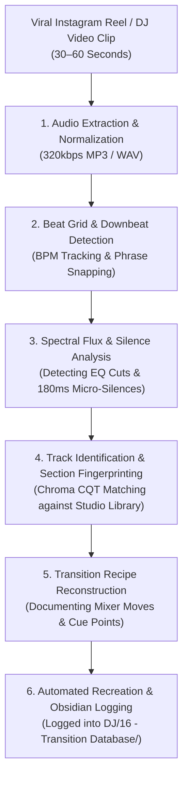
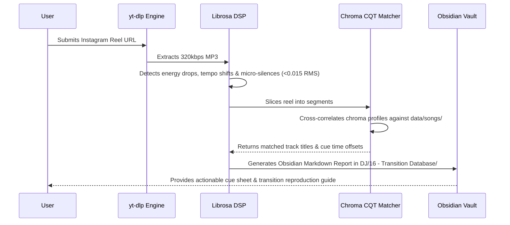

# Reverse-Engineering Viral DJ Sets & Instagram Reels

With the rise of short-form social media (Instagram Reels, TikTok, YouTube Shorts) and recorded performance platforms (Boiler Room, Cercle, Hör Berlin), the most innovative DJ techniques are displayed publicly in 30-to-60-second clips. 

Rather than treating these viral moments as mysterious wizardry, a serious DJ treats them as **forensic audio engineering puzzles**. By learning to deconstruct recorded audio, you can reverse-engineer the exact tracks, cue points, EQ sweeps, stem isolates, and micro-silences used by world-class DJs, and reconstruct them in your own software or hardware.

---

## The 5 Pedagogical Questions

### 1. What is it?
**Transition Archaeology:** The systematic process of analyzing a recorded DJ routine by ear and through computational audio tools (spectrograms, onset envelopes, and chroma vectors) to reveal:
* Which studio songs were played.
* Which exact bars were chosen (and which were pruned).
* What physical and digital actions the DJ took on the mixer (EQ kills, fader cuts, echo throws, stem mutes, or micro-silences).

### 2. Why does it matter?
Most amateur DJs learn through passive listening and trial-and-error, taking months to figure out why a transition sounds good. Reverse-engineering demystifies professional technique:
* You realize that a seemingly complex transition is often just an **8-bar build + 1-beat vocal punchline cut + Beat 1 drop snap**.
* It reveals the specific micro-decisions top DJs make (e.g., cutting the bass 2 beats before the drop rather than on the downbeat).
* It trains your ear to dissect layered frequencies in real time during live performances.

### 3. What does it sound/feel like?
You stop hearing a seamless wash of sound; instead, your brain hears the **individual mixer operations**:
* You hear the subtle rise of a $500\text{ Hz}$ high-pass filter.
* You hear the momentary emptiness of a $180\text{ms}$ micro-silence.
* You notice when a vocal has been isolated from its instrumental bed via AI stems.
* You can visualize the DJ’s physical hands moving across the controller.

### 4. How do I practice it?
1. Find a 30-second Instagram Reel or TikTok video of a DJ transition that blew your mind.
2. Download the audio file to your workstation.
3. Open it in a DAW (Ableton, FL Studio) or an audio analyzer (Audacity, Sonic Visualiser, or Pulse AI's `reel_learner.py`).
4. Zoom in to the exact transition point:
   * *Where did Track A's kick drum stop?*
   * *Was there a silent gap between the tracks? How many milliseconds was it?*
   * *Did the vocal continue while the drums stopped?*
5. Recreate the move on your own DJ controller using two songs from your library.

### 5. When should I deliberately break the rule?
* **Never copy a set note-for-note:** Reverse-engineering is for extracting *mechanics, patterns, and principles*, not for playing someone else’s exact tracklist. Once you understand the *structural formula* (e.g., Tech House siren build into Bollywood dholak drop snap), apply it to fresh, unique track combinations that represent your original musical identity.

---

## The Forensic Checklist: How to Decode Mixer Moves

When analyzing a viral transition, listen repeatedly to the 4 seconds surrounding the transition downbeat and answer these 6 diagnostic questions:

| Forensic Diagnostic Question | What You Hear in the Audio | What the DJ's Hands Actually Did |
| :--- | :--- | :--- |
| **1. Where did the bass go?** | The sub-bass suddenly vanishes 2 to 4 beats before the drop. | The DJ snapped the Low EQ knob to Kill ($-\infty\text{ dB}$) or engaged a High-Pass Filter ($500\text{ Hz}$). |
| **2. Is there a micro-silence?** | A sudden, brief vacuum (100–250ms) right before the drop hits. | The DJ executed [[Vocal Punchline Drop Snap]]: cutting the channel upfader or holding mute on the upbeat of 4. |
| **3. Did a vocal hang over the drop?** | The singer's voice echoes or reverberates into the new song's drop. | The DJ used a Post-Fader Echo ($1/2\text{ or }1\text{ beat}$) or isolated the Vocal Stem live on Deck 1. |
| **4. Is there a rapid stutter riser?** | A vocal or snare syllable rapidly repeats ($1/4 \to 1/8 \to 1/16$). | The DJ held down a Beat Loop Roll performance pad while sweeping the FX wet knob. |
| **5. Did the pitch change during the mix?** | The incoming song sounds slightly higher or lower in pitch than the original. | Key Lock / Master Tempo was disabled, and the DJ altered tempo via pitch fader without phase-vocoder preservation. |
| **6. Was it a hard cut or a blend?** | The new track appears instantaneously on Beat 1 with zero bleed from the old song. | The DJ performed a [[Hard Cut]] or [[Drop Swap]] using crossfader cut lag or instant Hot Cue triggering. |

---

## Computational Reverse-Engineering in Pulse AI (`reel_learner.py`)

To automate this reverse-engineering process, Pulse AI provides the `reel_learner.py` engine:

### Key Algorithmic Steps:
1. **Silence Gap Profiling:** The algorithm scans the RMS energy envelope with a 256-sample hop length. Any energy drop below $0.015\text{ RMS}$ lasting between $80\text{ms}$ and $350\text{ms}$ is classified as a **Micro-Silence Drop Snap (Rule 2)**.
2. **Chroma CQT Cross-Correlation:** Normalized Constant-Q Chromagram vectors are compared via dot product ($\cos \theta > 0.65$) against your local library to identify exact track titles despite crowd cheers or pitch shifting.
3. **Automated Obsidian Logging:** Every decompiled reel is recorded as a standardized note in `DJ/16 - Transition Database/` with timestamps, detected recipes, and step-by-step recreation drills.

---

## Related Notes
* [[Vocal Punchline Drop Snap]]
* [[Short-Form & Viral Track Architecture (The 32-Bar Rule)]]
* [[Drop Swap]]
* [[EQ & Frequency Management]]
* [[Effects (FX) Mastery]]
* [[Skrillex Case Study]]
* [[Fred again.. Case Study]]
