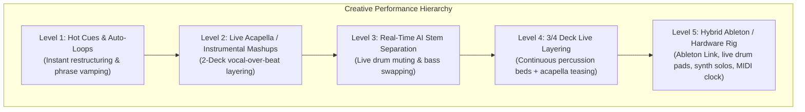
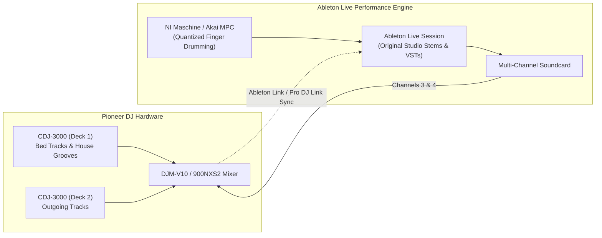

# Stems, Live Remixing & Ableton Integration: The Hybrid Frontier

Creative DJing is the spectrum where traditional playback mixing transforms into **live music production**. Instead of simply transitioning between pre-rendered master recordings, you take the constituent elements of songs—vocals, basslines, drum kits, synth leads—and remix them dynamically on the fly.

---

## 1. The Creative Payoff vs. Complexity Matrix

Not all advanced techniques are worth the cognitive effort. In a high-pressure live set, complicated workflows that require 20 button presses for a subtle change are liabilities.

| Technique | Complexity (1–10) | Live Crowd Payoff (1–10) | Efficiency Verdict |
| :--- | :---: | :---: | :--- |
| **Real-Time Stems Acapella Lift** | **3** | **9.5** | **MAXIMUM ROI:** Muting drums to isolate a vocal takes 1 tap and drives the crowd insane. |
| **2-Deck Live Mashup (In-Key)** | **4** | **9.0** | **HIGH ROI:** Dropping an iconic vocal over a heavy club beat creates instant festival euphoria. |
| **Hot Cue Drumming / Syllabic Stutter** | **3** | **7.5** | **HIGH ROI:** Simple finger-drumming builds instant tension before a drop. |
| **3-Deck Percussion Layering** | **5** | **8.0** | **HIGH ROI:** Running a clean 909 hi-hat loop on Deck 3 keeps the room driving continuously. |
| **Live Looping & Beat Slicing** | **6** | **7.0** | **MODERATE ROI:** Excellent for extending mixes, but risks becoming repetitive if held too long. |
| **Ableton Live Hybrid Rig (Stems + MIDI)**| **8** | **9.5** | **ELITE / ADVANCED:** The ultimate performance engine (used by Fred again..), but requires rehearsal and technical crew support. |
| **Complex Modular Synth Patching Live** | **10** | **4.0** | **LOW ROI:** Massive technical failure risk with minimal crowd recognition on a loud club PA. |

---

## 2. Real-Time Stems: The Modern Superpower

Real-time stem separation (Rekordbox, Serato DJ Pro, VirtualDJ, djay Pro) isolates 4 independent audio stems from any standard stereo MP3/WAV in real time:
* **Vocals:** The singing/speaking voice.
* **Melodic / Other:** Synths, pianos, guitars, horns.
* **Bass:** Sub-bass, 808s, basslines.
* **Drums:** Kicks, snares, claps, hi-hats.

### Tactical Stem Performance Recipes:
1. **The Instant Acapella:** During any song, press the `MUTE DRUMS` and `MUTE BASS` buttons. Instantly, you have a pristine, radio-quality acapella floating over the club.
2. **The "Groove Steal":** Take an incredible 128 BPM tech house drum track. Mute its vocal and melody. Take a pop hit on Deck 2 and mute its drums and bass. You have instantly manufactured a world-class live remix with zero studio preparation!
3. **The Clean Vocal Exit:** If a song's outro is messy, isolate the vocal stem, engage a 1-beat echo on the vocal alone, and fade the song down. The vocal echoes out beautifully without echoing any messy drums. (See [[Stems Transition]]).

---

## 3. Ableton Live Integration & Hybrid Setups

For artists like [[Fred again.. Case Study]], the CDJ-only paradigm is insufficient. They integrate **Ableton Live** into their performance architecture to bridge DJing and live musicianship.

### Key Technical Mechanisms of Ableton DJ Integration:
1. **Ableton Link:** A wireless/Ethernet network protocol that synchronizes tempo and beat grids across multiple computers, CDJs, and iOS apps with microsecond precision. You can speed up a CDJ, and Ableton's session clips follow instantly.
2. **Multi-Track Stem Playback:** Running original multi-track stems (isolated live drums, lead synths, backing vocals) directly out of Ableton into dedicated mixer channels on a DJM-V10.
3. **Tactile Hardware Controllers:** 
   * **Native Instruments Maschine MK3 / Akai MPC:** Quantized finger drumming of vocal chops, live claps, and 808 kicks over the DJ set.
   * **Novation Launchpad / Akai APC40:** Triggering ambient textures, risers, and sound effects.

---

## 4. Samples, One-Shots & Vocal Chops

* **One-Shot Samples:** Short, non-looping audio hits (e.g., air horn, laser, reggae siren, vocal drop like *"Drop that!"*).
* **Vocal Chops:** Micro-slices ($1/8$ or $1/16$ notes) of a vocal recording mapped across performance pads. Tapping the pads creates live melodies and syncopated hooks. (A hallmark of Fred again..'s live Boiler Room set).
* **Golden Rule of Sampling:** Keep one-shots **quantized** to the beat grid and **EQ-carved** so they don't fight the kick drum.

---

## The 5 Pedagogical Questions for Creative DJing

1. **What is it?** Real-time deconstruction, stem isolation, sample manipulation, and live remixing across performance hardware and software.
2. **Why does it matter?** Separates a genuine live artist from an automated playlist player, creating unique, unrepeatable musical moments.
3. **What does it sound/feel like?** Fluid, spontaneous, and high-energy. Done poorly, it sounds cluttered, chaotic, and messy.
4. **How do I practice it?** Complete the [[Practice Lab & Progressive Curriculum]] Level 6 drills: perform a live 2-deck mashup using Stems and cue drumming.
5. **When should I deliberately break the rule?**
   * Know when to **do nothing**. If a legendary track is playing its climax and 3,000 people are singing their hearts out, step back and let the music play. Do not ruin a sacred musical moment by frantically tapping finger-drum pads over it.

---

## Related Notes
* [[Stems Transition]]
* [[Live Mashup]]
* [[Hot Cues & Performance Pads]]
* [[Fred again.. Case Study]]
* [[Skrillex Case Study]]
