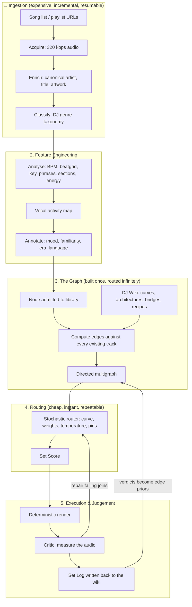

# The Agentic DJ Framework: From a List of Songs to a Routed Set

This note is the **master implementation plan** for the autonomous DJ system. Its sibling notes cover the two halves of the theory: [[Set Graph Theory & Stochastic Set Routing]] describes *how a set is chosen*, and [[Autonomous AI DJ Arranger & Intelligent Mashup Engine]] describes *how new audio is composed from stems*. This note describes the **machine that runs them** — the pipeline, the tools, the workflows, and the order in which to build it.

The governing principle, stated once and applied everywhere:

> **The AI does not touch audio. The AI chooses; deterministic tools execute; measurement judges.**
> Every musical decision is made by a tool grounded in this wiki, and every decision is explainable by pointing at the note that justified it.

---

## The Shape of the System

Two properties matter more than any detail below:

1. **Ingestion is expensive and incremental.** Adding songs computes only the new work.
2. **The graph is built once and routed infinitely.** Every "change the vibe" request is a re-route taking milliseconds, never a rebuild.

---

## The 5 Pedagogical Questions

### 1. What is it?
An agentic pipeline that accepts a list of songs or playlist links and carries them all the way to a finished, explainable DJ set: downloading, enriching, analysing, annotating, graphing, routing, rendering, critiquing, and logging — with the DJ steering at every stage through a small set of musical controls rather than through code.

### 2. Why does it matter?
* **It removes the clerical half of DJing.** Tagging, key-detecting, cue-setting and crate-organising are hours of unpaid labour that a machine does better.
* **It is explainable.** Every choice cites the note that justified it. There is no black box and nothing to take on faith.
* **It scales with the library.** The graph grows superlinearly in useful paths as tracks are added, so the hundredth record is worth far more than the tenth.
* **It learns your taste without training a model.** Set logs and verdicts become edge weights over time.

### 3. What does it sound / feel like?
Like handing a trusted, tireless resident DJ your entire collection and a single sentence of direction — *"ninety minutes, open format, build to a Bollywood peak, land soft"* — and receiving five genuinely different, fully mixed, fully explained answers within seconds.

### 4. How do I practice / implement it?
Follow the phase ladder in section 6. The order is not negotiable: perception before graph, graph before routing, routing before rendering. Each phase is independently useful, and the first five contain no AI at all.

### 5. When should I deliberately break the rule?
When the system's answer is merely *correct*. A router optimising a curve will reliably produce a competent set and will occasionally miss the reckless, wrong-on-paper juxtaposition that makes a night memorable. Turn the temperature up, or override the edge by hand — and then **log why**, so the graph learns that the "mistake" was the point.

---

## 1. The Ingestion Pipeline

Every stage is content-keyed, so re-running is free and an interrupted batch resumes exactly where it stopped.

| Stage | Purpose | Notes |
| :--- | :--- | :--- |
| **Acquire** | Playlist or single-link download to high-bitrate audio | Must be a resumable job with a per-track manifest; one failure never kills a sixty-track batch |
| **Enrich** | Canonical artist, title, album, artwork | Public catalogue lookup, no credentials required |
| **Classify genre** | A *DJ* genre, not a shop genre | The critical gap: commercial catalogues return "Bollywood" or "World", which is useless for [[Genre Bridge]] routing. The taxonomy must come from the ten playbooks in this wiki — tech house, bhangra-pop, trap, drum & bass — because that is what the router reasons about |
| **Analyse** | BPM, beatgrid, downbeats, Camelot key, 8-bar phrases, section map, energy | See section 7 — this stage currently has defects that block everything downstream |
| **Vocal map** | Vocal-active regions | Feeds collision avoidance |
| **Annotate** | Mood, familiarity, era, language, crowd fit | The soft dimensions of the [[Track Selection Framework]]. Computed **once, offline**, then frozen as node attributes |
| **Separate** | Isolated stems | Deferred until a stem recipe is actually routed |
| **Admit** | Node enters the graph; edges computed against every existing track | A part-analysed track waits in staging and is never routed |

> [!IMPORTANT]
> **A track is not in the library until it has passed every stage.** Half-ingested records must be invisible to the router. A node with a wrong BPM is worse than a missing node, because the router will confidently build a set around it.

---

## 2. The Tool Surface

The agent works exclusively through tools. Each is deterministic, each returns structured data, each fails loudly. This is the contract that makes the system drivable by an agent rather than by a person.

| Group | Capability |
| :--- | :--- |
| **Ingest** | Add a link or playlist; check job status; retry only the failures |
| **Features** | Analyse; enrich; classify; annotate; separate; re-index the library after an engine fix |
| **Graph** | Build or extend the graph; report topology; list the edges leaving a track; report library gaps; report graph version |
| **Route** | Plan a set; produce diverse alternatives; re-route from a live position; explain a route edge by edge |
| **Execute** | Render a route; critique a render; repair the joins the critique failed |
| **Knowledge** | Read the compiled recipes, energy curves, set architectures and genre bridges out of this wiki |

Two tools carry most of the product:

* **Plan** takes a duration, a target curve, a temperature, a seed, optional pins and waypoints, weightings, and filters. Every one of those arguments is a musical control, and together they are the entire creative interface.
* **Report topology** answers *"what should I download next?"* mechanically, and is useful **before a single set exists**.

---

## 3. Compiling the Wiki

The wiki is not prompt material. It is **compiled into a rulebook**, exactly as the transition cookbook already is — where the standardised recipe template yields machine-readable constraints such as whether a recipe needs stems, how large a tempo gap it tolerates, and whether it may bypass harmonic gating.

The set-level notes compile the same way:

| Source note | Compiles to |
| :--- | :--- |
| [[Energy Management & Dynamics]] | Five named target energy curves, as numeric vectors over time — **the objective function** |
| [[Set Construction & Architecture]] | Eight narrative stages; per-duration track counts and transition cadence; the planned-versus-improvised ratio |
| [[Genre Bridge Playbook]] | A routing table keyed by genre pair and tempo pair, including the double-time octave relationship |
| [[Track Selection Framework]] | The seven scoring dimensions and the Rule of Two Anchors |
| [[DJ - What Do I Play Next]] | The edge-typing table: which recipe suits which musical relationship |
| Transition Cookbook | Recipe constraints and executable step sequences |

Because these are parsed rather than paraphrased, **editing a note changes system behaviour.** Adjusting a curve in the energy note re-shapes every set routed afterwards. The wiki is the configuration.

---

## 4. Where the AI Is Allowed to Act

Deliberately small, and never in the hot loop.

| Task | Who does it | Why |
| :--- | :--- | :--- |
| BPM, key, phrases, sections, energy | Deterministic DSP | Measurable facts |
| Edge legality and scoring | Deterministic, wiki-grounded | Must be explainable and reproducible |
| Route search | Deterministic search, stochastic sampling | Fast, seedable, auditable |
| Rendering | Deterministic DSP | Audio is never generated by a model |
| Quality judgement | Measurement on rendered audio | A model cannot be trusted to grade its own plan |
| **Genre and mood classification** | Model, **once per track, offline** | Genuinely subjective; frozen into node attributes |
| **Choosing among finished routes** | Model, advisory | Narrative taste across whole journeys |
| **Naming and explaining a route** | Model | Communication, not decision-making |

The pattern to hold onto: **model judgement is compiled into the graph in advance, not consulted during the search.**

---

## 5. The Five Workflows

**W1 · Library expansion.** Add a playlist, let every stage run, extend the graph, then read the **diff report**: new nodes, new edges, components merged or still isolated, new articulation points, updated gaps. You learn what those songs actually bought you rather than merely that they arrived.

**W2 · Build a set cold.** Choose a duration and a curve, request several diverse routes, have them named and argued for, pick one, render, critique, repair, export.

**W3 · Change the vibe.** Re-roll the seed, or swap the curve, or shift the weights, or narrow the filters. Re-solve. Seconds.

**W4 · Live deviation.** You took an edge that was not in the plan. Freeze what has played, re-solve the remainder toward the pinned closer from where you actually stand.

**W5 · Post-mortem.** The critic's measurements plus **your own verdict** are written into the Set Log section of this wiki. Over time those verdicts become edge priors: transitions you genuinely liked are weighted up. This is how the system acquires your taste without anyone training a model — and it is the reason every set you play makes the next one better.

---

## 6. Implementation Phases

| Phase | Deliverable | Gate |
| :--- | :--- | :--- |
| **1** | **Repair perception** — phrase-snapped sections, tempo octave correction, cross-library absolute energy | Every edge weight is computed from these numbers |
| **2** | **Ingestion pipeline** — resumable jobs, DJ genre taxonomy, node annotation | Feeds everything |
| **3** | **Compile the wiki** — curves, architectures, bridges, edge-typing table | Pure parsing, no audio |
| **4** | **Build the graph** — all-pairs edge computation, incremental extension | |
| **5** | **Topology report** — components, articulation points, degree, tempo-band density, gaps | **Ships early; tells you what to download next** |
| **6** | **Stochastic router** — time-layered search, temperature, diverse alternatives, pins, waypoints, both routing modes | |
| **7** | **Score, render, critique, repair** | |
| **8** | **Graph interface** — routes overlaid, draggable waypoints, hover for the justifying note | |
| **9** | **Live routing** in the console | The endgame: an AI that DJs in front of you and yields when you touch the crossfader |

Phases 1 to 5 contain **no AI whatsoever** and carry most of the risk. Phase 5 begins paying dividends before a single set exists.

---

## 7. Known Blockers (verified 2026-09-11)

These are recorded honestly because the whole architecture rests on them, and because they are invisible unless you go looking.

**Structural segmentation is unusable.** Sections are currently labelled per one-second window from the energy curve, with no smoothing, no minimum length and no phrase snapping. The result is one-second "breakdowns" and labels that flap between build, verse and breakdown within a few seconds. A router asked to find a track's reset valley receives noise. **Sections must be at least 8 bars by construction and snapped to the phrase grid** that is already computed.

**Tempo detection has octave errors.** Across the current library, identical tempo values recur suspiciously across unrelated tracks, alongside impossible outliers at roughly half and double plausible dance tempi. This is beat tracking without a genre-appropriate tempo prior choosing the wrong metrical level. Every tempo-compatibility score, every recipe tolerance gate and every genre-bridge routing decision inherits the error — and a doubled tempo is far more damaging than a missing one.

**Energy is not comparable across tracks.** Values are per-track normalised, so a peak-time weapon and a warm-up record can score identically. The router's entire objective is fitting a **cross-library** curve, which this measure cannot support. It needs an absolute scale, loudness-normalised, combining the dimensions set out in [[Energy Management & Dynamics]]: tempo, spectral density, low-end punch and dynamic tension.

**Genre is commercial, not musical.** Catalogue lookups return retail categories. Routing needs the vocabulary of the genre playbooks in this wiki.

**Separated stems are not yet consumed by the renderer.** Stem separation runs and caches correctly, but stem-based recipes currently fall back to a generic blend that ignores the isolated stems entirely. This must be closed before the mashup work in [[Autonomous AI DJ Arranger & Intelligent Mashup Engine]] can begin.

---

## 8. What to Add to the Library

The router can only walk edges that exist. Three deliberate gaps are worth filling as the library grows:

1. **Glue** — instrumental and percussive tools at club tempo with long, DJ-friendly intros and outros. A library of dense full-vocal radio edits makes almost every join a vocal collision, and leaves the router nowhere to breathe.
2. **Valley material** — drumless, emotional, acoustic. Stage 6 of the narrative arc is unbuildable without somewhere to land.
3. **A tempo ladder** — a handful of records at each rung, so the tempo bands connect. Per [[Genre Bridge Playbook]], a single hip-hop record near half of a drum & bass tempo can connect two otherwise unreachable halves of a library through the double-time relationship.

Tag records as they arrive. Tags are filters that let you say *"tonight lives in this world"* — never obligations that force every tagged track into the set.

---

## Related Notes
* [[Set Graph Theory & Stochastic Set Routing]]
* [[Autonomous AI DJ Arranger & Intelligent Mashup Engine]]
* [[Set Construction & Architecture]]
* [[Energy Management & Dynamics]]
* [[Track Selection Framework]]
* [[DJ - What Do I Play Next]]
* [[Genre Bridge Playbook]]
* [[Reverse-Engineering Viral DJ Sets & Instagram Reels]]
* [[Stems, Live Remixing & Ableton Integration]]
