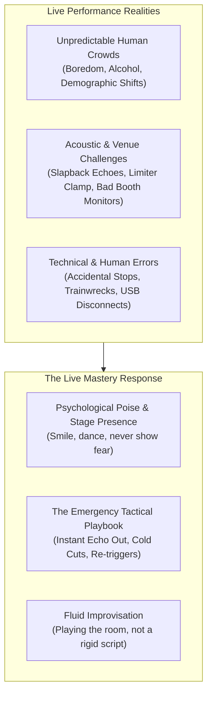

# Live Performance & Crisis Management: The Art of Live Improvisation

Anyone can mix songs in a silent bedroom with no pressure. The true test of a DJ begins the second you step into a dark, loud, chaotic club with 500 drinking, dancing, unpredictable human beings staring at you, and an expensive sound system vibrating your chest.

Live DJing is not an automated recitation of a pre-planned playlist. **Live DJing is an unscripted, real-time dialogue between you and the room.**

---

## 1. Escaping the "Rigid Pre-Planned Playlist" Trap

The most common rookie mistake is preparing a rigid, track-for-track 60-minute playlist at home and refusing to deviate from it on stage.

### Why Rigid Playlists Always Fail Live:
1. **The Room is Different Than You Imagined:** You prepared high-energy 130 BPM Tech House, but the room is half-empty, people are seated at tables talking, and an aggressive banger feels completely absurd.
2. **The Previous DJ Shifted the Vibe:** The DJ before you played hard techno right up to the final second. If you drop your planned slow deep house track, the energy immediately drops off a cliff.
3. **You Miss Organic Moments:** A rigid playlist blinds you to the room's energy spikes. If a Latin vocal gets an unexpected cheer, a playlist-bound DJ ignores it and plays whatever was next on the list. An improviser immediately pulls up another Latin groove and sets the room on fire!

### The Professional Preparation Model: "Crates Over Playlists"
Instead of a rigid linear playlist, organize your music into **vibe clusters and energy mini-blocks (Crates)**:
* `Crate 01: Warm-Up & Low-Density (120–124 BPM)`
* `Crate 02: Peak-Hour Rolling Tech House (126–128 BPM)`
* `Crate 03: Stadium Anthems & Pop Mashups (128 BPM)`
* `Crate 04: The Bass Emergency (140–150 BPM Trap & Dubstep)`
* `Crate 05: The High-Speed Weapon (174 BPM Drum & Bass)`
* `Crate 06: Secret Weapons & Nostalgic Sing-Alongs`

Within each crate, prepare **2-track and 3-track "mini-routines"** (pairs of tracks that you know blend beautifully), then freely choose which mini-routine to deploy based on real-time crowd feedback!

---

## 2. Crisis Management & Emergency Protocols

Every legendary DJ on earth has made horrific mistakes live. During his iconic 2022 Boiler Room set, an over-excited fan bumped into the deck and physically stopped the music in front of hundreds of thousands of live streamers. **Fred again.. laughed out loud, cheered with the crowd, restarted the track on the drop, and turned a potential humiliation into one of the most beloved viral moments in modern electronic music history.**

### Emergency Scenario 1: The Trainwreck (Tracks Drifting Wildly)
* **What Happened:** Two tracks are galloping out of phase (`th-thump, th-thump`); you tried nudging the wheel, but made it worse.
* **The Rookie Mistake:** Panicking and trying to nudge back and forth for 15 seconds while the crowd winces.
* **The Emergency Fix:**
  1. **DO NOT HESITATE.** 
  2. Put your hand on the outgoing track's channel fader (or crossfader).
  3. Hit a **1-beat Echo** or high-pass filter flick.
  4. **Yank the outgoing fader to ZERO in 1/4 second.**
  5. The trainwreck stops immediately. Track B is playing clean. The crowd forgives an abrupt 1-second cut; they never forgive an ongoing 15-second trainwreck.

### Emergency Scenario 2: The Deck Accidentally Stops (Total Silence)
* **What Happened:** You hit the wrong Cue button, a drunk patron leaned over the booth, or a USB crashed. The club is dead silent.
* **The Rookie Mistake:** Looking terrified, staring at your hands, or swearing into the microphone.
* **The Emergency Fix:**
  1. **LOOK UP AND SMILE.** Throw your hands up.
  2. If a patron hit the deck, point at them playfully or laugh into the mic: *"Y'all were dancing too hard, you broke the deck!"*
  3. Load an undeniable, instantly recognizable vocal anthem (e.g., ABBA, Queen, Fisher, Fred again..).
  4. Hit **PLAY** directly on the chorus. The crowd will scream and sing along instantly.

### Emergency Scenario 3: The Wrong Song / Empty Dancefloor Reaction
* **What Happened:** You dropped a new track you thought was incredible, and within 30 seconds, half the dancefloor stopped dancing and walked to the bar.
* **The Rookie Mistake:** Letting the bad song play its full 4-minute duration out of stubborn pride.
* **The Emergency Fix:**
  1. **Eject immediately.** You do not owe the song your career.
  2. Catch a 4-beat loop of the verse.
  3. Apply a High-Pass Filter sweep.
  4. Slam cut on the next phrase downbeat into a guaranteed crowd favorite.

---

## 3. Physical Stage Presence & Building Unshakeable Confidence

* **The Mirror Principle:** The dancefloor is an acoustic mirror of your nervous system. If you look bored, stiff, terrified, or hunched over a laptop screen like an accountant filing taxes, the crowd will feel cold and stiff.
* **Eye Contact & Bodily Groove:** Look up at the room at least once every 15 seconds. Make eye contact with smiling dancers in the front, mid, and back of the room. Bob your head to the rhythm. If you are visibly having the time of your life in the booth, that energy becomes infectious.
* **Handling Sound System Delays (The Booth Monitor Rule):** In large clubs or outdoor festivals, sound takes 100–300 milliseconds to travel from the main PA speakers to the back of the room and bounce off the walls back to the booth. **Never mix to the sound in the room.** Always turn your **Booth Monitors** up loud, or mix entirely inside your headphones using **Cue/Master split monitoring**.

---

## The 5 Pedagogical Questions for Live DJing

1. **What is it?** The psychological and technical execution of music before a living, reactive human audience.
2. **Why does it matter?** Sets are remembered for human connection, energy spikes, and atmosphere—not mathematical perfection.
3. **What does it sound/feel like?** Electric, thrilling, terrifying, and transcendent.
4. **How do I practice it?** Complete the live failure recovery drills in [[Practice Lab & Progressive Curriculum]].
5. **When should I deliberately break the rule?**
   * Deliberately play an unreleased, weird, or risky underground record when the room is at maximum trust, giving the audience a musical discovery they can't get on commercial radio.

---

## Related Notes
* [[Reading the Room & Crowd Psychology]]
* [[Energy Management & Dynamics]]
* [[Set Construction & Architecture]]
* [[Fred again.. Case Study]]
