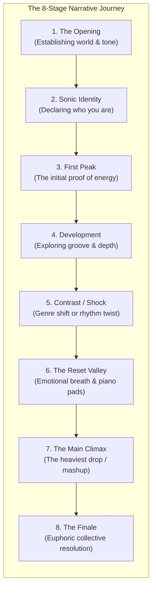
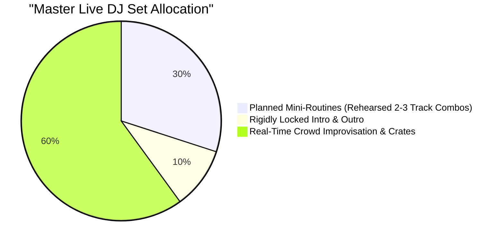

# Set Construction & Architecture: The Narrative Symphony

A DJ set is not a random collection of disconnected songs; **a DJ set is an architectural narrative with a beginning, a middle, and a cathartic resolution.** Whether you are performing a compressed 15-minute competition showcase, a 60-minute headline club set, or an expansive 90-minute festival spectacle, mastering set architecture allows you to command the audience's emotional journey.

---

## 1. The 8-Stage Narrative Blueprint

### Stage 1: The Opening (The Atmosphere Setter)
* **Purpose:** Clears the room's psychological slate from the previous DJ or background silence. Establishes the acoustic world you are inviting them into.
* **Tactic:** Often begins with atmospheric soundscapes, spoken-word voice notes, ambient strings, or a stripped-back percussive tease before the first kick drum drops.

### Stage 2: Establishing Sonic Identity (The Statement)
* **Purpose:** Declares your taste, groove, and authority within the first 3 tracks.
* **Tactic:** A distinctive, signature record that announces: *"You are in good hands tonight."*

### Stage 3: The First Peak (Proof of Concept)
* **Purpose:** Proves to the audience that you know how to make them dance. Gives them their first communal adrenaline rush.
* **Tactic:** A high-energy banger or familiar vocal anthem to pack the floor tightly.

### Stage 4: Development & The Hypnotic Pocket
* **Purpose:** Deepens the dancefloor groove. Rather than exhausting the crowd with constant build-ups, let the music roll for 10–15 minutes.
* **Tactic:** Extended bassline mixing, subtle percussion layering, and groove continuity.

### Stage 5: Contrast & Stylistic Shock
* **Purpose:** Subverts expectations right when the crowd assumes they have your style figured out.
* **Tactic:** A bold [[Genre Bridge]]—e.g., dropping from 126 BPM House into 140 BPM Trap, or introducing an unexpected classic rock or hip-hop vocal.

### Stage 6: The Reset Valley (Emotional Catharsis)
* **Purpose:** The vital breath before the summit. Strips the sub-bass away, reduces density, and lets dancers connect human-to-human.
* **Tactic:** A beautiful, drumless vocal breakdown or acoustic piano chords. (See [[Breakdown Transition]]).

### Stage 7: The Main Peak (The Climax)
* **Purpose:** The highest energy peak of the entire set.
* **Tactic:** Your most devastating [[Drop Swap]], a thunderous [[Double Drop]], or an exclusive live mashup.

### Stage 8: The Finale (The Emotional Anchor)
* **Purpose:** Leaves the audience with an indelible emotional memory as they walk out of the venue.
* **Tactic:** A transcendent, uplifting anthem where the entire venue sings in unison.

---

## 2. Set Architectures by Duration

### A. The 15-Minute Showcase / Mini-Set (High-Velocity Sprint)
* **Pacing:** Ultra-fast; 10 to 16 tracks; transitions occur every 45–75 seconds.
* **Blueprint:**
  * `00:00–02:00:` High-impact custom intro mashup (sets tone immediately).
  * `02:00–05:00:` Rapid 2-deck drop swap routine (Tech House / Bass House).
  * `05:00–08:00:` Sudden metric jump into 140 BPM Trap / Dubstep shock.
  * `08:00–10:00:` 15-second vocal tease / ambient fake drop.
  * `10:00–13:00:` 174 BPM Drum & Bass double-drop climax!
  * `13:00–15:00:` Iconic sing-along vocal finale.

### B. The 30-Minute Festival / Club Showcase
* **Pacing:** High density; 18 to 25 tracks; two distinct peaks.
* **Blueprint:**
  * `00–05m:` Atmospheric build into opening anthem.
  * `05–15m:` Building peak 1 (Groove and familiar hooks).
  * `15–18m:` Brief emotional reset / vocal valley.
  * `18–26m:` Rising cross-genre mountain climb (House $\to$ Bass $\to$ DnB).
  * `26–30m:` Massive climax and grand finale.

### C. The 60-Minute Headline Set (The Standard)
* **Pacing:** 25 to 40 tracks; full 3-peak narrative journey. (See visual curve in [[Energy Management & Dynamics]]).

### D. The 90-Minute Journey (The Masterclass)
* **Pacing:** 35 to 55 tracks; extensive room for deep exploration, unreleased tracks, and subtle tension building before the final 30 minutes of festival fireworks.

---

## 3. The Golden Ratio: Planned vs. Improvised

* **The 10% Foundation (Intro & Outro):** Always know your **first 2 tracks** and your **final closing track**. Having your opening 5 minutes locked removes stage fright; knowing your finale gives you a clear destination.
* **The 30% Arsenal (Mini-Routines):** Prepare 8 to 10 rehearsed "mini-routines" (couplets or triplets of tracks that transition seamlessly together, like an exclusive mashup or drop swap).
* **The 60% Freedom (Live Improvisation):** The glue connecting those mini-routines is 100% improvised in real time based on how the crowd responds!

---

## The 5 Pedagogical Questions for Set Construction

1. **What is it?** The macro-level sequencing and energetic pacing of tracks across an entire performance duration.
2. **Why does it matter?** Individual good songs do not make a good show. The emotional arc and contrast between songs create memories.
3. **What does it sound/feel like?** A cohesive, cinematic musical novel that keeps dancers engaged for hours without exhaustion.
4. **How do I practice it?** Complete the 15-minute and 30-minute set construction missions in [[Practice Lab & Progressive Curriculum]].
5. **When should I deliberately break the rule?**
   * If an unannounced guest artist walks onto the stage or the crowd demands an encore, throw all structure out the window and play purely on crowd-driven instinct.

---

## Related Notes
* [[Energy Management & Dynamics]]
* [[Reading the Room & Crowd Psychology]]
* [[Track Selection Framework]]
* [[Live Performance & Crisis Management]]
* [[Set Graph Theory & Stochastic Set Routing]]
* [[The Agentic DJ Framework]]
