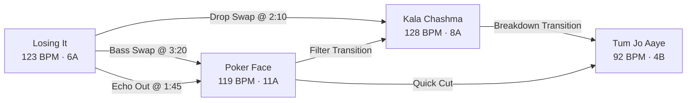
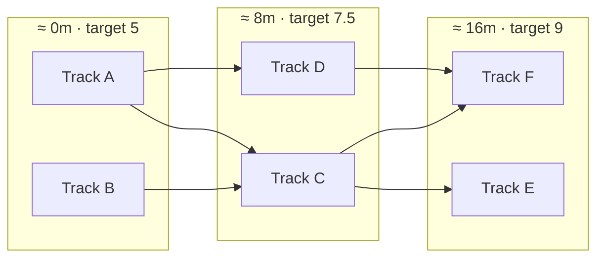

# Set Graph Theory & Stochastic Set Routing: The Library as a Network

Most DJs think of their library as a **list** — a long alphabetical scroll of files to be searched under pressure. This is the wrong mental model, and it is the reason booth panic exists.

> **A DJ library is not a list. It is a directed network.**
> The tracks are *nodes*. The playable transitions between them are *edges*. A DJ set is nothing more or less than **a path traced through that network.**

Once you accept this, set construction stops being an act of inspiration and becomes an act of **navigation**. There is not one correct set hiding in your library — there are thousands of legal paths, and the craft is choosing which one to walk tonight.

Notice that **A and B are joined by three different edges.** Same two records, three completely different musical events. Choosing between them is choosing how the set *feels*, and that choice is invisible in a list-shaped library.

---

## The 5 Pedagogical Questions

### 1. What is it?
Set Graph Routing is the practice of modelling your entire library as a **directed multigraph**, where every node is a track and every edge is one specific, viable transition — a particular recipe from the Transition Cookbook executed at a particular exit and entry point. Planning a set becomes a **pathfinding problem** over that graph, constrained by a target energy curve from [[Energy Management & Dynamics]] and the narrative stages of [[Set Construction & Architecture]].

### 2. Why does it matter?
* **It reveals what your library can actually do.** A list tells you what you own. A graph tells you what you can *play* — and, brutally, which records you own but can never reach.
* **It makes alternatives visible.** "Show me another way through tonight" becomes a button, not a re-think.
* **It turns taste into a knob.** Smooth-and-safe versus wild-and-narrative stops being a personality trait and becomes a weighting you can dial.
* **It removes booth panic.** Standing on a node with 60 seconds left, you are not searching 3,000 files — you are looking at the eight edges leading out of where you already are. This is [[DJ - What Do I Play Next]] made literal.

### 3. What does it sound / feel like?
A well-routed set feels *inevitable* — as though each record was the only possible answer to the one before it. A badly routed set feels like a shuffle button with good taste: individually strong records that never accumulate into a story. The difference is audible in the **joins**, not the tracks.

### 4. How do I practice it?
Take ten tracks. On paper, draw an arrow between every pair you believe could work, and **label each arrow with the recipe and the exit point.** You will discover two things immediately: some tracks have arrows to almost everything (your *glue*), and some have almost none (your *orphans*). Then trace three different paths through your drawing and play all three. Same ten records, three genuinely different nights.

### 5. When should I deliberately break the rule?
When the room hands you a moment the graph cannot see. A crowd singing a hook back at you, a sudden downpour on an outdoor stage, a birthday in the front row — these are edges that exist only in the room. Take them. Then **re-route from where you actually landed** rather than trying to force your way back onto the original path. The graph is a map, not a rail.

---

## 1. Anatomy of the Graph

### Nodes — tracks
A node carries everything the router needs to reason about a record:

| Attribute | Source | Used for |
| :--- | :--- | :--- |
| BPM, beatgrid, downbeats | DSP analysis | Edge legality, tempo bridging |
| Camelot key | Chroma analysis | Harmonic scoring (see [[Harmonic Mixing & Camelot System]]) |
| 8-bar phrase boundaries | Beatgrid | Exit/entry snapping (see [[Phrasing & Structure]]) |
| Section map (Intro / Build / Drop / Breakdown / Outro) | Structural segmentation | Stage matching, valley routing |
| **Absolute energy (1–10)** | Cross-library calibrated | Fitting the target curve |
| Vocal-active regions | Vocal-stem activity detection | Collision avoidance |
| DJ genre | Classified, not scraped | [[Genre Bridge]] routing |
| Mood, familiarity, era, language | Annotated once, offline | The soft dimensions of the [[Track Selection Framework]] |

> [!IMPORTANT]
> Entry and exit points belong to the **edge**, not the node. *How you arrive* determines where you enter, and a track entered at its drop is a different musical object from the same track entered at its intro.

### Edges — transitions
Every edge is one concrete musical move: a source track, a destination track, a recipe, an exit point and an entry point. Because many recipes are viable between the same pair, the structure is a **multigraph** — parallel edges are the norm, not an edge case.

| Edge attribute | Meaning |
| :--- | :--- |
| Recipe | Which cookbook recipe this edge executes |
| Exit / entry time | Phrase-snapped points on each track |
| Score | Overall viability, 0–100 |
| Camelot / BPM / phrase / vocal sub-scores | *Why* it scored that way — the explanation |
| Energy delta | How far this move shifts the room |
| Play duration | How long the outgoing track plays given this exit |

The relationship table in [[DJ - What Do I Play Next]] (Step 6) is precisely an **edge-typing rule**: same BPM with a long outro implies [[EQ Blend]]; competing vocals imply [[Stems Transition]]; a massive tempo gap implies [[Echo Out]] or [[Breakdown Transition]]. That table tells the router which parallel edge to prefer.

### Illegal edges are never drawn
An edge only exists if it is musically defensible. Clashing keys are refused unless the recipe explicitly routes around harmony; simultaneous sub-bass below $120\text{ Hz}$ is forbidden outright per [[EQ & Frequency Management]]; tempo gaps beyond a recipe's tolerance are excluded. **The graph contains only legal moves.** Everything downstream inherits that safety.

---

## 2. Why Simple Shortest-Path Fails: Time-Layering

The cost of an edge **depends on when you take it.** A $+3$ energy jump is thrilling at minute 22 and a catastrophe at minute 27. No single static weight can express this.

The solution is to layer the graph over elapsed time, so the router's position is not *"which track"* but *"which track, and how far into the night"*:

Because elapsed time only ever increases, **the layered graph is acyclic** even though the underlying library graph is full of loops. That makes the search well-behaved and fast.

### The Objective Function
Each candidate path is scored against four competing pressures:

$$L(\text{path}) = w_{\text{curve}}\sum_i |E_i - T(t_i)| \;+\; w_{\text{mix}}\sum_i (100 - s_i) \;+\; w_{\text{arch}} \cdot A(\text{path}) \;+\; w_{\text{var}} \cdot R(\text{path})$$

* **Curve fit** — how closely the realised energy $E_i$ tracks the target curve $T(t)$.
* **Mix quality** — the summed transition scores $s_i$ of every edge taken.
* **Architecture** — penalties for violating [[Set Construction & Architecture]]: wrong track count for the duration, peak in the wrong place, no reset valley.
* **Variety** — penalties for monotony: four bass swaps in a row, the same artist twice, three consecutive tracks from one genre.

The weights are the DJ's front panel. **Mix Safety versus Narrative Fidelity** is a slider, and the same library at two settings produces two different sets.

### The Target Curve Is Already Written Down
The energy curves in [[Energy Management & Dynamics]] are not illustrations — they are **the objective**, stated numerically:

| Curve | Shape |
| :--- | :--- |
| 60-Minute Headline | Three peaks, deep valley at 25–35m |
| 30-Minute Festival | Two peaks, no wasted intro, climax at 27m |
| House / Techno Wave | Gentle undulation, no cliffs |
| DnB Roller | Short valleys, violent kinetic peaks |
| Open-Format Contrast | Wild swings, a deliberate cliff at the reset |

Choosing a curve is choosing what kind of night this is.

---

## 3. The Two Routing Modes

### Mode A — Journey Mode (choose *and* order)
The router selects **a subset** of the library and orders it. It is free to leave excellent records unplayed, exactly as a real DJ does. This is how you build a set from a large library.

### Mode B — Best-Order Mode (order a fixed set)
You hand the router a specific list — tonight's crate, a themed selection, a client's requests — and it finds the **best possible order** for those tracks, using every one of them. The question shifts from *"what should I play?"* to *"I am playing these; what sequence makes them sing?"*

Best-Order Mode is the sharper tool when you already know your material, and it is the honest test of the routing engine: with the selection fixed, the only remaining variable is craft.

> [!TIP]
> Tags and playlists are **filters, not obligations.** Tagging a group of tracks narrows the pool the router draws from; it never forces every tagged track into the set. Use tags to say *"tonight lives in this world"*, then let the router choose within it.

---

## 4. Stochastic Routing: Rolling the Dice Safely

A deterministic router returns the same set every time. That is correct, and boring. **Stochastic routing** samples among good edges instead of always taking the single best one, so every solve is a different night.

### Temperature

| Temperature | Behaviour |
| :--- | :--- |
| **Cold** | Always the best edge. One canonical set. Fully repeatable. |
| **Warm** | Plausible variety. A different journey each roll, every one defensible. |
| **Hot** | Adventurous and strange. Occasionally incoherent, occasionally the best set you have ever played. |

### The Safety Property
> [!IMPORTANT]
> **Temperature only chooses among edges that are already legal.**
> A wild, hot-temperature set is still beatmatched, still phrase-locked on Beat 1, still harmonically sane, still free of sub-bass collision. Turning the dial up buys **surprise**, never **mess**. This is what makes randomness safe to use on a real dancefloor.

### Reproducibility
A set you loved is fully described by its **routing seed** — the curve, the weights, the temperature, the pins, the filters and the random seed. That handful of settings regenerates the entire journey exactly. Save the seed, not the tracklist.

A seed is only valid against the library version it was drawn from; adding records changes the graph, and therefore changes what that seed produces.

---

## 5. The Vibe Controls

Every one of these is a **re-route**, not a rebuild. The graph is stable; only the path through it changes.

| Control | What it does |
| :--- | :--- |
| **Target curve** | Headline ↔ Festival ↔ House Wave ↔ DnB ↔ Open-Format |
| **Energy offset** | Same shape, globally hotter or cooler |
| **Safety ↔ Narrative** | Smooth blends versus bold storytelling |
| **Recipe filter** | "No hard cuts" for a smooth set; "no stem recipes" for speed |
| **Track filter** | By genre, language, era, mood or playlist tag |
| **Temperature** | How adventurous the router is allowed to be |
| **Re-roll** | Same settings, different journey |
| **Pins and waypoints** | Lock the opener, lock the closer, demand a specific track at the peak |

Pinning deserves emphasis. The Golden Ratio in [[Set Construction & Architecture]] insists you always know your **first two tracks and your closing track**. In graph terms that is a fixed source and a fixed sink, with the router free to improvise the middle — a precise mechanical expression of how professionals actually prepare.

---

## 6. Re-Routing Mid-Set

You planned a path. At minute 12 the room asks for something else, and you take an edge that was not in the plan. Nothing is broken:

1. **Freeze the prefix.** What you have played is history and cannot change.
2. **Locate yourself.** You are standing on a real node at a real elapsed time.
3. **Re-solve the remainder** toward your pinned closing track, against whatever curve now matches the room.

This is the 60% improvisation of the Golden Ratio, with a safety net. You may deviate as often as you like and still arrive somewhere deliberate.

---

## 7. What the Topology Tells You About Your Library

Graph structure exposes truths a list can never show:

| Structure | What it means for you |
| :--- | :--- |
| **Connected components** | Islands. If your $174\text{ BPM}$ tracks form their own component, you *cannot reach them* from the dancefloor you are on. |
| **Articulation points** | Tracks that are the sole bridge between two clusters. Remove one and your library splits in half. **These are your most valuable records**, and they are rarely the ones you would guess. |
| **Node degree** | High degree means *glue* — it mixes into everything. Degree zero means an orphan you own but can never play. |
| **Edge density by tempo band** | Exactly where your library is thin, and therefore what to go and find. |

This converts an impossible question — *"what should I buy next?"* — into a mechanical one. A library with an unreachable Drum & Bass cluster does not need more Drum & Bass; it needs **one bridge**, and per [[Genre Bridge Playbook]] a single $87\text{ BPM}$ hip-hop record connects it instantly through the double-time octave relationship.

> The most valuable record in your collection is rarely your favourite. It is the one that connects two halves of your library that otherwise could never meet.

---

## Related Notes
* [[Set Construction & Architecture]]
* [[Energy Management & Dynamics]]
* [[Track Selection Framework]]
* [[DJ - What Do I Play Next]]
* [[Genre Bridge Playbook]]
* [[Harmonic Mixing & Camelot System]]
* [[Phrasing & Structure]]
* [[The Agentic DJ Framework]]
* [[Autonomous AI DJ Arranger & Intelligent Mashup Engine]]
