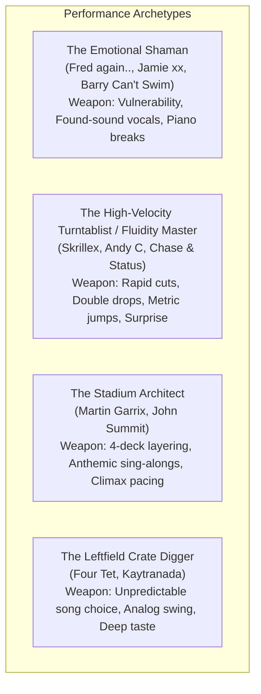

# Master DJ Comparison Matrix: Styles, Architectures & Techniques

This matrix provides a comparative analysis of elite, influential DJs across diverse electronic and open-format traditions, deconstructing their performance strengths, technical methodologies, and live philosophies.

---

## 1. Master Comparative Matrix

| Artist | Primary Style / Genre | Track Selection | Energy Control | Genre Flexibility | Technical Mixing | Live Manipulation | Vocals & Toplines | Live Sampling | Crowd Interaction | Surprise Factor | Emotional Sequencing |
| :--- | :--- | :---: | :---: | :---: | :---: | :---: | :---: | :---: | :---: | :---: | :---: |
| **Fred again..** | Melodic Electronic / UK Garage / Hybrid | 9.5 | 9.0 | 8.5 | 8.0 | **10.0** (Maschine/Pads) | **10.0** (Voice memos) | **10.0** (Real-time chops) | 9.5 (Intimate/Vulnerable) | 8.5 | **10.0** (Cinematic/Diary) |
| **Skrillex** | Bass Music / Open-Format Club | **10.0** | **10.0** | **10.0** (Unmatched) | 9.5 (Turntablist speed) | 9.0 (Hot cue cuts) | 9.0 (Live edits/grime) | 8.5 | 9.0 (High-energy hype) | **10.0** (Extreme shock) | 8.5 |
| **Martin Garrix** | Festival Progressive / EDM | 9.0 | **10.0** (Stadium peaks) | 6.5 (Festival focused) | 9.0 (4-deck V10) | 7.5 (ID/vocal triggers) | 9.5 (Stadium anthems) | 6.0 | **10.0** (Sing-alongs) | 7.0 | 9.5 (Euphoric catharsis) |
| **Four Tet** | Experimental House / Leftfield Club | **10.0** (Deep crate digger) | 9.0 (Tension master) | 9.5 (Ambient to Riddim) | 8.5 (Unquantized swing) | 9.5 (Micro-loops/Ableton)| 7.5 (Pitched soul) | 9.0 (Analog texture) | 8.0 (Anti-star presence) | **10.0** (Plays Country/Avicii)| 9.5 (Hypnotic journeys) |
| **Jamie xx** | Indie Dance / UK Bass / Breakbeat | 9.5 | 8.5 | 9.0 | 8.5 (Vinyl & CDJ) | 8.0 | 9.0 (Soulful/nostalgic) | 9.0 (Steel pans/breaks) | 7.0 (Understated) | 9.0 | 9.5 (Melancholy warmth) |
| **John Summit** | Tech House / Vocal Club Anthems | 9.0 | 9.5 (Peak-time party) | 7.5 (House to Techno) | 8.5 (Clean Bass Swaps) | 7.0 | 9.5 (Commercial hooks) | 6.0 | 9.5 (Social media/party) | 7.0 | 8.0 (Party narrative) |
| **Bicep** | Melodic Techno / Breakbeat (Live Rig) | 9.0 | 9.0 | 7.5 | 8.0 (Live hardware) | 9.5 (Custom synths) | 8.5 (Ethereal vocals) | 8.5 | 7.5 (Visual show) | 7.5 | 9.5 (Soaring nostalgia) |
| **Kaytranada** | Swung Hip-Hop / Soulful House / Funk | **10.0** (Signature swing) | 8.5 (Head-nod groove) | 8.5 (Hip-hop to Disco) | 8.0 (Loose pocket) | 8.5 (SP-404 live stabs) | 9.0 (R&B collabs) | 9.0 | 8.0 | 8.0 | 9.0 (Warm groove flow) |
| **Barry Can't Swim** | Uplifting House / Jazz / World Breaks | 9.0 | 8.5 | 8.5 | 8.0 | 9.0 (Live keys/percussion)| 8.5 (Global chants) | 8.5 | 8.5 | 8.0 | 9.0 (Sunshine joy) |
| **Chase & Status** | Drum & Bass / Jungle / UK Bass | 9.5 | **10.0** (Relentless) | 8.0 (DnB, Dub, Grime) | 9.5 (Rapid 3-deck cuts) | 7.5 | 9.5 (Ragga/vocal hooks) | 7.0 | 9.5 (Rave pandemonium) | 9.0 | 8.5 |
| **Andy C** | Drum & Bass (The Executioner) | 9.0 | **10.0** (High-velocity) | 6.5 (Pure DnB) | **10.0** (Fastest 3-deck) | 7.0 | 7.5 | 6.0 | 9.0 | 9.0 (Double drops) | 8.0 |
| **ISOxo** | Trap / Hybrid Bass / Punk Electronic | 9.0 | **10.0** (Violent impact) | 8.0 (Trap to House) | 8.5 (Drop swaps) | 8.0 | 8.0 | 7.5 | 9.5 (Mosh pit energy) | 9.5 (Sudden beat stops) | 8.0 |

---

## 2. Key Takeaways Across Archetypes

### The Ultimate Synthesis for an Open-Format DJ:
Take the **vocal intimacy and sampling soul** of Fred again.., fuse it with the **high-speed genre fluidity and drop-swapping violence** of Skrillex, and govern it with the **stadium-scale energy management and 4-deck layering** of Martin Garrix!

---

## Related Notes
* [[Fred again.. Case Study]]
* [[Skrillex Case Study]]
* [[Martin Garrix Case Study]]
* [[Track Selection Framework]]
* [[Energy Management & Dynamics]]
