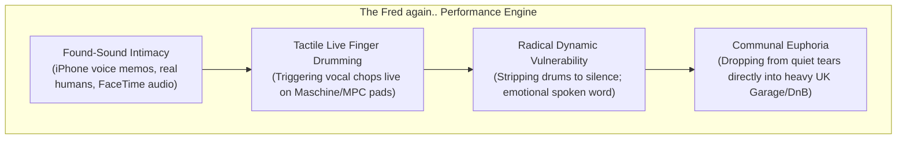

# Fred again.. Case Study: Emotional Intimacy & Hybrid Performance

Fred Gibson (Fred again..) represents a generational paradigm shift in electronic music performance. While traditional DJs stand behind CDJs and select tracks, Fred bridges the divide between **underground UK club culture (Garage, 2-Step, DnB)**, **pop songwriting**, and **tactile live musicianship**, turning real-world human emotion into communal club catharsis.

---

## 1. Hardware, Software & Live Rig Architecture (Verified Documentation)

* **Writing & Studio Production Environment (Verified):** As documented in his appearances on the *Tape Notes Podcast* (Episodes 109 & 120), Fred writes almost exclusively in **Apple Logic Pro**. He relies on stock Logic plugins (EXS24 / Quick Sampler, Pitch Shifter, Tape Delay, Channel EQ) to maintain instantaneous creative flow without getting bogged down in software engineering.
* **Live Touring Rig (Verified):** On stage (e.g., Alexandra Palace, Coachella, Glastonbury), his performance setup operates as a hybrid synchronized network:
  * **Ableton Live:** Operates as the background playback and stem playback engine, routing multi-track audio to mixer channels and transmitting SMPTE / MIDI clock to lighting and visual systems.
  * **Tactile Controllers:** Native Instruments Maschine MK3 and Akai MPC for live finger drumming of vocal chops, live claps, and percussion hits.
  * **CDJ-3000 / DJM Club Sets:** For traditional DJ gigs (such as his legendary 2022 Boiler Room London set and Madison Square Garden / Times Square shows with Skrillex & Four Tet), he mixes on Pioneer CDJ-3000s and a DJM-900NXS2 or DJM-V10, frequently using custom drumless edits and live sampler pads.

---

## 2. Core Performance Philosophy & Deconstructed Techniques

### 1. Found-Sound Sampling & Vocal Manipulation
* **The Method:** Samples everyday life: poetry spoken on FaceTime, construction workers shouting, buskers on the London Underground (e.g., Carlos, Dermot Kennedy, Delilah).
* **The Processing:** Uses heavy formant shifting (e.g., Soundtoys Little AlterBoy, Logic Pitch Shifter) to alter vocal gender, age, and emotional intimacy without changing the underlying key.

### 2. The Power of Vulnerability & The Drumless Valley
* **The Philosophy:** Most club DJs are terrified of low energy. Fred embraces **complete acoustic fragility**. He will let a delicate, unaccompanied voice note or intimate piano chord ring out in a 20,000-person arena for 45 seconds. 
* **The Impact:** Because the room became completely quiet, the subsequent UK Garage kick drum hits with shattering emotional power. (See [[Energy Management & Dynamics]]).

### 3. Tactical Live Arrangement & Looping
* Rather than playing a song from start to finish, Fred loops 2-bar emotional phrases, constantly repeating a vocal mantra (e.g., *"I want you to see me, Fred..."*) while gradually layering hi-hats, building dynamic tension through sheer repetition before releasing the groove.

### 4. Human Presence & Handling Stage Errors
* During the 2022 Boiler Room set, an over-excited fan accidentally bumped the play button on a deck, silencing the music. Rather than reacting with frustration, Fred laughed, danced with the crowd, celebrated the moment, and restarted the track on the drop—turning an error into an iconic piece of performance lore.

---

## 3. Technique vs. Artist-Specific Choices

| Universal Technique (Transferable to Anyone) | Fred again..-Specific Aesthetic Choice |
| :--- | :--- |
| Layering vocal chops live over CDJ bed tracks | Using iPhone voice memos of personal friends |
| Isolating stems live to create spontaneous acapellas | Distinctive melancholic, minor-key chord progressions |
| Extreme dynamic drops into drumless piano valleys | Personal visual branding (ambient video diary projections) |
| Using high-pass filters and delays to dissolve tracks | UK Garage / 2-Step swung percussive shuffle rhythms |

---

## 4. Fred again.. — What I Can Learn (Actionable Playbook)

### Principle 1: Make Space for Human Emotion
* **How to apply it:** In your sets, do not be afraid to drop the drums completely. Take a beautiful, dry vocal line and let it hang in the room with zero bass. Let the crowd absorb the lyrics before dropping the beat.

### Principle 2: Treat Vocals as Rhythmic Instruments
* **How to apply it:** Slice an iconic vocal word into an 8th-note slice. Map it to Hot Cue 8 (or a performance pad). Tap that pad rhythmically over a rolling house groove to build anticipation before the drop. (See [[Stutter Transition]]).

### Principle 3: Bridge Pop Vocals with Heavy Underground Grooves
* **How to apply it:** Take a recognizable commercial pop or rap vocal and drop it over an energetic, swung UK Garage or Breakbeat instrumental. Give the audience familiarity in the melody and freshness in the rhythm. (See [[Live Mashup]]).

---

## Related Notes
* [[Melodic Electronic Playbook]]
* [[Stems, Live Remixing & Ableton Integration]]
* [[Reading the Room & Crowd Psychology]]
* [[DJ Comparison Matrix]]
* [[Source Index]]
