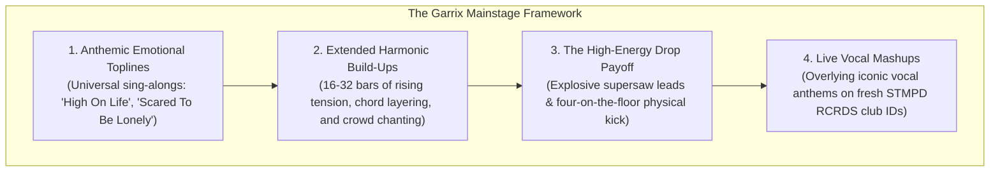

# Martin Garrix Case Study: Festival Architecture & Stadium Melodic Catharsis

Martin Garrix is the archetype of the world-class festival mainstage headliner. Headlining Tomorrowland, Ultra Music Festival, and stadiums across the globe, Garrix has perfected the art of **engineering communal euphoria for crowds of 50,000 to 100,000 people.**

---

## 1. Hardware, Mixer Routing & Multi-Deck Layering (Verified)

* **Hardware Rig (Verified):** 4x Pioneer CDJ-3000s paired with the **Pioneer DJM-V10** 6-channel flagship mixer (or DJM-A9).
* **3-Deck and 4-Deck Continuous Layering:** Garrix rarely mixes simple 2-deck track A-to-B transitions. He frequently keeps **Deck 3 or Deck 4 running continuously**, looping a recognizable high-passed vocal ID or a driving 128 BPM percussion riser to maintain acoustic density while trading melodic synths and basslines between Decks 1 and 2. (See [[3-Deck Layering]]).
* **Key Sync & Harmonic Lift:** Uses Key Sync and intentional harmonic modulation (+2 semitones / Camelot $+7$ hours) during climactic build-ups to produce massive emotional lifts on the drop.

---

## 2. Master Festival Architecture & Psychological Engineering

### 1. The Power of Stadium Sing-Alongs (Crowd Participation)
* Garrix understands that the most memorable festival moments are not technical scratching tricks; **they are the moments when 80,000 human beings sing the same melody in unison with the music turned completely off.**
* He frequently cuts the master fader on the final bar of an anthemic vocal chorus, allowing the raw acoustic roar of the crowd to fill the stadium before dropping the bassline.

### 2. The Harmonic Energy Escalation
* During progressive house climaxes, Garrix sequences tracks that climb the Camelot Wheel (e.g., modulating from A minor $\to$ B minor $\to$ C# minor across 3 consecutive records). Each key modulation feels like an acoustic gear shift that elevates crowd energy.

### 3. Exclusive Mashups & VIP Edits
* Upwards of 70% of a Garrix festival set consists of **custom studio mashups** and exclusive VIP edits made specifically for his live shows. This guarantees that his set sounds completely unique and cannot be replicated by other DJs playing standard Spotify edits.

---

## 3. Transferable Principles You Can Use in ANY Genre

### Principle 1: Never Let the Energy Floor Drop Completely (Keep the Engine Running)
* **How to apply it outside EDM:** In Tech House, Pop, or Drum & Bass, use a 3rd deck to keep a subtle percussion loop (shakers, hi-hats) running under your transitions. This prevents the "empty room" feeling when swapping melodic elements. (See [[3-Deck Layering]]).

### Principle 2: Engineer Pre-Drop Crowd Participation
* **How to apply it:** When playing an iconic song (e.g., Queen's *"Bohemian Rhapsody"* or Fisher's *"Losing It"*), cut the volume fader 1 bar before the drop and let the crowd shout the signature lyric. The subsequent drop will feel twice as satisfying.

### Principle 3: Build Custom Mashups Before Your Sets
* **How to apply it:** Do not rely solely on original radio releases. Spend time in your DAW or DJ software creating custom edits where you pair beloved vocal hooks over fresh club grooves. (See [[Live Mashup]]).

---

## Related Notes
* [[EDM & Progressive House Playbook]]
* [[3-Deck Layering]]
* [[Build-to-Drop Transition]]
* [[Energy Management & Dynamics]]
* [[DJ Comparison Matrix]]
* [[Source Index]]
