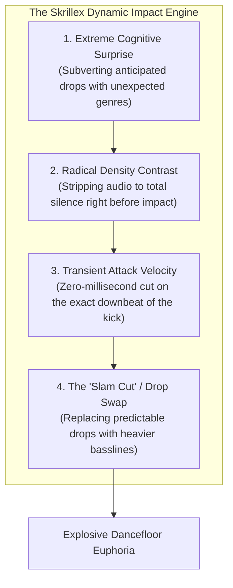

# Skrillex Case Study: High-Velocity Fluidity & The Anatomy of Maximum Impact

Sonny Moore (Skrillex) is widely recognized as one of the most technically agile, genre-fluid, and explosive live DJs in electronic music history. From pioneering American dubstep in 2010 to revolutionizing modern club music with *Quest For Fire* and the legendary **Skrillex / Fred again.. / Four Tet (TBA)** super-trio, Moore approaches the DJ booth with the hyper-accelerated mindset of a master producer and turntablist.

---

## 1. Technical Setup & Live Hardware Workflow (Verified)

* **Club & Festival Hardware (Verified):** 4x Pioneer CDJ-3000s paired with a Pioneer DJM-900NXS2 or DJM-V10 mixer.
* **Master Tempo & Key Sync Usage:** Heavily utilizes Pioneer's proprietary **Master Tempo (Key Lock)** DSP. When executing rapid tempo leaps (e.g., from 128 BPM to 140 BPM to 174 BPM), Master Tempo keeps pitch perfectly stable, eliminating chipmunk or demonic vocal artifacts.
* **The "Ableton Mentality" on CDJs:** Moore treats CDJ-3000s like clip launchers in Ableton Live. He maps all 8 horizontal Hot Cues beneath the screen to exact drop transients, vocal stabs, and build-up sections, allowing him to jump anywhere in a track within milliseconds.
* **Tactile Scratch & Spinback Mechanics:** Uses **Vinyl Mode** continuously with loose platter tension to execute lightning-fast 1/2-beat backspins, resonant High-Pass Filter cuts, and instantaneous crossfader cuts on the downbeat.

---

## 2. Deconstructing the Question: "What Makes a Skrillex-Style Moment Hit So Hard?"

A Skrillex drop does not hit hard simply because the synthesizer is loud; **it hits hard because the acoustic and psychological contrast preceding it is absolute.**

### 1. The Weaponization of Silence (The 1-Beat Pause)
* **The Technique:** In the final bar of an intense, deafening build-up, Skrillex cuts the audio completely for 1 beat (or 2 beats).
* **The Acoustic Science:** Complete silence triggers the human ear's **acoustic reflex** (the stapedius muscle relaxes). When the drop arrives 500 milliseconds later, the sound system feels $+6\text{ dB}$ louder and physically thunderous because the ear has reset its dynamic sensitivity! (See [[Energy Management & Dynamics]]).

### 2. The "Drop Swap" Subversion
* **The Technique:** He builds up with an iconic, beloved commercial record (e.g., Fisher, Missy Elliott, or a classic pop hook). The crowd is bracing for the familiar drop.
* **The Shock:** On Beat 1, he cuts the pop track dead and slams into a devastating, unreleased 140 BPM bassline or 174 BPM DnB roller that nobody saw coming. (See [[Drop Swap]]).

### 3. Metric Modulation & Half-Time Shock
* Shifting rapidly between half-time and double-time rhythms (e.g., transitioning from a bouncy 130 BPM Four-on-the-Floor UK Bassline track into an 85/170 BPM Half-Time Trap or DnB rhythm). The sudden change in physical dance cadence jolts the room out of auto-pilot.

---

## 3. Transferable Principles You Can Actually Practice

### Principle 1: Master the "Beat-1 Slam Cut"
* **How to practice:** Forget long, slow 32-bar blends for bass music. Set Hot Cue 4 on the exact downbeat of Track B's drop. Practice slamming Track A's fader down to 0 and hitting Hot Cue 4 simultaneously on Beat 1. Make the transition instantaneous. (See [[Quick Cut]] and [[Drop Swap]]).

### Principle 2: Use Sound Color Filters as Knives, Not Spoons
* **How to practice:** Use the High-Pass Filter with rapid, decisive wrist motions. Flick the filter knob up to cut all bass right before a snare roll, and flick it back to center the microsecond the kick drum lands.

### Principle 3: Fearlessly Leap Across Genres
* **How to practice:** Build a 15-minute routine that travels from Pop (124 BPM) $\to$ Tech House (128 BPM) $\to$ Dubstep (140 BPM) $\to$ Drum & Bass (174 BPM). Use [[Echo Out]] throws and [[Breakdown Transition]] bridges to navigate the gaps.

---

## Related Notes
* [[Drop Swap]]
* [[Backspin (Spinback)]]
* [[Loop Roll]]
* [[Dubstep Playbook]]
* [[DJ Comparison Matrix]]
* [[Source Index]]
