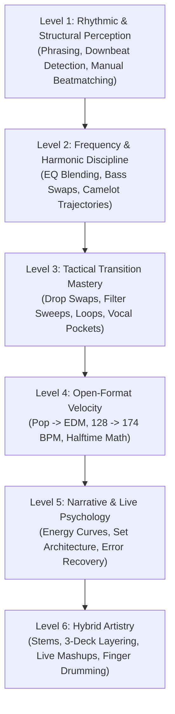

# Practice Lab & Progressive Curriculum: From Bedroom to Mainstage

DJing is not an intellectual concept; it is an applied physical craft governed by muscle memory, psychoacoustic ear training, and split-second reflex coordination. 

This curriculum organizes your development into **6 progressive, disciplined skill tiers**. Do not move to the next level until you have passed the success criteria of every exercise in your current level.

---

## Curriculum Overview

---

## LEVEL 1: Rhythmic & Structural Perception

### Exercise 1.1: The Blind Downbeat & Phrase Count
* **Objective:** Instantly identify Beat 1 and count 8-bar phrases purely by ear without looking at waveforms.
* **Setup:** Close your laptop lid or turn off visual displays. Load 5 random tracks.
* **Procedure:** Press Play. Start counting aloud: `1, 2, 3, 4 | 2, 2, 3, 4 ... 8, 2, 3, 4`. On the next beat, shout: *"Phrase 2, Bar 1!"*
* **What to listen for:** The crash cymbal, snare fill, or bassline entrance that marks the downbeat of bar 1.
* **Common failure:** Getting tricked by syncopated pickup vocals that start on beat 4 of the preceding bar.
* **Success criteria:** 100% accuracy predicting phrase boundaries across 5 consecutive unfamiliar tracks.
* **Difficulty:** 1 / 5.
* **Next exercise:** [[#Exercise 1.2: Manual Tempo & Phase Matching]].

### Exercise 1.2: Manual Tempo & Phase Matching
* **Objective:** Beatmatch two tracks manually without touching the Sync button or looking at BPM readouts.
* **Setup:** Cover the BPM display on Deck 2 with a piece of tape or post-it note. Set Deck 1 to 126 BPM. Randomize Deck 2's pitch fader.
* **Procedure:** Cue Deck 2 on Beat 1. Launch on Beat 1 of Track A. In your headphones, listen to the phase. If Track B is dragging, spin the jog wheel rim clockwise; adjust the pitch fader to lock the speed.
* **What to listen for:** The "flam" double-strike turning into a single, punchy kick transient.
* **Common failure:** Nudging the platter without moving the pitch fader, causing the tracks to drift apart 5 seconds later.
* **Success criteria:** Both tracks remain locked in phase for 32 bars with zero audible drift.
* **Difficulty:** 2 / 5.
* **Next exercise:** [[#LEVEL 2: Frequency & Harmonic Discipline]].

---

## LEVEL 2: Frequency & Harmonic Discipline

### Exercise 2.1: The Precision Bassline Swap
* **Objective:** Execute an instantaneous, seamless transfer of low-end energy between two tracks on the downbeat.
* **Setup:** Load two Tech House tracks at 126 BPM in the same Camelot key (e.g., 8A). Set Track B's Low EQ to $- \infty$ (killed). Track B upfader at 100%.
* **Procedure:** Count to Bar 16, Beat 4. On Bar 17, Beat 1: simultaneously twist Deck 1 Low EQ from 12 o'clock to 7 o'clock, and Deck 2 Low EQ from 7 o'clock to 12 o'clock in one fluid motion.
* **What to listen for:** An uninterrupted, thunderous continuation of kick drum weight with zero volume dip or bass rumbling mud.
* **Common failure:** Swapping the bass off-beat (on Beat 2 or 3).
* **Success criteria:** The transition sounds like a single track changed basslines. Zero redlining on the master meter.
* **Difficulty:** 2 / 5.
* **Next exercise:** [[#Exercise 2.2: The Energy Boost Harmonic Lift]].

### Exercise 2.2: The Energy Boost Harmonic Lift (+2 Semitones)
* **Objective:** Execute an intentional Camelot energy modulation (+2 hours / whole tone lift).
* **Setup:** Track A in 8A (A minor); Track B in 10A (B minor).
* **Procedure:** Layer Track B's high-passed build under Track A. On Beat 1 of the drop, swap to Track B's drop.
* **What to listen for:** The unmistakable emotional sensation of the room "lifting off" due to upward whole-tone modulation.
* **Success criteria:** Perfect phrase alignment; crowd experiences immediate energy lift.
* **Difficulty:** 3 / 5.
* **Next exercise:** [[#LEVEL 3: Tactical Transition Mastery]].

---

## LEVEL 3: Tactical Transition Mastery

### Exercise 3.1: The Beat-1 Drop Swap
* **Objective:** Subvert an expected festival drop with an unexpected, heavy bass drop.
* **Setup:** Track A (EDM build) on Deck 1. Track B (Bass House / Dubstep drop) cued at Hot Cue 4 on Deck 2.
* **Procedure:** Ride Track A's 16-bar build. On Bar 17, Beat 1: slam Channel 1 fader to 0 and smash Hot Cue 4 on Deck 2 simultaneously.
* **What to listen for:** Instantaneous transition with zero gap and zero audio bleed.
* **Common failure:** Hesitating for 50 milliseconds, creating a brief gap of dead silence.
* **Success criteria:** The new drop explodes with massive dynamic impact.
* **Difficulty:** 3 / 5.
* **Next exercise:** [[#Exercise 3.2: The Loop Roll Tension Build]].

### Exercise 3.2: The Loop Roll Tension Build
* **Objective:** Construct a synthetic build-up on an outgoing track using Slip Loop Roll.
* **Setup:** Slip Mode ON. Pad Mode: Roll.
* **Procedure:** On the final bar before the drop, engage a 1/2-beat roll, halving down to 1/4, 1/8, and 1/16 beat while sweeping a High-Pass Filter. Release and drop Track B on Beat 1.
* **What to listen for:** The stuttering roll accelerating into a high-tension buzzing tone.
* **Success criteria:** Track B drops cleanly on the downbeat with zero lag.
* **Difficulty:** 3 / 5.
* **Next exercise:** [[#LEVEL 4: Open-Format Velocity]].

---

## LEVEL 4: Open-Format Velocity

### Exercise 4.1: The 128 BPM $\to$ 174 BPM Drum & Bass Pivot
* **Objective:** Transition smoothly across a 46 BPM gap between House/Pop and Drum & Bass.
* **Setup:** Track A at 128 BPM; Track B at 174 BPM (Master Tempo ON).
* **Procedure:** Follow the blueprint in [[Genre Bridge Playbook]]: Enter Track A's drumless breakdown; introduce Track B's high-speed breakbeat shakers; build up and drop into 174 BPM DnB!
* **What to listen for:** The smooth transition from half-time floating ambience to high-speed kinetic drum rolling.
* **Success criteria:** Zero tempo trainwrecks; transition feels exciting and natural.
* **Difficulty:** 4 / 5.
* **Next exercise:** [[#Exercise 4.2: Hip-Hop to EDM Word-Play Cut]].

### Exercise 4.2: Hip-Hop to EDM Word-Play Cut
* **Objective:** Leap from 80 BPM Hip-Hop into 128 BPM EDM using a 1/2-beat echo throw on a vocal word.
* **Setup:** Beat FX: Echo set to 1/2 beat on Channel 1. Track B at 128 BPM cued on Hot Cue 1.
* **Procedure:** On the final punchy rhyme of the rap chorus, hit FX ON and pull Channel 1 fader to 0. Drop Track B on Beat 1.
* **Success criteria:** The echo fills the temporal space; Track B lands on the exact downbeat.
* **Difficulty:** 3 / 5.
* **Next exercise:** [[#LEVEL 5: Narrative & Live Psychology]].

---

## LEVEL 5: Narrative & Live Psychology

### Exercise 5.1: The 15-Minute Narrative Mini-Set
* **Objective:** Construct and record an intentional 15-minute multi-genre set with an established opening, two peaks, one valley, and a finale.
* **Setup:** Select 10–12 tracks across Pop, House, and DnB. Chart the energy curve on paper first.
* **Procedure:** Perform the set live in one take. Record the audio.
* **What to listen for:** Did the valley feel like a breath of fresh air or an energy flatline? Did the peaks hit with genuine contrast?
* **Success criteria:** You achieve the exact energy curve charted beforehand.
* **Difficulty:** 4 / 5.
* **Next exercise:** [[#Exercise 5.2: The Live Trainwreck Recovery Drill]].

### Exercise 5.2: The Live Trainwreck Recovery Drill
* **Objective:** Recover from an intentional, catastrophic phase error within 1 second without panicking.
* **Setup:** Play two tracks. Deliberately shove Deck 2's jog wheel so the tracks trainwreck loudly.
* **Procedure:** Give yourself exactly **ONE SECOND** to solve the crisis: apply a 1-beat Echo on Track A, slam the fader down, and let Track B take over solo.
* **Success criteria:** The auditory car crash is silenced immediately with an intentional-sounding echo throw.
* **Difficulty:** 3 / 5.
* **Next exercise:** [[#LEVEL 6: Hybrid Artistry]].

---

## LEVEL 6: Hybrid Artistry

### Exercise 6.1: Real-Time Stems Live Mashup
* **Objective:** Create an unreleased mashup live on stage by separating vocals and drums in real time.
* **Setup:** Stems Mode enabled on performance pads.
* **Procedure:** Mute the drums and bass of a Pop hit on Deck 1. Mute the vocals and melody of a Tech House track on Deck 2. Blend them together so the pop vocal sings over the house groove.
* **What to listen for:** Zero vocal clashing, tight rhythmic pocket, and pristine frequency separation.
* **Success criteria:** The mashup sounds like a pre-rendered studio release.
* **Difficulty:** 4 / 5.
* **Next exercise:** [[#Exercise 6.2: 3-Deck Continuous Architecture]].

### Exercise 6.2: 3-Deck Continuous Architecture
* **Objective:** Maintain a continuous percussion bed on Deck 3 while transitioning melodic components between Decks 1 and 2.
* **Setup:** Deck 3 loaded with a 909 shaker/hi-hat loop (High-Passed). Decks 1 and 2 loaded with progressive house tracks.
* **Procedure:** Keep Deck 3 running across two full transitions between Decks 1 and 2, managing all 3 channel strips without letting the master bus clip.
* **Success criteria:** The transition zone never feels thin; the energy floor remains elevated.
* **Difficulty:** 5 / 5.

---

## Related Notes
* [[First 10 Practice Missions]]
* [[Transition Cookbook]]
* [[Energy Management & Dynamics]]
* [[Stems, Live Remixing & Ableton Integration]]
