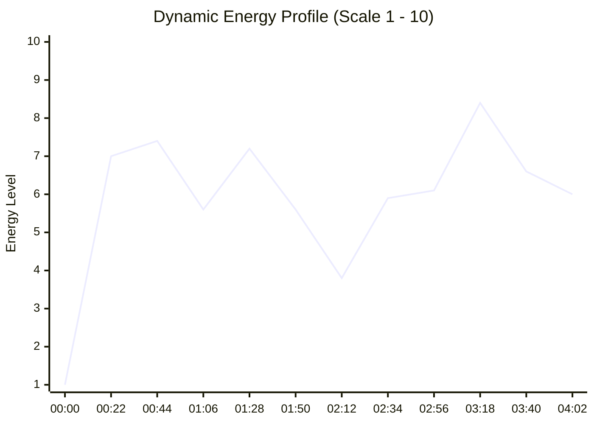

# Unknown Artist — HEER TOH BADI SAD HAI' full VIDEO song

## 1. Track Identity & Sonic Blueprint
* **Artist:** Unknown Artist
* **Title:** HEER TOH BADI SAD HAI' full VIDEO song
* **Genre:** Electronic / Open-Format
* **BPM:** `95.7` (Beat grid locked)
* **Key:** `4B` (G# Major)
* **Overall Energy:** `5.5/10`
* **Duration:** `04:23` (263.0s)
* **8-Bar Phrases Count:** 13 phrases (416 beats)

---

## 2. Dynamic Energy Architecture

---

## 3. Tactical Performance Hot Cues (8-Pad Layout)

| Pad & Color | Timestamp | Function | Tactical Purpose |
| :--- | :--- | :--- | :--- |
| **Pad 1 (Green)** | `00:04` (4.3s) | **Intro Downbeat** | Clean entrance door (Beat 1) |
| **Pad 2 (Yellow)** | `00:21` (21.0s) | **Verse / Groove Entry** | Vocal pickup or initial groove |
| **Pad 3 (Orange)** | `00:33` (33.0s) | **Build-Up Start** | Tension riser (snare roll / sweep) |
| **Pad 4 (Red)** | `00:24` (24.3s) | **MAIN DROP** | Primary sub-bass & kick release |
| **Pad 5 (Cyan)** | `00:24` (24.0s) | **Breakdown / Valley** | Emotional reset window (no sub-bass) |
| **Pad 6 (Magenta)** | `01:45` (105.3s) | **Drop 2 / Climax** | VIP or second energetic peak |
| **Pad 7 (White)** | `03:26` (206.5s) | **Mix-Out Exit Point** | 8-bar phrase percussive exit window |
| **Pad 8 (Blue)** | `00:24` (24.3s) | **Signature Hook** | Iconic vocal chop or stab for live drumming |

---

## 4. Structural Anatomy Breakdown

| Time Window | Section | Characteristics |
| :--- | :--- | :--- |
| 00:00 – 00:21 | **Intro** | Energy: 3.9/10 |
| 00:21 – 00:22 | **Verse** | Energy: 5.6/10 |
| 00:22 – 00:23 | **Drop** | Energy: 7.0/10 |
| 00:23 – 00:24 | **Verse** | Energy: 5.2/10 |
| 00:24 – 00:25 | **Breakdown** | Energy: 2.8/10 |
| 00:25 – 00:26 | **Verse** | Energy: 5.3/10 |
| 00:26 – 00:28 | **Breakdown** | Energy: 4.0/10 |
| 00:28 – 00:29 | **Verse** | Energy: 5.0/10 |

---

## 5. Algorithmic Transition Recommendations

* **Ideal Inbound Entry:** Cue **Pad 1** or **Pad 2** snapped to the outgoing track's 8-bar phrase exit.
* **Harmonic Match Partners (Camelot):** Same key (`4B`), adjacent hour, or relative major/minor.
* **Energy Boost Partner (+2 Hours):** Energy surge into drops.
* **Sub-Bass Management:** When mixing into another track, ensure sub-bass (<120 Hz) is swapped on Beat 1 of a new phrase using [[Bass Swap]].
* **Related Transition Recipes:**
  * [[Bass Swap]]
  * [[Drop Swap]]
  * [[Echo Out]]
  * [[Acapella Overlay]]
  * [[Filter Transition]]

---

## Related Notes
* [[DJ - Track Analysis]]
* [[Track Selection Framework]]
* [[Energy Management & Dynamics]]
* [[Phrasing & Structure]]
