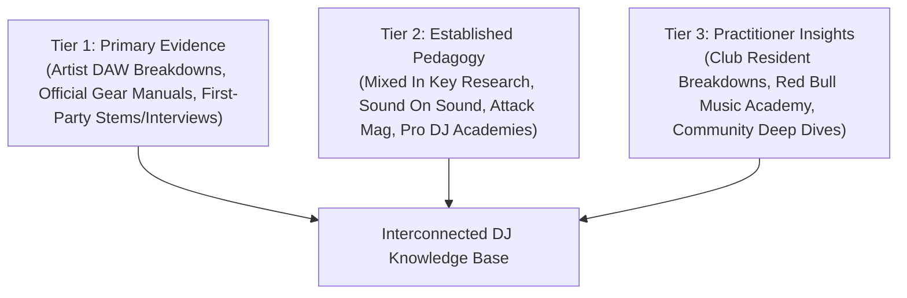

# Source Index & Research Compendium

This index documents the primary, secondary, and tertiary sources informing this DJ Knowledge Base. In accordance with rigorous performance research methodology, claims across this vault distinguish between **verified facts** (hardware manuals, artist DAW breakdowns, direct engineering documentation), **industry conventions** (standard club mixing practices, established key/tempo theory), and **expert interpretation / synthesis**.

---

## Source Classification Tiers

---

## Tier 1: Primary Evidence (Official Documentation & Direct Artist Breakdowns)

### 1. Fred again.. — Production & Live Performance Architecture
* **Source:** *Tape Notes Podcast* (Episode 109 & Episode 120, hosted by John Kennedy).
* **Topic:** DAW Workflow, sampling real-world audio, stem separation, and live performance triggering.
* **Verified Findings:**
  * Uses **Apple Logic Pro** as his native production environment (relies on stock plugins: EXS24/Quick Sampler, Pitch Shifter, Delay Designer) rather than Ableton for writing.
  * Live stage setup relies on a synchronized **Ableton Live** rig operated with a dedicated playback/MIDI technician to handle stems, SMPTE timecode, and visual triggers.
  * Real-time tactile performance is executed via **Native Instruments Maschine MK3** and **Akai MPC** for quantized finger drumming and live vocal chop playback over CDJ-driven bed tracks.
* **Vault Integration:** Cited in [[Fred again.. Case Study]], [[Stems, Live Remixing & Ableton Integration]], [[Sampling & Vocal Chops]].

### 2. Skrillex — Modern CDJ-3000 Workflow & Hybrid Open-Format Dynamics
* **Source:** *Zane Lowe / Apple Music In-Depth Interview (Quest For Fire / Don't Get Too Close Era)*; Pioneer DJ CDJ-3000 Engineering Whitepaper & Feature Documentation.
* **Topic:** High-tempo energy modulation, hot-cue jumping, drop-swapping, and pitch-independent tempo transitions.
* **Verified Findings:**
  * Relies on **Pioneer CDJ-3000s** utilizing Key Sync, Master Tempo algorithm, and 8 physical Hot Cue buttons arranged horizontally beneath the display.
  * Set structure relies on the "slam" and "drop swap" rather than extended 64-bar house blends, creating abrupt dynamic contrast.
  * Employs half-time to double-time arithmetic (e.g., 70/140 BPM dubstep/trap into 174 BPM DnB) using quick backspins and resonant high-pass filter cuts on the 1-beat.
* **Vault Integration:** Cited in [[Skrillex Case Study]], [[Drop Swap]], [[Backspin (Spinback)]], [[Genre Bridge Playbook]].

### 3. Martin Garrix — Festival Architecture & Stadium Sound Control
* **Source:** *Tomorrowland Technical Production Breakdown*, *STMPD RCRDS Studio Masterclasses*, *Pioneer DJ Artist Profile*.
* **Topic:** Large-scale festival pacing, DJM-V10 6-channel routing, 4-deck layering, and crowd psychology.
* **Verified Findings:**
  * Uses a 4-deck **Pioneer CDJ-3000** setup paired with the **Pioneer DJM-V10** 6-channel mixer.
  * Utilizes 3-deck and 4-deck layering to keep a percussion loop running on Deck 3 while transitioning melodic components between Deck 1 and Deck 2.
  * Builds extended emotional breakdowns utilizing progressive house vocal anthems, modulating key upward (+1 or +2 semitones) for the climax.
* **Vault Integration:** Cited in [[Martin Garrix Case Study]], [[3-Deck Layering]], [[Energy Management & Dynamics]], [[Festival-Style Set Construction]].

### 4. Pioneer DJ / AlphaTheta Hardware Documentation
* **Source:** *CDJ-3000 Instruction Manual*, *DJM-900NXS2 / DJM-V10 Operating Instructions*, *Pro DJ Link Network Architecture Guide*.
* **Key Technical Specifications:**
  * **Quantize Mechanics:** Snaps hot cues, loops, and beat jumps to the analyzed Rekordbox beat grid (1/8, 1/4, 1/2, or 1 beat resolution).
  * **Master Tempo:** Digital time-stretching DSP preserving musical pitch within $\pm 16\%$ range without excessive phase smearing.
  * **Mixer EQ Curves:** Isolator mode ($- \infty$ kill) vs. Standard EQ ($-26\text{ dB}$ cut, $+6\text{ dB}$ boost).
* **Vault Integration:** Cited in [[DJ Equipment & Software Concepts]], [[Beatmatching & Tempo]], [[EQ & Frequency Management]].

---

## Tier 2: Established Pedagogy & Music Production Science

### 5. Mixed In Key & Harmonic Mixing Research
* **Source:** Davis, Mark. *Beyond Beatmatching: How to Be a Modern DJ* (Mixed In Key Publications); *The Camelot Wheel Patent & Key Detection Whitepapers*.
* **Core Principles:**
  * The 12-hour Camelot wheel mapping of musical keys (1A–12A minor, 1B–12B major).
  * Energy boost modulation (+2 hours / +7 semitones) and emotional darkening (-1 hour / -7 semitones).
  * Limits of harmonic mixing: Dissonance in percussive intros vs. harmonic clash during vocal overlays.
* **Vault Integration:** Cited in [[Harmonic Mixing & Camelot System]], [[Harmonic Energy Modulation]], [[Vocal Transition]].

### 6. Acoustic Masking & Sound Engineering
* **Source:** *Sound on Sound* Sound Engineering Guides; *Attack Magazine* Technique Archives (Frequency Slotting, Low-End Phase Cancellation).
* **Key Principles:**
  * **Auditory Masking:** High-amplitude low-frequency energy (kick/sub-bass between $30\text{--}120\text{ Hz}$) masks higher harmonics and reduces overall dynamic headroom if played simultaneously on two decks.
  * **Comb Filtering:** Phase cancellation occurring when two identical or near-identical kick drums play milliseconds out of phase, hollowing out transient punch.
  * **Frequency Ownership:** The non-negotiable rule that only one track owns the sub-bass ($<100\text{ Hz}$) at any given microsecond.
* **Vault Integration:** Cited in [[EQ & Frequency Management]], [[Bass Swap]], [[Rules vs Principles]].

### 7. Professional DJ Academies (Crossfader & Digital DJ Tips)
* **Source:** Hartley, Jamie (Crossfader); Morse, Phil (Digital DJ Tips, author of *Rock The Dancefloor!*).
* **Key Principles:**
  * The 32-beat (8-bar) and 64-beat (16-bar) phrase counting discipline.
  * The hierarchy of track selection over technical flashiness.
  * Open-format tempo bridging through ambient breakdowns, echo throws, and double-time relationships.
* **Vault Integration:** Cited in [[Phrasing & Structure]], [[What Makes a Great DJ]], [[Open-Format DJing Guide]], [[Practice Lab & Progressive Curriculum]].

---

## Tier 3: Practitioner Insights & Performance Analytics

### 8. Resident Advisor: "The Art of DJing" Series
* **Source:** In-depth technical interviews with Four Tet (Kieran Hebden), Andy C, Joy Orbison, Jamie xx.
* **Key Insights:**
  * Four Tet on unquantized rhythmic friction, track unpredictability, and micro-loops.
  * Andy C on 3-deck Drum & Bass rapid double-dropping, phrase matching at 174 BPM, and riding pitch faders manually under crowd pressure.
* **Vault Integration:** Cited in [[DJ Comparison Matrix]], [[Double Drop]], [[Reading the Room & Crowd Psychology]].

---

## Methodological Distinctions Used in This Wiki

| Category | Definition | Example in Vault |
| :--- | :--- | :--- |
| **Verified Fact** | Physically documented gear, DSP algorithms, primary artist quotes. | Fred again.. uses Logic Pro for writing and an Ableton playback rig on stage. |
| **Industry Convention** | Widespread club practice validated across international venues. | Swapping basslines on the downbeat of bar 1 of a 16-bar phrase. |
| **Expert Interpretation** | Acoustic, psychological, or aesthetic analysis of why something works. | Why a sudden drop in density creates perceived volume increase when the kick returns. |
| **Author Synthesis** | Practical frameworks, listening drills, and pedagogical roadmaps created here. | The 7-dimension Track Selection Framework and 10-level Practice Lab. |
