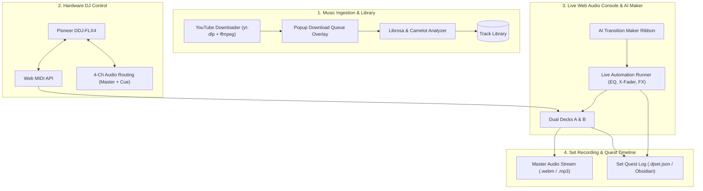

# IDEAS.md — Feature Architecture & Future Roadmap

> **Repository:** `AI-DJ-Mixing-System` (`DJAITest`)  
> **Status:** Planning & Feature Design Specification (Documentation Only)  
> **Last Updated:** September 2026  

This document serves as the master ideas and architectural blueprint for expanding the **Pulse DJ Console** and **AI Music Brain** into a fully integrated live performance system. It covers four major pillars:
1. **AI Transition Maker:** Real-time Web Audio transition automation directly on the live console decks.
2. **Hardware DJ Controller Integration:** Native zero-install Web MIDI mapping for the **Pioneer DDJ-FLX4** (and similar class-compliant controllers) with 4-channel audio routing.
3. **YouTube Audio Downloader & Queue Overlay:** In-browser YouTube ingestion with a multi-item download queue and auto-analysis into the library.
4. **Full Set Recording & Choreography Timeline ("Set Quest Log"):** Synchronized master audio recording paired with a `.djset.json` action timeline that captures every transition recipe, EQ movement, FX throw, and track quest journey.

---

## 1. System Architecture Overview



---

## 2. Pillar I: The AI Transition Maker (Live Console Execution)

### 2.1 The Concept
Instead of rendering an offline `.mp3` snippet played through a detached HTML `<audio>` tag, the **AI Transition Maker** runs transitions **live on the console itself**. The DJ can watch the AI physically execute the transition on the platters, faders, and knobs, or take over control at any point.

### 2.2 Studio Ribbon Interface
Located immediately above the 2-channel mixer and below the dual waveforms:

```
┌────────────────────────────────────────────────────────────────────────────────────────────────┐
│ ✦ AI TRANSITION MAKER                                     HARMONIC: 8A → 9A (+1) · BPM: 126.0  │
├────────────────────────────────────────────────────────────────────────────────────────────────┤
│  RECOMMENDED RECIPES:                                                                          │
│  ┌───────────────────────┐  ┌───────────────────────┐  ┌───────────────────────┐               │
│  │ 01 · BASS SWAP  (94%) │  │ 02 · ECHO OUT   (89%) │  │ 03 · FILTER SWEEP(84%)│  [+ MORE (28)]│
│  │ Bar 64 ➔ Bar 1 (8-Bar)│  │ Bar 72 ➔ Bar 1 (4-Bar)│  │ Bar 56 ➔ Bar 1 (16-Bar│               │
│  │ [▶ PLAY ON CONSOLE]   │  │ [▶ PLAY ON CONSOLE]   │  │ [▶ PLAY ON CONSOLE]   │               │
│  └───────────────────────┘  └───────────────────────┘  └───────────────────────┘               │
│                                                                                                │
│  CUSTOM MAKER BUILDER:                                                                         │
│  [ Recipe: Bass Swap ▾ ]  [ Length: 8 Bars (32 Beats) ▾ ]  [ Pre-Roll: 4 Bars ▾ ]             │
│  [ Exit A: 02:14.2 (Phrase 8) ▾ ]  [ Entry B: 00:15.8 (Phrase 1) ▾ ]  [ FX: Auto ▾ ]           │
│  [ ▶ EXECUTE ON CONSOLE ]   [ ⏺ ARM AS HOT CUES ]   [ ⤓ EXPORT AUDIO ]                         │
└────────────────────────────────────────────────────────────────────────────────────────────────┘
```

### 2.3 Automation Mechanics on Web Audio Nodes
When `▶ PLAY ON CONSOLE` is clicked:
1. **Pre-Roll Positioning:** Deck A and Deck B seek to $T_{\text{transition}} - T_{\text{pre-roll}}$ (typically 4 bars / 16 beats prior).
2. **Tempo & Phase Sync:** Deck B's pitch slider adjusts to match Deck A's effective BPM via the console's `SYNC` routine.
3. **Execution across Web Audio Nodes:**
   * **Bass Swap:** Crossfader glides from A to Center. On Bar 8 Beat 1, Deck A's `lowFilter` snaps from `0 dB` to `-26 dB` in $<10\text{ms}$, while Deck B's `lowFilter` snaps from `-26 dB` to `0 dB`. Crossfader glides to Deck B.
   * **Echo Out:** 1 bar before exit, Deck A's insert FX engages `ECHO` at 70% wet. On Beat 1, Deck A's channel fader drops instantly to zero while the post-fader echo tail rings out, and Deck B slams in on-air.
   * **Filter Transition:** Deck A sweeps a high-pass filter from 20 Hz to 4,000 Hz while Deck B sweeps a low-pass filter open from 200 Hz to 20,000 Hz.
   * **Drop Swap / Cut:** Hard cuts exactly on Beat 1 of the new phrase.
4. **Physical UI Synchronized Animation:** Crossfader slider and rotary EQ knobs visually slide and turn on screen via `requestAnimationFrame` matching the audio parameter changes.
5. **Persistent Waveform Mix Corridor:** A glowing colored highlight covers the active mix window across both waveforms with a real-time sweep playhead.

### 2.4 Waveform Interaction Note: Seeking vs. Setting Transition Points
* **The Current Issue:** When a user clicks directly on the main WaveSurfer waveform (`#waveform-a` or `#waveform-b`), the click is intercepted by an `interaction` listener in `app.js` purely to set `state.aTime` / `state.bTime` for the AI preview. As a result, the playhead **does not jump or seek along the track**, violating standard DJ software expectations (where clicking a waveform instantly scrubs/seeks playback). Meanwhile, seeking is only available by clicking the tiny mini-overview strip (`#overview-a`/`#overview-b`).
* **Proposed UX Solutions:**
  1. **Dual-Function Seeking (Primary Seek + Smart Cue):**
     * **Primary Click:** Clicking anywhere on the waveform immediately seeks the active deck (`deck.seek(clickedTime)`) and moves the playhead (standard DJ behavior).
     * **Auto-Update Transition Point:** Seeking can simultaneously update the candidate exit/entry point snapped to the nearest 8-bar phrase boundary, keeping both features in harmony without blocking playback.
  2. **Modifier Key / Mode Toggle:**
     * **Normal Click:** Seek playback along the track.
     * **Shift + Click (or Alt + Click):** Pin/set the manual AI transition exit/entry marker without jumping playback.
     * **Waveform Mode Switcher:** An optional toggle icon on the waveform lane header: `[ 🔍 SEEK MODE ]` vs `[ 🎯 TRANSITION PIN MODE ]`.
  3. **Draggable Transition Region Handles:**
     * Allow seeking by clicking anywhere on the waveform body, and provide dedicated draggable flag markers (`[A EXIT]` / `[B ENTRY]`) at the top of the waveform lane that can be slid along the beatgrid to designate mix points.

---

## 3. Pillar II: Pioneer DDJ-FLX4 Hardware Controller Integration

The console can directly support physical DJ controllers like the **Pioneer DDJ-FLX4** via the **Web MIDI API**, with zero external drivers or native software required.

### 3.1 Web MIDI Handshake (Chromium Native)
Modern Chromium browsers (Chrome, Edge, Brave, Opera) support `navigator.requestMIDIAccess({ sysex: false })`. The DDJ-FLX4 is a USB Class-Compliant MIDI controller that sends and receives standard MIDI messages.

```
┌─────────────────────────────────────────────────────────────┐
│                    Pioneer DDJ-FLX4                         │
│   [Jog Wheel A]       [Mixer: EQs / Faders]   [Jog Wheel B] │
│   [Pads 1-8]          [Crossfader / Smart CFX][Pads 1-8]    │
└──────────────────────────────┬──────────────────────────────┘
                               │ USB-C (Class-Compliant MIDI + Audio)
                               ▼
┌─────────────────────────────────────────────────────────────┐
│                       Web Browser                           │
│  navigator.requestMIDIAccess()    AudioContext (4 Channels) │
│  ├── MIDI In (Controls)           ├── Ch 1-2: Master (RCA)  │
│  └── MIDI Out (LED Feedback)      └── Ch 3-4: Cue (Phones)  │
└─────────────────────────────────────────────────────────────┘
```

### 3.2 Pioneer DDJ-FLX4 MIDI Mapping Table

| FLX4 Hardware Control | MIDI Message Type & Address | Web Console Mapping | Behavior in Engine |
| :--- | :--- | :--- | :--- |
| **Jog Platter (Touch)** | NoteOn `0x90 0x36` (Ch 1) / `0x91 0x36` (Ch 2) | Vinyl Platter Touch | Engages scratch/vinyl mode; halts playback progression. |
| **Jog Wheel (Outer Ring)** | CC `0x21` (Ch 1) / `0x23` (Ch 2) | Pitch Bend / Nudge | Relative 2's complement: values $>64$ nudge down, $<64$ nudge up. Maps to `deck.setBendPercent()`. |
| **Play / Pause Button** | NoteOn `0x90 0x0B` (Ch 1) / `0x91 0x0B` (Ch 2) | Transport PLAY | Calls `deck.toggle()` (vinyl spin-up and brake routines). |
| **CUE Button** | NoteOn `0x90 0x0C` (Ch 1) / `0x91 0x0C` (Ch 2) | Transport CUE | Calls `deck.cue()`. |
| **Tempo / Pitch Slider** | Pitch Bend or 14-bit CC `0x00/0x20` | Pitch Fader | Maps directly to `deck.setPitchPercent(val)`. |
| **3-Band EQ (Hi/Mid/Low)**| CC `0x07`, `0x09`, `0x0B` (Ch 1 / Ch 2) | 3-Band Biquad EQ | 0–127 maps to `-26 dB` .. `+6 dB` on shelves and peak filter. |
| **Trim Knob** | CC `0x02` (Ch 1) / `0x04` (Ch 2) | Pre-EQ Trim | Maps 0–127 to gain `0.0` .. `2.0`. |
| **Channel Faders** | CC `0x13` (Ch 1) / `0x14` (Ch 2) | Channel Volume | Maps 0–127 to `0.0` .. `1.2`. |
| **Crossfader** | CC `0x1F` (Ch 1) | Equal-Power Crossfader | Maps 0–127 to `-1.0` .. `+1.0` on `applyCrossfader()`. |
| **Pads (1–8)** | NoteOn `0x97 0x00`–`0x07` (Ch 8 / Ch 9) | Hot Cues / Sampler | Hot Cue mode sets/jumps cues 1–8; Sampler mode fires one-shot samples. |
| **Smart Fader Button** | NoteOn `0x90 0x48` | **AI Transition Trigger** | **Dedicated hardware button to trigger `▶ PLAY ON CONSOLE`!** |
| **Smart CFX Button** | NoteOn `0x90 0x49` | AI FX Macro | Engages the AI-recommended transition FX (e.g. Echo Out wash). |

### 3.3 4-Channel Audio Routing (Master Out + Headphone Pre-Cueing)
The DDJ-FLX4 features an integrated multi-channel audio interface over USB:
* **Channels 1 & 2:** Master Output $\to$ RCA outputs on rear panel $\to$ Main speakers / PA.
* **Channels 3 & 4:** Cue Output $\to$ 3.5mm headphone jack on front panel $\to$ DJ headphones.
* **Web Audio Implementation:**
  ```javascript
  // Route master to Channels 1 & 2, Headphone Cue to Channels 3 & 4
  const splitter = audioCtx.createChannelSplitter(4);
  const merger = audioCtx.createChannelMerger(4);
  masterGain.connect(merger, 0, 0); // Master L -> Out 1
  masterGain.connect(merger, 0, 1); // Master R -> Out 2
  headphoneCueGain.connect(merger, 0, 2); // Cue L -> Out 3
  headphoneCueGain.connect(merger, 0, 3); // Cue R -> Out 4
  merger.connect(audioCtx.destination);
  ```

---

## 4. Pillar III: YouTube Audio Downloader & Queue Overlay

An in-browser downloading hub that extracts high-quality 320 kbps MP3s directly from YouTube into the track library, backed by an interactive queue overlay.

### 4.1 UI Design & Queue Modal

```
┌────────────────────────────────────────────────────────────────────────────────────────────────┐
│  TRACK BROWSER                                          [ ▶ YOUTUBE DOWNLOAD & QUEUE (3) ]     │
└────────────────────────────────────────────────────────────────────────────────────────────────┘

┌────────────────────────────────────────────────────────────────────────────────────────────────┐
│ ✦ YOUTUBE AUDIO DOWNLOAD QUEUE                                                    [ CLOSE ✕ ]  │
├────────────────────────────────────────────────────────────────────────────────────────────────┤
│  PASTE YOUTUBE URL(S):                                                                         │
│  ┌─────────────────────────────────────────────────────────────────┐ ┌──────────────────────┐  │
│  │ https://www.youtube.com/watch?v=k_9Yg4h_49Q                     │ │ + ADD TO QUEUE       │  │
│  └─────────────────────────────────────────────────────────────────┘ └──────────────────────┘  │
│  📁 Target Folder: data/cache/uploads (or local data/songs/)  ·  Audio: 320kbps MP3 (CBR)     │
├────────────────────────────────────────────────────────────────────────────────────────────────┤
│  DOWNLOAD QUEUE:                                                                               │
│                                                                                                │
│  [■] Fred again.. - Delilah (pull me out of this)                                              │
│      Status: DOWNLOADING (74%) ━━━━━━━━━━━━━━━━━━━╸━━━━━  320 kbps  [ CANCEL ]                 │
│                                                                                                │
│  [✓] Skrillex, Fred again.., Flowdan - Rumble                                                  │
│      Status: READY (Analyzed: 140.0 BPM · 6A Bb minor)                                         │
│      Actions: [ LOAD DECK A ]   [ LOAD DECK B ]   [ OPEN IN EXPLORER ]                         │
│                                                                                                │
│  [⏳] Fisher - Losing It                                                                        │
│      Status: QUEUED (Waiting in line...)                                                       │
└────────────────────────────────────────────────────────────────────────────────────────────────┘
```

### 4.2 Architecture & Flow
1. **Background Download Worker:** Managed in `app/ui/server.py` using `yt-dlp` and `ffmpeg` running in a dedicated async thread pool.
2. **High-Fidelity Audio Parameters:**
   * Format: `bestaudio/best` extracted to **320 kbps CBR MP3**.
   * Embedded ID3v2 metadata (Title, Artist, Date, Uploader) and high-resolution thumbnail embedded as album cover art.
3. **Auto-Analysis on Completion:**
   * As soon as a download finishes, the file is saved to the upload folder and indexed into `_tracks`.
   * The server runs `app.music_brain.analyzer` in the background (BPM, Camelot key, beatgrid, downbeats, 8-bar phrase boundaries, energy curve).
   * The client updates automatically—the track is instantly playable and ready to be loaded onto Deck A or Deck B.
4. **API Endpoints:**
   * `POST /api/youtube/queue` — Submits URL(s) to the download queue.
   * `GET /api/youtube/queue` — Returns queue status, progress percentages, and current stages.
   * `DELETE /api/youtube/queue/{id}` — Cancels an active or queued download.

---

## 5. Pillar IV: Full Set Recording & Choreography Timeline ("Set Quest Log")

A recording and session-archival architecture that captures both raw master audio and an exact, synchronized **musical choreography log** ("Auto-Quest") of the performance.

### 5.1 The Dual-Artifact Output
Finishing a recorded set produces two complementary artifacts:
1. **Master Audio Recording:** `set_YYYY-MM-DD_HH-mm.webm` (or `.mp3`), captured from `masterGain` via `MediaRecorder`.
2. **Choreography Timeline File:** `set_YYYY-MM-DD_HH-mm.djset.json`, recording every track, transition recipe, EQ tweak, FX throw, and auto-quest recommendation.

### 5.2 Schema: `.djset.json` (The Choreography Timeline Format)

```json
{
  "$schema": "https://pulse.dj/schemas/djset-v1.json",
  "metadata": {
    "session_id": "set_2026_09_10_club_mix",
    "date": "2026-09-10T02:00:00Z",
    "duration_seconds": 2145.6,
    "total_tracks": 8,
    "total_transitions": 7,
    "harmonic_coherence_score": 92.4,
    "energy_arc": "Wave (Warmup -> Peak 1 -> Dip -> Festival Drop -> Outro)"
  },
  "track_quest_journey": [
    {
      "index": 1,
      "track_id": "a9f3b20c1e84",
      "title": "Bicep - Glue",
      "deck": "A",
      "bpm": 130.0,
      "key": "8A",
      "energy_score": 6.2,
      "start_time_in_set": 0.0,
      "exit_time_in_set": 240.0,
      "recommendation_reason": "Starting groove / ambient breakbeat intro"
    },
    {
      "index": 2,
      "track_id": "c4d5e6f7a1b2",
      "title": "Overmono - So U Kno",
      "deck": "B",
      "bpm": 132.0,
      "key": "9A",
      "energy_score": 7.5,
      "start_time_in_set": 224.0,
      "exit_time_in_set": 480.0,
      "recommendation_reason": "Camelot +1 energy boost; matching UK bass percussion"
    }
  ],
  "transitions": [
    {
      "transition_index": 1,
      "outgoing_track": "Bicep - Glue",
      "incoming_track": "Overmono - So U Kno",
      "recipe_name": "Bass Swap",
      "recipe_category": "Blends & EQ",
      "mix_start_time": 224.0,
      "swap_point_time": 240.0,
      "mix_end_time": 256.0,
      "bars_length": 8,
      "performance_type": "AI-Automated",
      "steps_log": [
        { "time": 224.0, "action": "Deck B started at 00:15.8 (Phrase 1)" },
        { "time": 224.0, "action": "Crossfader ramp started A -> Center" },
        { "time": 240.0, "action": "SWAP: Deck A Low -> -26dB, Deck B Low -> 0dB" },
        { "time": 256.0, "action": "Deck A volume cut to 0; Deck B On-Air solo" }
      ]
    }
  ],
  "control_event_stream": [
    { "t": 224.0, "param": "crossfader", "val": -1.0 },
    { "t": 232.0, "param": "crossfader", "val": 0.0 },
    { "t": 240.0, "param": "deck_a_eq_low", "val": -26.0 },
    { "t": 240.0, "param": "deck_b_eq_low", "val": 0.0 },
    { "t": 240.0, "param": "deck_a_fx_echo_wet", "val": 0.65 },
    { "t": 256.0, "param": "crossfader", "val": 1.0 }
  ]
}
```

### 5.3 Capabilities Unlocked by the Set Quest Log
1. **Ghost DJ Replay Mode:** The console can load a `.djset.json` file and replay the entire mix live on the decks—moving the platters, faders, and EQs automatically like a player piano.
2. **Obsidian Vault Post-Mortem Export:** Automatically generates a comprehensive markdown set post-mortem note matching the template in `DJ/17 - Set Logs/`:
   * Tracklist with timestamps (ready for YouTube / SoundCloud tracklists).
   * Visual Camelot wheel journey showing harmonic transitions.
   * Transition post-mortem (flagging clashing frequencies or vocal clashes).
3. **Auto-Quest Recommendations:** During live play, the console dynamically recommends candidate tracks to continue the musical quest:
   * *Harmonic Advance Quest:* $\pm 1$ Camelot key at matching BPM.
   * *Energy Lift Quest:* $+2$ Camelot energy boost into a peak section.
   * *Genre Bridge Quest:* Open-format bridge track into Drum & Bass or Hip-Hop.

---

## 6. Pillar V: The Ultimate AI DJ Companion & Learning Engine

To transform the console into an autonomous, adaptive creative partner rather than a static automixer, the AI companion incorporates learning, live contextual advising, and open sandbox exploration:

### 6.1 The "Technique Learning" Engine (Expanding Beyond Static Presets)
How the AI Companion acquires and internalizes new DJ moves:
1. **Markdown Recipe Compiler (Obsidian Knowledge Base Integration):**
   * Drop any new markdown note into `DJ/05 - Transition Cookbook/` adhering to the standardized 17-part template.
   * A parser extracts the textual step-by-step instructions (e.g. *"Step 1: Loop 4 beats. Step 2: Low EQ cut to -26dB on bar 4. Step 3: Echo at 70% feedback..."*) and compiles them directly into an executable Web Audio automation script.
2. **"Mimic / Macro Mode" (Learn by Watching the DJ):**
   * The DJ performs a creative transition manually on the console or DDJ-FLX4.
   * The AI records the exact fader gestures, EQ sweeps, and FX timing, quantizes them to the nearest 1/4 beat or 8-bar phrase, names it a custom recipe (e.g., *"My Signature Echo Drop"*), and makes it re-playable across any track pair.
3. **Video / Tutorial Ingestion (YouTube DJ Masterclass Parser):**
   * Paste a YouTube DJ tutorial link (e.g. James Hype, Laidback Luke, DJ Carlo Atendido technique breakdowns).
   * The AI companion transcribes the video, identifies the DJ mechanics (hot cue triggers, roll lengths, EQ hand-offs), drafts a new 17-part recipe in the Obsidian vault, and creates an automated preset.

### 6.2 The Interactive Transition Playground (Sandbox Exploration)
An exploratory playground designed for rapid experimentation:
1. **Real-Time Recipe Hot-Swapping:**
   * While the pre-roll loop is cycling, click between different candidate recipes (*Bass Swap* ➔ *Filter Sweep* ➔ *Echo Out* ➔ *Drop Swap*) with instantaneous audio switching to audition the sonic contrast before committing.
2. **Phrase-Shift Scrubber:**
   * A slider that shifts the active 8-bar Mix Corridor forward or backward by entire phrase blocks (e.g., test mixing from the first chorus vs the breakdown vs the outro with 1 click).
3. **Dynamic Energy & Tension Visualizer (Based on `DJ/06`):**
   * Live gauges computing the dynamic contrast between Track A's outgoing energy and Track B's incoming impact.
   * Alerts the DJ if a transition causes an "anti-climax" (energy drop without release) or "spectral collision" (two competing basslines or lead vocals).

### 6.3 Live Co-Pilot & Collection Radar (The 7-Dimensional Advisor)
Based on `DJ/07 - Track Selection/Track Selection Framework.md`, the AI companion acts as an intelligent set co-pilot:
1. **Contextual Track Discovery ("What Do I Play Next?" Radar):**
   * As Deck A plays live, the AI continuously evaluates the local library across the 7 dimensions:
     1. *BPM Gap:* Compatible within 3% seamless or 6% ramp.
     2. *Camelot Wheel Distance:* 0 (harmonic match), $\pm 1$ (smooth progression), or $+2$ (energy boost).
     3. *Vocal Density:* Prevents vocal-over-vocal trainwrecks.
     4. *Energy Arc Fit:* Aligns with target set architectures (Ramp, Wave, Mountain).
     5. *Acoustic Texture:* Evaluates drum weight and mid-range saturation.
     6. *Genre Bridge Suitability:* Identifies bridge tracks for cross-genre jumps.
     7. *Crowd Trajectory:* Evaluates tension vs. dancefloor release.
   * Suggests the Top 3 next tracks with explicit reasons (e.g. *"Camelot +1 lift with sparse intro matching Deck A's outro"*).
2. **Smart Vocal Collision Shield:**
   * When both tracks have active vocal sections, the AI companion automatically engages Demucs stem isolation to mute Track A's vocal stem or ducks the mid-EQ on Track A.
3. **One-Click "Emergency / Trainwreck Recovery" Button (`DJ/11`):**
   * If a manual mix goes out of phase or key, pressing the panic button triggers an instantaneous 1-second recovery protocol:
     * Engages a 1/2 beat post-fader Echo Out on Deck A.
     * Cuts Deck A's fader and applies turntable brake.
     * Snaps crossfader to Deck B and starts Deck B on the immediate downbeat.

### 6.4 Advanced Performance Blueprints (Extending Web Audio Execution)
Expanding the console from basic blends into advanced high-energy techniques:
1. **Double Drop Engine (DnB / Dubstep / Bass Music):**
   * Automatically synchronizes the drop points of two high-energy tracks to drop simultaneously on Beat 1.
   * Allocates the sub-bass ($<120\text{ Hz}$) strictly to Track A's drop, while blending the mids and highs of both tracks for maximum sonic wall-of-sound.
2. **Drop Swap & Fake Drop (`DJ/05 - Transition Cookbook`):**
   * *Drop Swap:* Uses Track A's build-up, cuts on the snare roll riser, and drops Track B's heavy drop on Beat 1.
   * *Fake Drop:* Plays Track A's build-up, teases Track A's drop for 1 bar, then hard-cuts into Track B's explosive second drop.
3. **Backspin (Spinback) Washout:**
   * Simulates an authentic analog backspin with rapid reverse playbackRate acceleration + tape stop curve, washed out with 50% wet reverb, followed by a punch-in of Track B.
4. **Live Stem Mashup Mode:**
   * Isolates Track B's vocal acapella on the fly and loops Track A's 8-bar instrumental groove, giving the DJ an instant live remix on the console.

### 6.5 Web Audio Keylock & In-Flight Harmonic Pitch Shifting
* Implement a client-side phase-vocoder / granular time-stretch engine (e.g. `SoundTouchJS` or `Tone.js` pitch-shift).
* Unlocks true **KEYLOCK** on both decks (tempo changes without pitch shifting).
* Enables **Harmonic Shift (+/- 1 or 2 semitones)** to modulate an incoming track into Camelot key compatibility on the fly!

---

## 7. Implementation Prioritization & Roadmap

| Feature Pillar | Target Layer | Primary Complexity | Impact |
| :--- | :--- | :--- | :--- |
| **1. Pioneer DDJ-FLX4 Web MIDI Mapping** | `deck-controller.js` | Low (Native Web MIDI API) | Transforms browser console into a real hardware DJ station |
| **2. Waveform Click-to-Seek & Pin Fix** | `app.js` + `deck-controller.js` | Low (Event delegation) | Fixes playhead scrub vs transition point collision |
| **3. YouTube Download Modal & Queue** | `server.py` + `index.html` | Low–Medium (`yt-dlp` async worker) | Removes friction of downloading and uploading tracks |
| **4. AI Transition Maker Console Play** | `deck-controller.js` + `app.js` | Medium (Web Audio `AudioParam` scheduling) | Replaces detached MP3 preview with live console automation |
| **5. Full Set Choreography Timeline Log** | `performance.js` + `server.py` | Low–Medium (JSON event telemetry stream) | Enables replayable sets and automated Obsidian set logs |
| **6. Advanced Recipes (Double Drop / Spinback)** | `deck-controller.js` | Medium (Multi-track phrase lock) | Enables bass-music and high-energy festival transitions |
| **7. "What Do I Play Next?" 7D Radar** | `server.py` + `browser.js` | Medium (7D evaluation scoring) | Live contextual DJ assistant recommending matching tracks |
| **8. Mimic / Macro Learning Mode** | `performance.js` | Medium–High (Motion capture & quantizer) | Learns and saves custom human transition recipes |
| **9. Web Audio Keylock (Phase Vocoder)** | Web Audio worklet / SoundTouchJS | High (Granular time-stretch) | Key-independent tempo changes and harmonic pitch shifting |

---

## 8. Ideas Surfaced by the Virtual Set Sim (2026-09-29)

Source: `app/sim/LEARNINGS.md` section (d). Unbuilt; ranked by expected audible impact.

1. **One Camelot table.** The console scores 0 where the KB scores 0.3-0.75, so blends are rewritten to
   Echo Out for keys the KB does not call a clash (`key_false_rewrites` 2.2 per run, stub-era). Share the KB
   tiers with the console.
2. **Skip the plan LLM when both decks have stems.** The matcher/plan recipe is overwritten anyway
   (past-session analysis, findings-2 #1); rank pairs by key and tempo gap and free 10-20 s of model time per song.
3. **Cumulative energy-drop rule** over the last 3 songs, and a suggest prompt floor at the current level,
   instead of "within 2 of the playing song".
4. **Overlap share cap and recipe variety:** cap total overlap near 25% of on-air time and avoid two identical
   recipes in a row (8 of 10 Long Blend in one session).
5. **Same-artist cap:** reject a pick whose artist is in 2 of the last 3 songs (7 Fred again.. in a row).
6. **End-of-file guard:** in master-watch, start the queued or next song when the on-air deck is within 3 s of
   its buffer end.
7. **Real-LLM sim baseline** so stall and empty-pick terms reflect selection quality, not the stub.

