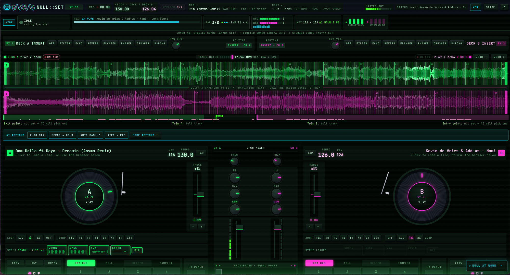

<div align="center">

```
 ███╗   ██╗██╗   ██╗██╗     ██╗         ██╗ ██╗    ███████╗███████╗████████╗
 ████╗  ██║██║   ██║██║     ██║         ╚═╝ ╚═╝    ██╔════╝██╔════╝╚══██╔══╝
 ██╔██╗ ██║██║   ██║██║     ██║         ██╗ ██╗    ███████╗█████╗     ██║
 ██║╚██╗██║██║   ██║██║     ██║         ╚═╝ ╚═╝    ╚════██║██╔══╝     ██║
 ██║ ╚████║╚██████╔╝███████╗███████╗    ██╗ ██╗    ███████║███████╗   ██║
 ╚═╝  ╚═══╝ ╚═════╝ ╚══════╝╚══════╝    ╚═╝ ╚═╝    ╚══════╝╚══════╝   ╚═╝
```

### 🎧 an AI that DJs your library, live, on two decks 🤖

**stems · phrase-locked transitions · merge → hold → drop · a local LLM that picks the next song**




<sub>▲ mid-set: Dom Dolla ft Daya "Dreamin (Anyma Remix)" into Kevin de Vries & Add-us "Nami", a <b>COMBO x3</b> of studied Anyma-set transitions</sub>

</div>

---

## ▶ Drop the needle

NULL::SET is a browser DJ console with an AI at the controls. It analyses every track, splits it into stems, learns how real DJs move between songs, then plays a whole set as one continuous piece of music. Beats locked, phrases aligned, one track owning the sub-bass at any moment.

Everything runs on your own machine:

| Layer | What it is |
|---|---|
| 🧠 **Brain** | a local LLM on Apple Silicon (Qwen3-Omni via mlx-vlm, one shared model for song picks and the live ear) or Ollama anywhere else |
| 🎛️ **Hands** | a vanilla-JS console (WebAudio decks, 4-stem players, FX rack, sampler) that does the actual mixing, sample-accurate |
| 🔬 **Ears** | librosa analysis (beat grid, 8-bar phrases, Camelot key, energy, vocals), Demucs stems, Rubber Band key-locked tempo stems |
| 📚 **Knowledge** | an Obsidian DJ wiki in `DJ/`: 28 transition recipes, EQ and phrasing rules, playbooks. The code reads it directly |

```
   ┌──────────┐     ┌──────────────┐     ┌──────────────┐     ┌──────────┐
   │  track A │ ──▶ │ analyse +    │ ──▶ │  pick next   │ ──▶ │ track B  │
   │ on air ◉ │     │ stems (4)    │     │ combo / LLM  │     │ cued  ◎  │
   └──────────┘     └──────────────┘     └──────────────┘     └──────────┘
         │                                                          │
         └──────────▶  MERGE ─▶ HOLD ─▶ HANDOVER  on the phrase ◀───┘
```

---

## 🎚️ What it plays

### The transition it loves: merge → hold → transition

The two tracks **merge** stem by stem (B's drums and bass under A's vocal and synths), **hold** together for whole 8-bar phrases while the pair stays clean, then **hand over** with the bass swapping on a downbeat. The hold length comes from the two songs' measured stem energy and vocal gaps, never a fixed constant. Only one track ever owns the low end.

When the gates say no, it falls back to the move that fits the pair:

| Move | When | What you hear |
|---|---|---|
| **Merge → hold → transition** | stems on both decks, tempos lock within 8 %, keys compatible | a mashup of both songs for 1 to 6 phrases, then the handover |
| **Riff over rap** | A grooves into its breakdown, B raps, tempos 3 to 15 % apart | A key-locked to B's tempo, looped under B's rap, B slams in. From Fred again.. & Thomas Bangalter's USB002 |
| **Mashup, then transition** | B has a vocal phrase over A's instrumental | B's voice rides A's beat, then B takes over on the line |
| **Stem blend / bridge** | tempos lock, or they cannot | synths first and bass on one line, or a beatless bridge between two tempos |
| **Echo Out** | clashing keys or big tempo gaps | an 8-bar echo, never a hard cut |

> 🚫 **No hard cuts.** The autopilot never plays a Hard Cut or Quick Cut, and the only rewind in the whole codebase is the **REWIND REPLAY** of a supermove.

### Inside a song

- **Stem remix**: hold-on loops, acapella breaks, drum breaks, bass out, synth holds
- **Learned moves** from studied DJ sets: vocal loops, vocal re-cuts, chops on the 1/8 grid, loop extends
- **Artist moves**: mids-only reverb sends, kick rolls into the drop, vocal echo throws, slip loops, cue teases, filter loops with an acapella on top
- **Strip & rebuild** for famous songs, **hook drops** on the emotional line, a rationed **auto sampler**
- An **FX budget** keeps it tasteful: one wet move per transition, a few per song

### Picking the next song

- **Studied combos first.** Pairs that real DJs played back to back (from sets it has studied, e.g. an Anyma Afterlife set) are tried before anything else, then known-good **combos** from the pair atlas, then the LLM
- **FOLLOW SET**: play a song by an artist from a studied set and the autopilot follows that set's music, nearest by tempo, key and energy
- A **pair atlas** scores every pair in your library by the console's own rules, with per-move compatibility (merge-hold, riff, mashup, supermove)
- Scene continuity, artist spacing on every path, energy-arc rules, Camelot key gates, set memory across sessions
- **Punjabi scene profile** (`PUNJABI` in the toggle drawer: auto, on, off). When both songs are Punjabi it treats punjabi, bhangra and desi as one scene, allows a 4-decade era gap, plays 45 to 90 s snippets, folds 88 and 176 BPM as the same feel and falls back to a Quick Cut on the downbeat. Learned moves from studied Punjabi sets may blend on a key clash. Off is byte-identical to the default

---

## 🕹️ Macros: replay a set, move for move

A **macro** is a stored set: songs, recipes, exit and entry points, hold bars. The console ships with studied-set macros, chains and seed combos, each with a proper title.

| Control | Does |
|---|---|
| **PLAY MACRO** | runs the whole macro unattended, loading and pre-rendering each next song |
| **PLAY STEP** / `Shift+M` | performs exactly the next stored move |
| **AUTO MIX** | with a macro selected, loads the step's song and performs its move |
| **SKIP / REPEAT / EDIT / SAVE** | step through, tweak a move, save your own |

The autopilot prefers a known macro step 80 % of the time (`MACRO_PREFERENCE`), so a set sounds curated without becoming a replay.

---

## 🤖 NULL, the mascot, and the visuals

- **NULL-BOT** flies in for every supermove (merge drops, double drops, drop swaps, riff arrivals), pops in place for small moves, and dances on Anyma-style drops
- The **bass band** at the bottom of the screen breathes with the low end; during a crossfade the wave travels from the incoming deck's side
- **ANYMA LOOK** (optional): ice-white and cyan light inside the platters, waveforms, meters and the VIBE strip, with a "DROP IN N BARS" countdown
- **VIBE strip**: what the AI hears, plans and does, including the combo streak
- **LEARNING** panel: live progress of set studies

---

## 📀 Learn from real DJ sets

```bash
python -m app.music_brain.agent_bridge learn-set "https://www.youtube.com/watch?v=<set>" \
    --tracklist tracklist.txt --jobs 2           # add --no-macros to skip the last step
python -m app.music_brain.agent_bridge learn-status
```

It clips every tracklist boundary, separates stems, matches each song, detects the techniques (bass swaps, stem intros, acapella overs, vocal loops and re-cuts, loop extends), has the local model review them, and merges them into `data/cache/learned_techniques.json`. Then it imports the set's songs into your library and rebuilds the pair atlas incrementally, which writes the set's macros (`studied-<set_id>-<n>` per transition, `studied-set-<set_id>` for the whole set). The JSON result reports that step under `macros`. To redo it by hand: `python -m app.music_brain.pair_atlas import-set <set_id>` then `python -m app.music_brain.pair_atlas build`.

Long sets are learned in parts. A set longer than `--split-minutes` (default 60, `0` never splits) is cut at tracklist boundaries into parts of about that length; neighbouring parts share one song, so each handover is studied once. Every finished part is checkpointed under `data/cache/sets/<set_id>/parts/`, and a run that crashes or is killed picks up at the next part when started again with the same tracklist. The result has the same shape as an unsplit run, and macros, ID cuts and the atlas build run once at the end.

After every learn (and after each part) the learner cleans up. First it registers every good song in your library, the same way a download does, and cuts every unreleased ID out of the set recording. Only then does it delete the clips, their stems, the song files now in the library, yt-dlp leftovers and the set recording. A song the library does not hold (a wrong download, a failed import) is never deleted: the result's `cleanup` lists it under `kept` with the reason. Add `--keep-files` to skip the cleanup.

Only want the set as a playable macro? `learn-set <url> --tracklist tracklist.txt --macros-only` skips the set download and stem separation: it fetches the songs, imports them, updates the atlas and writes `set-<set_id>` in tracklist order.

What the player knows travels with the repo: `app/music_brain/knowledge/` holds every macro, the learned observations and a slim, segmented pair atlas. Every learn-set run exports there (`python -m app.music_brain.knowledge export`), and a fresh checkout seeds its own cache from it on start, matching songs by name. Your local cache always wins.

Glossary of every named concept (atlas, macros, gates, recipes, sim): [ANNEX.md](ANNEX.md).

---

## ⚡ Quick start

```bash
python3 -m venv .venv && source .venv/bin/activate
pip install -r requirements.txt
./start.sh            # one shared Qwen3-Omni server, the app, opens http://localhost:8000
```

Then paste a seed URL and press **▶ START SET**, or play any song and press **▶ FROM CURRENT**.

| `start.sh` | |
|---|---|
| `./start.sh --no-open` | do not open a browser tab |
| `./start.sh --dual` | a separate text model (mlx_lm) beside the ear model |
| `PORT=8010 ./start.sh` | another port |
| `OMNI_MAX_SEQS=4 ./start.sh` | concurrent sequences on the shared model |

Logs: `/tmp/ai-dj-server.log` (app), `/tmp/ai-dj-omni-server.log` (model).

### Requirements

- Python 3 with `requirements.txt` (librosa, numpy, scipy, demucs, torch, fastapi, uvicorn, yt-dlp, ...)
- `ffmpeg`, and the `rubberband` CLI for key-locked tempo stems (`brew install rubberband`)
- Apple Silicon with `mlx-vlm` in `~/.venvs/mlx-vlm` (default), or [Ollama](https://ollama.com) anywhere
- Optional: Node.js for the JS checks and the virtual-set sim

---

## 🔧 Configuration (`.env`)

| Variable | Default | Purpose |
|---|---|---|
| `LLM_BACKEND` | `auto` | `auto`, `mlx` or `ollama` |
| `OMNI_MODEL` | `mlx-community/Qwen3-Omni-30B-A3B-Instruct-4bit` | the shared model (song picks and live ear) |
| `OMNI_PORT` / `OMNI_MAX_SEQS` | `8901` / see `start.sh` | model server port and batch size |
| `MLX_MODEL` / `MLX_PORT` | `Qwen3-30B-A3B-Instruct-2507-4bit` / `8081` | the text model with `--dual` |
| `OLLAMA_URL` / `OLLAMA_MODEL` | `http://localhost:11434` / `gemma3:27b` | fallback backend |
| `YTDLP_COOKIES_FILE` | `~/.config/ai-dj/youtube-cookies.txt` | YouTube cookies for yt-dlp (keep it out of the repo) |
| `YT_GUARD` | `off` | `on` brings back the bot-check cooldown breaker |
| `KEYLOCK_CACHE_MAX_GB` | `20` | cap for regenerable key-locked tempo stems (oldest evicted first) |
| `SUGGEST_BUDGET_S` / `SUGGEST_VERIFY` | `15` / `1` | suggestion time budget / check picks against YouTube |
| `DJ_LIBRARY_DIRS` | none | semicolon-separated local music folders |
| `LOG_LEVEL` / `CONSOLE_LEVEL` | `info` / `warn` | app log and `start.sh` console verbosity |

---

## 🧪 A virtual set, before you trust a rule

The sim runs the console's real browser JS in node with fake decks on a virtual clock, against the real API, and scores a whole set with one number (lower is better). Record once with the real model, then replay deterministically with no network.

```bash
python3 -m app.sim.virtual_set --seed 1 --tracks 10 --mode quick --out app/sim/out/run
python3 -m app.sim.virtual_set --replay real-s1-quick --out app/sim/out/replay
python3 -m app.sim.suite --check        # regression gate vs baseline.json
```

Learning log: [`app/sim/LEARNINGS.md`](app/sim/LEARNINGS.md). It judges decisions, not sound: it cannot hear.

```bash
python -m pytest app/tests/ -q -m "not slow"      # 700+ tests; node checks run inside
```

---

## 🗂️ Repository layout

```
app/
  music_brain/    analysis, stems, recipe matcher, techniques, pair atlas, macros,
                  studied combos, blend / mashup / keylock / riff planners, set learner
  ui/             FastAPI server, autopilot service, engine (Host port), LLM runtime + gate,
                  live ear, prerender, downloads, dedup
  ui/static/      the console: autopilot, dj-mind, stem / fx / artist / learned moves,
                  macro mode, NULL-BOT, visuals, ANYMA look (vanilla JS, no build step)
  music_brain/knowledge/  tracked macros, learned observations, slim pair atlas
  legacy_pipeline/        the older end-to-end batch mixer (data/songs -> data/output/mix.mp3)
  sim/            the virtual set: fake decks, record / replay, scorer, suite
  tests/          pytest + node checks
DJ/               the Obsidian DJ knowledge base
research/notes/   studies: hidden DJ practices, artist signatures, stack evaluation
data/             songs and caches (gitignored)
.github/workflows CI: console JS checks and pytest on every push and PR
```

The decision engine talks to the world only through an injected **Host port** (`engine.js`, `app/ui/engine.py`), so the same engine runs in the browser and in the sim.

---

## 📚 The DJ knowledge base

`DJ/` is an Obsidian vault: fundamentals, phrasing, Camelot, EQ and frequency ownership, 28 transition recipes in a fixed 17-part template, energy management, genre playbooks and artist case studies. `knowledge_parser.py` turns the cookbook into executable recipes, and the rules the code enforces come from it: 8-bar phrase snapping, a single sub-bass owner below 120 Hz, Camelot scoring, Echo Out for big tempo gaps.

## 🔌 Agent bridge and REST

`app/music_brain/agent_bridge.py` is a Python API and a CLI that prints JSON (`analyze`, `separate`, `match`, `preview`, `list-recipes`, `learn-set`, `learned`, `learn-status`). The REST surface lives in `app/ui/server.py` and `app/ui/atlas_api.py`: tracks, stems, match and plans, autopilot suggest and plan, live ear, pair atlas partners, macros, studied sets, learn progress, session logs.

---

<div align="center">

**v1.0.1** · see [CHANGELOG.md](CHANGELOG.md) · built with a lot of late nights, two decks and an AI that will not stop mixing

<sub>MIT. See <a href="LICENSE">LICENSE</a>. Use only music you are legally allowed to use.</sub>

🎧 ◉ ═══════ ◎ 🎧

</div>
